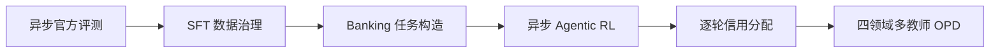

# Service Agent

面向长程客服交互与工具调用的 4B 模型后训练全链路

[](https://shihaofu2003.github.io/slime/)
[](https://github.com/THUDM/slime)
[](https://github.com/sierra-research/tau2-bench)
[](LICENSE)

本仓库基于 [THUDM/slime](https://github.com/THUDM/slime)，围绕 Airline、Retail、Telecom、Banking 四类客服环境，完成 Qwen3-4B-Instruct-2507 Agent 的评测、监督微调、强化学习、信用分配和多教师 on-policy distillation（OPD）。代码与历史产物沿用 `tau2-bench` 路径；项目文档将加入 Banking 后的四领域任务集合称为 tau3-benchmark。

## 项目概览

客服 Agent 需要在长程对话中理解需求、检索政策、调用工具并正确改变业务状态。这里将模型质量、训练信号和系统吞吐放在同一条可复查链路中处理：



训练使用 Agent 作为唯一优化对象，Qwen3.6-27B 作为固定 User simulator。留出评测保留官方二元任务成功定义，同时分别报告平均单次成功率 `pass@1`、至少一次成功的任务覆盖率 `pass@4(any)` 和四次全部成功的一致性 `pass^4`。

## 六项工作

| 阶段 | 实现 | 已完成结果 |
|---|---|---|
| 异步评测 | 领域进程、轨迹线程、共享 Agent/User 推理池、弹性并发与 User round-robin | 历史三领域 400 条轨迹从 174.26 分钟降至 35.71 分钟，端到端 4.88×；按申请资源计算的 GPU-hours 从 11.62 降至 4.76 |
| SFT 数据治理 | 修复 Agent/User 工具边界，按 target-prefix 审查局部监督，重建官方原生格式 | 形成 30,376 条三领域 AReaL 监督数据；匹配重训与官方评测用于选择数据配方 |
| Banking 任务构造 | 15 类业务模板、7 种任务形态、独立实体与数据库、预设解法回放 | 构造 647 个独立场景，其中 542 个进入训练；同时保留官方 97 题作为独立测试集 |
| 异步 Agentic RL | 连续采样、K=8 完整组、真实 token/logprob、TIS、有界策略滞后、环境多进程 | 严格同步/异步本身在 20/100 updates 为 1.060×/0.977×；解决 CPU 与供给瓶颈后的 Airline 匹配窗口达到 4.60× |
| Credit assignment | 字段反馈、错误 Assistant-turn 归因、固定预算零和 turn credit、状态进度 DB-count | v2 对 outcome-only 的三项成功率点估计为 +2.50/+3.50/+4.00 pp，配对区间均含 0；按预设规则保留 v1，DB-count 后续用于四领域专家 |
| 多教师 OPD | 学生自主 rollout，按领域路由四位专家，current-student reverse-KL advantage 与 TIS | 从已评测 checkpoint 选择 Update 80；单个 4B 学生保留按领域教师总体 pass@1 的 93.4% |

这些数字来自不同阶段的受控实验，不能拼成一次运行的联合增益。详细口径与负结果见下方文档。

## 主要结果

最终四领域 OPD 使用 197 个官方任务、每题 4 trials，共 788 条轨迹；固定 Qwen3.6 User、Agent temperature 0.6、seed 300，并使用 Banking BM25 检索。

| 模型 | pass@1 | pass@4(any) | pass^4 |
|---|---:|---:|---:|
| SFT4505 | 27.92% | 43.15% | 13.20% |
| **Update 80 学生** | **28.55%** | **46.70%** | **14.72%** |
| 按领域选择四位教师 | 30.58% | 49.24% | 12.69% |

Update 80 是一个统一学生模型；“按领域选择四位教师”是四个模型组成的参照系统。学生的分领域成绩如下：

| 领域 | pass@1 | pass@4(any) | pass^4 |
|---|---:|---:|---:|
| Airline | 50.00% | 80.00% | 30.00% |
| Retail | 58.13% | 85.00% | 37.50% |
| Telecom | 48.13% | 87.50% | 15.00% |
| Banking | 3.87% | 7.22% | 2.06% |

Update 80 是在同一 seed 300、同一批任务上比较多个 checkpoint 后选出的，尚无独立 seed 确认选型优势。SFT 初始化本身已经达到教师总体 pass@1 的 91.3%；93.4% 表示学生保留的教师绝对成功率，不表示追回了 93.4% 的专家增益。Banking 占 197 题中的 97 题，仍是当前主要能力缺口。

## 方法与实现

- [官方评测入口](examples/tau2-bench/eval/official/) 使用 tau2 runner API，支持多领域并发、共享推理服务、trial 恢复与统一汇总。
- [连续采样 producer](examples/tau2-bench/rl/continuous.py) 按完成顺序组装完整 K=8 group，在 Trainer 更新期间继续推进其他对话，并以最早策略版本约束 lag。
- [原始生成 token 记录](slime/rollout/agent_tokens.py) 保留逐 turn prompt、输出 token、行为 logprob 和 loss mask；超长轨迹重采样，不截断历史消息。
- [逐轮信用分配](examples/tau2-bench/rl/reward_postprocess.py) 将动作、格式与状态进度归到产生它们的 Assistant turn；[状态进度实现](examples/tau2-bench/rl/progress.py) 支持四领域 DB/环境比较。
- [多教师 OPD](examples/tau2-bench/opd/tau2_opd.py) 根据任务领域请求对应教师，对学生实际生成 token 打分，并保留异步 rollout 的 TIS 校正。

## 仓库结构

| 路径 | 内容 |
|---|---|
| [examples/tau2-bench/eval/official](examples/tau2-bench/eval/official/) | 官方原生评测、模型请求与异步调度 |
| [examples/tau2-bench/sft](examples/tau2-bench/sft/) | Agent/User SFT 数据准备与训练入口 |
| [examples/tau2-bench/analysis](examples/tau2-bench/analysis/) | 数据审查、Banking 合成与实验分析 |
| [examples/tau2-bench/rl](examples/tau2-bench/rl/) | rollout、reward、credit、连续采样和训练脚本 |
| [examples/tau2-bench/opd](examples/tau2-bench/opd/) | 多教师 OPD 数据、教师评分与启动脚本 |
| [scripts](scripts/) | 训练、转换、评测、监控和集群提交脚本 |
| [output/doc](output/doc/) | 跨实验结论与证据索引 |
| [output/experiments](output/experiments/) | 每项实验的配置、作业链接和结果摘要 |

## 运行与验证

本项目训练环境沿用 slime 的 Megatron-LM + Ray + SGLang 栈。先按[上游 Quick Start](docs/en/get_started/quick_start.md)安装框架，再准备同级的 `tau2-bench`、模型、数据和 checkpoint；集群脚本中的 `SERVICE_AGENT_ROOT`、`PROJECT_ROOT`、模型与数据路径均可通过环境变量覆盖。

官方评测示例：

```bash
bash scripts/submit.sh --experiment tau2-eval --gpus 2 \
  examples/tau2-bench/eval/official/run_eval.sh
```

异步 rollout 与 OPD 的 CPU 回归：

```bash
NUM_GPUS=0 python -m pytest \
  tests/test_tau2_continuous.py \
  tests/test_tau2_opd_training.py -q
```

正式训练前还会运行 [rollout preflight](examples/tau2-bench/rl/test_rollout_logic.py)。实验启动配置与选定 checkpoint 记录在对应的 experiment README 中。

## 文档与证据

- [项目主页](https://shihaofu2003.github.io/slime/)：按论文结构呈现六项工作、系统图、实验表格与限制。
- [实验总索引](output/doc/INDEX.md)：全部实验目的、README 与运行记录入口。
- [异步评测](docs/01-async-evaluation-star.md)、[SFT 数据治理](docs/02-sft-data-star.md)、[Banking 任务构造](docs/03-banking-task-synthesis-star.md)。
- [异步 RL、速度与 credit 汇总](output/doc/TAU2_ASYNC_SYNC_SPEED_CREDIT.md)。
- [Credit assignment 受控对照](output/experiments/tau2-agent-single-call-credit-core/CREDIT_COMPARISON.md)。
- [四领域 OPD 最终记录](output/experiments/tau2-opd-four-domain-20260923/README.md)与 [OPD 状态摘要](output/doc/OPD_STATUS.md)。

## 致谢与许可

本项目建立在 [slime](https://github.com/THUDM/slime)、[tau2-bench](https://github.com/sierra-research/tau2-bench) 与 [Qwen3](https://github.com/QwenLM/Qwen3) 之上。框架原始文档保留在 [docs](docs/)，上游中文介绍见 [README_zh.md](README_zh.md)。

代码沿用仓库的 [Apache 2.0 License](LICENSE)。
