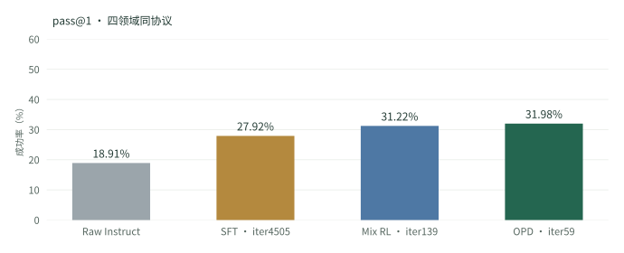

# Service Agent

面向多轮客服交互与工具调用的 4B 模型后训练项目。

[项目主页](https://shihaofu2003.github.io/slime/) · [核心项目文档](project_docs/README.md) · [完整实验结果](output/experiments/tau2-opd-mix139-airline-20260929/README.md)

基于 slime / Megatron-LM / Ray / SGLang，围绕 Airline、Retail、Telecom、Banking 四个领域，完成 Qwen3-4B-Instruct-2507 的数据准备、SFT、异步强化学习、状态进度信用分配与双教师 OPD。训练和正式评测使用 Qwen3.6-27B 作为固定 User，关闭 thinking。历史代码路径沿用 `tau2-bench`。

## 最终模型与结果

最终主线为 **Raw Instruct → SFT4505 → Mix RL iter139 → OPD iter59**。Raw 指尚未经过本项目训练的指令模型。OPD 的学生和非 Airline 教师均来自 2026-09-25 Mix RL iter139，Airline 教师为单域 expert iter29；最终选择 OPD 的第 60 次更新，即 iter59。

| 模型 | pass@1 | pass@4(any) | pass^4 |
|---|---:|---:|---:|
| Raw Instruct | 18.91% | 31.98% | 8.63% |
| SFT4505 | 27.92% | 43.15% | 13.20% |
| Mix RL iter139 | 31.22% | 48.73% | 13.71% |
| **OPD iter59** | **31.98%** | **48.22%** | **14.21%** |



统一协议：197 个官方任务 × 4 trials，seed300，Banking BM25；Agent temperature0.6、top_p1、每轮最多1,200 tokens；Qwen3.6 User temperature0、每轮最多512 tokens；max_steps200、max_errors10。总体按各域任务数 20/40/40/97 加权。

`pass@1` 是全部试验的成功比例；`pass@4(any)` 是四次至少一次成功的任务比例；`pass^4` 是四次全部成功的任务比例。完整主线相对 Raw 提高 **+13.07 / +16.24 / +5.58 pp**。OPD 相对 Mix 的总体 pass@4(any) 小幅回落，iter59 也不是所有 checkpoint 的最高分；单 seed 不作统计显著性结论。

最终模型的 Airline 为 **51.25 / 75.00 / 20.00%**，相对初始化提高 **+11.25 / +5.00 / +5.00 pp**。其他三域合计成功轨迹从 214/708 变为 211/708，pass@1 保留率 **98.6%**。Banking pass@1 仍只有5.15%，pass^4 为0。

## 六项核心工作

| 工作 | 主要做法 | 对应证据 |
|---|---|---|
| 异步评测 | 多轨迹共享 Agent/User 推理服务，完成领域释放并发名额，调整副本配比和请求路由 | [01 异步评测](project_docs/01_异步评测.md)：历史三域作业174.26→35.71分钟，4.88×；GPU-hours减少59.0%。该测速有旧 parser 问题，不能替代当前协议速度或质量结果 |
| SFT 数据治理 | 检查对话成功标签、工具归属和信息边界，展开调用并配对真实返回，只监督当前 Assistant target | [02 数据治理](project_docs/02_AReaL三领域SFT数据质量治理.md)：30,376行三域数据；匹配 SFT 的 pass@1/pass^4 点估计+2.63/+5.00pp，pass@4(any)下降1.50pp |
| Banking 任务构造 | 按能力组合生成新客户、状态、参考动作和成功条件，在真实环境回放后采集示范 | [03 任务构造](project_docs/03_Banking任务构造.md)：15类业务、647场景，1,651条完整轨迹、5,672行 SFT 数据；与三域数据合为36,048行 |
| 异步 Agentic RL | 持续采样完整K8组，采样与训练重叠，按Agent调用边界同步权重，保存真实token并使用TIS | [04 异步RL](project_docs/04_异步Agentic_RL.md)：两组均已异步，优化CPU、缓存和采样后20次更新370.22→80.46分钟，4.60× |
| 状态进度信用分配 | 用到目标DB的字段差异计算进度，按相对初态变化的记录数分组标准化，再与终局优势相加 | [05 Credit assignment](project_docs/05_Credit_assignment.md)：同预算iter139较Vanilla GRPO为+1.27/+2.54/+0.51pp，未单独消融各组成项 |
| 双教师OPD | 学生先交互，Airline专家或固定Mix教师评价真实token；current-student优势、TIS与总缓冲32组 | [最终OPD](output/experiments/tau2-opd-mix139-airline-20260929/README.md)：Airline提升，非Airline合计pass@1保留98.6%；无固定策略滞后步数上限 |

这些专项数字来自各自匹配的对照，不能拼成一次运行的联合提升。网站逐项说明问题、实现、实测图表和结论范围；[旧四教师OPD](project_docs/06_多教师OPD.md)保留为历史资料。

## 代码与文档

| 路径 | 内容 |
|---|---|
| [project_page](project_page/) | 当前网站源码、14张实测图表、可下载CSV/JSON和绘图脚本 |
| [project_docs](project_docs/) | 与简历六项工作对应的完整项目说明 |
| [examples/tau2-bench/eval/official](examples/tau2-bench/eval/official/) | 官方原生评测、共享推理服务和并发调度 |
| [examples/tau2-bench/sft](examples/tau2-bench/sft/) | Agent/User SFT 数据处理与训练入口 |
| [examples/tau2-bench/domain_generalization](examples/tau2-bench/domain_generalization/) | 四领域 SFT 对照、训练报告和配对评测汇总 |
| [examples/tau2-bench/rl](examples/tau2-bench/rl/) | 采样、环境、奖励、信用分配和各实验版本 |
| [examples/tau2-bench/opd](examples/tau2-bench/opd/) | 按领域选择教师、逐token评分和OPD启动脚本 |
| [slime/rollout/agent_tokens.py](slime/rollout/agent_tokens.py) | 多轮真实token、行为概率与loss mask对齐 |
| [output/doc/INDEX.md](output/doc/INDEX.md) | 实验总索引 |
| [output/experiments](output/experiments/) | 实验说明、选定启动脚本、分析程序与结果汇总 |

## 环境与验证

训练环境沿用[上游安装说明](docs/en/get_started/quick_start.md)，需要完整的 Megatron-LM、Ray、SGLang 和 Tau2 环境。本次归档的 CPU 回归使用 Python3.12、PyTorch2.6 CPU；不支持用系统 Python3.8 执行当前训练代码。

核心 CPU 检查：

```bash
NUM_GPUS=0 python -m pytest tests/test_tau2_opd_training.py \
  tests/test_tau2_continuous.py tests/test_tau2_sft_domain_generalization.py -q
```

本次验证通过：168项训练/采样/credit-signal检查、7项SFT对照检查、39项官方评测接口检查，共214项。合并时保留SFT测试的CPU CI登记，并从模板重新生成workflow。

实验专用的奖励/环境preflight保留在examples中，按启动脚本手动执行，部分需要本地Tau2数据和实验任务文件。正式训练的历史验证与依赖记录在各实验README；本次Git归档不重新训练模型。

网站本地预览：

```bash
python3 -m http.server 8765 --directory project_page --bind 127.0.0.1
```

打开 `http://127.0.0.1:8765/`。网站无前端构建依赖；重绘图表需要 Matplotlib、NumPy 和中文字体，见[网站说明](project_page/README.md)。

## Git 归档与运行产物

| 分支 | 用途 |
|---|---|
| `main` | 最终训练实现、SFT对照工具、当前项目文档和网站源码 |
| `feature/async-tau2` | 异步RL、后续奖励研究、Mix RL与最终双教师OPD记录 |
| `feature/sft-domain-generalization` | SFT领域对照的完整工作分支 |
| `feature/credit-assignment` | 早期progress-RTG与独立DB-count实现、设计和对照记录；保留历史版本 |
| `gh-pages` | GitHub Pages部署副本 |

源码、文档、必要图表与紧凑结果汇总纳入Git。checkpoint、训练数据、原始轨迹、运行日志、服务地址文件和本地工具状态保留在原目录，由`.gitignore`排除。文档中的这些运行产物链接用于本地追溯，不表示GitHub包含相应文件。实验脚本仍保留当时的路径配置，复现前需要准备模型、数据并调整环境变量。

当前网站源码以`main:project_page/`为准，发布时同步到`gh-pages`根目录。最终阶段另保留日期标签`serviceagent-final-20260929`。

## 结果下载

- [完整模型对比CSV](project_page/data/results.csv)与[原精度JSON](project_page/data/results.json)：最终实验2026-09-29 19:58 CST快照中的11个完整模型。
- [专项图表数据](project_page/data/supporting-studies.json)：评测加速、SFT治理、Banking、RL提速及OPD调参。
- [在线实验依据](https://shihaofu2003.github.io/slime/sources.html)：协议、完整checkpoint表与辅助诊断。
- [最终OPD实验](output/experiments/tau2-opd-mix139-airline-20260929/README.md)：配置、作业记录、模型选择和已完成评测。

## 致谢与许可

基于 [slime](https://github.com/THUDM/slime)、[tau2-bench](https://github.com/sierra-research/tau2-bench) 和 [Qwen3](https://github.com/QwenLM/Qwen3)。原始框架文档保留在 [docs](docs/)，代码沿用 [Apache 2.0 License](LICENSE)。
