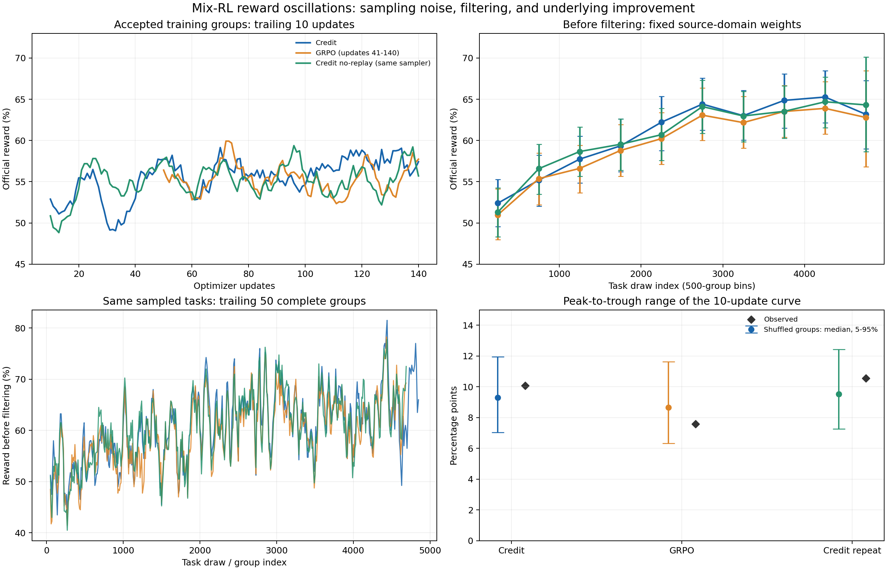

# 混合 RL 奖励曲线诊断

目的：核查 `tau2-mix-rl-sft4505-b128-20260925` 的 credit/GRPO 和 `tau2-mix-rl-sft4505-credit-no-replay-20260926` 的奖励起伏。分析日期：2026-09-27。读取 114,636 条轨迹记录，按原绘图逻辑去重后为 113,875 条；检查 380 个有完整训练日志的更新、4,480 个 credit 训练组及已有官方评测。此次只生成分析文件。

初次失败的 `20260925_mix-train` 没有完成优化器更新，未纳入训练趋势比较。三次正式运行重建的逐批奖励和过滤前总均值均与原始绘图 CSV 一致。

## 结论

主要证据支持：山峰形状主要来自小批量任务难度差异、终局全对/全错过滤，以及异步完成顺序。它不能直接证明策略反复退化。三条线的过滤前奖励长期均有提升，后段进入平台；目前没有梯度爆炸或数值崩溃的证据。

最强的两项证据：相同任务抽样顺序下，跨运行去趋势后的奖励相关系数仍为 0.90–0.91；仅随机重排已采到的任务组，不引入任何策略退化，就能产生与实测接近的波峰波谷。领域比例解释了一部分波动，领域内部的任务难度差异也很大。

左上为训练组奖励；右上包含所有完成的 K=8 组，并固定四领域权重，误差条为组级重采样的 95% 区间；左下按任务抽取顺序对齐；右下比较实测波峰波谷与随机重排结果。右上最后一个区间不足 500 组，误差更大。图表用于诊断，不能替代固定任务集的官方评测。

## 曲线实际统计的内容

- `reward_curves.png`：进入优化器的 16 个任务组 × 8 条轨迹；全对、全错、不适合训练的组已被过滤。credit 模式画的仍是官方终局二元 reward，不是加入 progress 后的 advantage。
- `reward_prefilter.png`：按轨迹写入日志的顺序，计算 40 条均值和尾随 400 条均值。包含被拒绝组的最终尝试，不包含中间重试；横轴不是优化步，也不是固定策略版本。
- 三个 launcher 均为 `RandomTaskDataSource`、rollout seed 42。它用 `rng.choice` **有放回**抽任务，没有全错任务延迟重试队列。`credit-no-replay` 与原 credit 是同一采样配方的重复运行，不能用来检验“取消失败任务回放”的效果。带延迟重试队列的是另一类 `ShuffledTaskDataSource`。
- GRPO 恢复运行时覆盖了 `run.log`，现有 accepted 曲线只有更新 41–140；轨迹文件保留更早数据，并存在 761 个重复的 `(group, sample)`。本分析沿用原 plotter 的去重规则：保留最后记录的值和首次出现的顺序；涉及训练批次的 GRPO 统计限于有日志的 100 次更新。

依据：[绘图脚本](../../../../scripts/plot_tau2_four_domain_rewards.py)、[随机采样器](../../../../examples/tau2-bench/rl/random_tasks.py)、[原 credit launcher](../../tau2-mix-rl-sft4505-b128-20260925/run_mix.sh)、[no-replay launcher](../run_mix.sh)。

## 波动幅度与随机采样相符

128 条轨迹不是 128 个独立任务，而是 16 个任务组。对每个已接受组计算 K=8 成功率，再用组间标准差除以 √16，得到随机组成一个 batch 时的标准误。

| 运行 | 实测单步 reward 标准差 | 随机 16 组的估计标准误 | 实测 10 步均线峰谷差 | 随机重排峰谷差的 5–95% 范围 |
|---|---:|---:|---:|---:|
| Credit | 6.83 pp | 6.65 pp | 10.08 pp | 7.03–11.95 pp |
| GRPO，更新 41–140 | 6.59 pp | 6.72 pp | 7.58 pp | 6.33–11.64 pp |
| Credit no-replay | 6.88 pp | 6.81 pp | 10.55 pp | 7.27–12.42 pp |

随机重排各执行 4,000 次，每次保持实际组奖励及更新数不变，重新分成每批 16 组。实测范围均在上述区间内。这是量级检查，不是证明策略质量完全不变的假设检验。

按 group index 对齐三次运行时，重叠任务身份完全一致。Credit 对 GRPO/no-replay 的单组 reward 相关系数分别为 0.915/0.915；50 组均线相关系数为 0.942/0.931。扣除 1,000 组长期趋势后，相关系数仍为 0.911/0.903。这直接支持“反复遇到相同难易任务序列”是共同波形的主要来源。

过滤前，取日志顺序的前后各 5,000 条最终轨迹，先分领域求成功率，再按原任务池比例加权：

| 运行 | 前 5,000 条 | 后 5,000 条 |
|---|---:|---:|
| Credit | 53.13% | 63.55% |
| GRPO | 52.36% | 63.49% |
| Credit no-replay | 52.31% | 63.90% |

这支持总体在学习，不能解读为 held-out 提升 10 pp。任务仍在变化，日志还包含重试和混合策略版本。完整分领域/抽样区间统计见 [domain_statistics.csv](domain_statistics.csv) 和 [draw_periods.csv](draw_periods.csv)。

## 过滤改变了训练分布，也限制了 credit

`TAU2_DROP_UNIFORM_OUTCOME_GROUPS=1` 在计算 progress advantage 之前丢掉终局全对和全错组。随着容易任务掌握得更好，全对组退出训练，训练均值就不会随整体能力同步上涨。

原 credit 的前/后 20 次更新中，全对组占完成筛选组的比例从 **21.49% 升至 40.28%**，全错组从 17.67% 变为 15.28%，接受率从 58.29% 降至 40.40%。这是“更多组已经全对，但 accepted reward 仍在约 55% 摆动”的实测解释。接受组的 `zero_variance_group_rate=0` 是过滤结果，不能说明抽样时没有零方差组。

| 领域 | 任务池比例 | Credit 实际训练比例 | GRPO 实际训练比例 | no-replay 实际训练比例 |
|---|---:|---:|---:|---:|
| Airline | 45.48% | 54.06% | 56.00% | 54.42% |
| Retail | 22.31% | 26.12% | 25.19% | 25.89% |
| Telecom | 10.74% | 6.34% | 6.63% | 6.21% |
| Banking | 21.47% | 13.48% | 12.19% | 13.48% |

Credit 有 44/140 个 batch 完全没有 Telecom；no-replay 为 51/140，GRPO 有日志的区间为 34/100。Banking 很多组全对，Telecom 很多组全错或不可训练，因此抽取比例不等于训练比例。这里没有梯度方向数据，不能据此断言存在多域梯度冲突。

对完整、无被移除样本且 progress 可计算的全错组：原 credit 有 748 组，其中 648 组至少一条轨迹取得正的净状态进步，545 组同时存在轨迹间净进步差异；no-replay 对应为 695/595/498 组。它们仍全部被二元 outcome 过滤排除。这里的正净进步不保证标准化 progress advantage 非零，但足以说明 **credit 的候选学习信号被提前丢弃**。计数包含训练结束时的尾部组，所以略大于最后一次更新记录的过滤累计数。

依据：[过滤逻辑](../../../../examples/tau2-bench/rl/filters.py)、[progress 计算](../../../../examples/tau2-bench/rl/progress.py)、[credit 拼接](../../../../examples/tau2-bench/rl/reward_postprocess.py)。

## Advantage、异步和训练健康检查

两条 credit 线各核查 2,240 组：outcome advantage 与 `(r−mean)/(sample_std+1e−6)` 的最大误差约 1.14e−7；outcome + progress + format 的拼接误差小于 9e−16。组归一化发生在轨迹拆分为训练段之前；credit token advantage 在训练端直接使用，没有再次叠加 outcome 或重复做 GRPO 归一化。未发现这些路径的公式错误。

按每条轨迹等权、轨迹内 Assistant token 加权，outcome advantage RMS 为 0.935；叠加后为 1.740/1.735，约 **1.86 倍**。约 5.12%/5.56% 的 token 权重发生相对 outcome 的符号翻转；有 928/904 条轨迹因 reward basis 不支持而回退为无 progress 项。这些改变了 credit 的学习信号，不能假设“LR 相同就等价于相同的优化强度”，也不能仅据 RMS 倍数推导 Adam 的参数步长倍数。

三条运行的梯度范数最大值为 1.28/0.88/1.18，日志中的 loss/梯度有限。KL penalty 和 entropy coefficient 均为 0；真实记录的参考 K2 KL 后 20 步均值约 0.020/0.014/0.016，并非 KL 始终为零。`ppo_kl=0` 和 `pg_clipfrac=0` 与每批只更新一次、用当前前向的 detached logprob 作 old policy 相符，不能用它们宣称整个训练期间策略未变化。接受样本的低截断率也不包含已被筛掉的长轨迹。

异步是次要的可疑因素，但目前没有证据把它定为主因：平均最早 turn 滞后 1.63/1.70/1.68 步，最大 15/10/10 步；约 37–40% 的训练轨迹跨策略版本。TIS 的平均绝对偏离约 0.006–0.007，剪切率很低，未见明显的平均重要性权重失控。

完成顺序还会放大短窗差异：原 credit 成功/失败轨迹平均耗时约 140/230 秒，Telecom 约 400 秒、Banking 约 89 秒。按完成顺序画 400 条均线，会混入不同任务速度和不同策略版本；它不等于固定版本模型的成功率。credit/no-replay 中另有 337/314 条没有 Agent token 的记录，其 policy version 默认写为 0；因此本诊断按任务抽样序号分区间，没有将它们错误归入初始策略。

依据：[异步生产者](../../../../examples/tau2-bench/rl/continuous.py)、[行为 token/段拆分](../../../../slime/rollout/agent_tokens.py)、[训练前向选择](../../../../slime/backends/megatron_utils/actor.py)、[loss/TIS](../../../../slime/backends/megatron_utils/loss.py)。

## 已有官方评测与下一步

相同官方 seed300，197 个任务 × 4 trials；no-replay 目录没有官方评测结果。

| 模型 | pass@1 | pass@4(any) | pass^4 |
|---|---:|---:|---:|
| SFT4505 | 27.92% | 43.15% | 13.20% |
| Credit iter89 | 28.93% | 44.67% | 15.23% |
| Credit iter129 | 31.60% | 46.70% | 14.21% |
| Credit iter139 | 31.22% | 48.73% | 13.71% |
| GRPO iter89 | 29.57% | 46.19% | 14.21% |
| GRPO iter129 | 31.47% | 48.22% | 15.23% |
| GRPO iter139 | 29.95% | 46.19% | 13.20% |

iter139−iter129 的 pass@1 差值，按领域分层、配对任务 bootstrap 5,000 次：Credit 为 −0.38 pp，95% 区间 [−3.05, +2.28] pp；GRPO 为 −1.52 pp，区间 [−4.19, +1.14] pp。两者都不足以确立末期退化。Credit 的 pass^4 没有随 pass@1 同步提高，后续仍需要用固定官方协议衡量一致性，不能只挑训练峰值。完整数值见 [official_evaluations.csv](official_evaluations.csv)；来源为上述两个实验 README 所链接的现有评测，以及 [SFT4505 基线](../../tau2-sft-areal3-banking-simplified-full-20260920/eval/four-domain-sft-iter4505/seed300_20260920_sft_iter4505_four_domain_summary.json)。

建议按以下顺序处理：

1. 主监控增加过滤前分领域 reward、固定领域加权均值、全对/全错/不可训练组比例及实际训练组数；accepted reward 继续保留。固定 checkpoint 评测任务和 seeds，用任务级误差衡量变化。
2. 优先做 credit 过滤对照：先计算 progress/format/outcome 的总学习信号，再区分“终局全错但有差异信号”和“确实没有学习信号”的组。保留前者作受控实验；不等于把所有全错组无条件加入训练。
3. 若目标是降低 batch 难度噪声，增加每次更新独立任务组数，或对接受后的领域比例作明确控制。K=8 保持时增加组数会增加轨迹预算，应与性能比较分开；改变 K 会同时改变组估计和过滤概率，不能视为纯粹的降噪操作。
4. 若固定任务评测确认真实退化，再单独测试 LR/KL 或同步采样。当前四 environment workers 明确只支持无限 lag，不能只把 `TAU2_MAX_POLICY_LAG` 改成 1 而保留其他设置。更改 credit 权重时同时检查 advantage/梯度统计。

复现：先运行 [extract.py](extract.py)，再运行 [analyze.py](analyze.py)。前者只提取原轨迹 JSONL 的 metadata/header，后者重建批次、重排组、重算 credit 并读取已有官方评测；没有模型推理或 GPU 作业。主要统计保存于 [summary.json](summary.json)，图另有 [PDF](diagnosis.pdf)。
