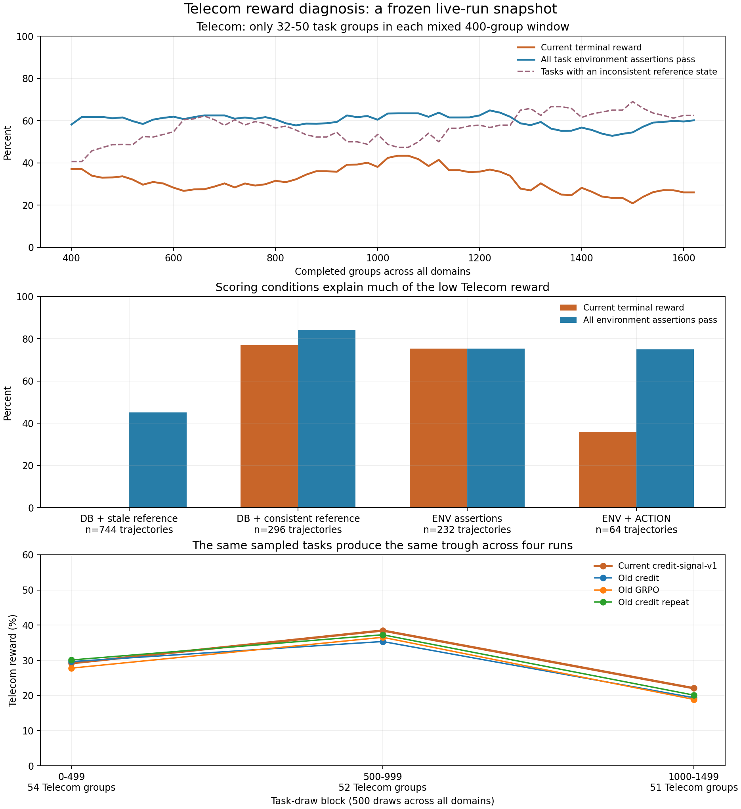

# Telecom 奖励低和波动的原因

快照时间：2026-09-27 14:25 CST。范围：当前 credit-signal-v1 运行的 1,628 个完整任务组、13,024 条最终轨迹，其中 Telecom 167 组 / 1,336 条；当时完成 91 次训练更新。本次只做离线分析、环境工具回放和报告，未修改或停止正在运行的训练。

## 主要结论

Telecom 存在实际的奖励目标问题：大量任务默认采用完整 DB 匹配，但参考环境执行黄金动作后没有同步 Agent/User 两侧状态，形成不一致的目标。小样本窗口又把不同任务的零奖励混在一起，使曲线明显起伏。真实的长对话和双边操作困难仍然存在，但不能把当前低 reward 全部归因于模型能力。

图中的“全部环境断言通过”是独立诊断，并非替换当前 reward 后的训练或官方评测结果。显式 ACTION 要求仍须满足。

## 奖励口径和不可达参考状态

训练池 271 个 Telecom 任务中，205 个未写 `reward_basis`，由 Task 模型默认成 `DB+COMMUNICATE`；另外 50 个显式使用 ENV_ASSERTION，16 个使用 ENV_ASSERTION+ACTION。[任务数据](../data/train.jsonl)、[默认值定义](../../tau2-areal-async-rl/dependencies/tau2/src/tau2/data_model/tasks.py)。

DB 评分要求 Agent DB 和 User DB 都匹配黄金动作生成的参考状态。[环境评估器](../../tau2-areal-async-rl/dependencies/tau2/src/tau2/evaluator/evaluator_env.py)构造参考状态时逐个调用 `make_tool_call`，该接口明确不执行 `sync_tools`；实际对话和评估轨迹回放会同步。训练 progress 的 [reference_database](../../../../examples/tau2-bench/rl/progress.py)也采用未同步的参考构造方式。

对全部 205 个默认 DB 任务离线执行参考动作后，有 **136 个任务**的参考状态再调用一次 `sync_tools` 就发生变化：96 个涉及 `mobile_data_usage_exceeded`，84 个涉及 `roaming_allowed`，部分任务同时涉及两者。

这些字段由相同后台 DB 和用户手机号确定。实际回放最后必定同步；完整 DB 匹配却要求回放结果等于未同步目标。因此这些目标在当前比较条件下不可达。按原池均匀抽取 Telecom 任务时，过滤前二元 reward 的长期期望上限被压到 **最多 135/271≈49.82%**。这不是固定 held-out 任务集的能力上限，也不限制小样本窗口或过滤后的均值。

实测与此一致：本次受影响的 75 个已抽到任务、93 组、744 条轨迹，**成功数为 0**。之前三条完整运行中，同一受影响任务集合的轨迹分别为 2,133 / 2,035 / 2,036 条，成功数也全部为 0。

| 本次 Telecom 子集 | 轨迹数 | 当前 reward 成功率 | 明确通过全部环境断言 |
|---|---:|---:|---:|
| DB，参考状态不同步 | 744 | 0.00% | 45.16% |
| DB，未发现上述不同步 | 296 | 77.03% | 84.12% |
| 显式 ENV_ASSERTION | 232 | 75.43% | 75.43% |
| 显式 ENV_ASSERTION+ACTION | 64 | 35.94% | 75.00% |

12 条未产生完整评估结果的失败轨迹按其任务配置归类，并保留 0 reward；表中的环境通过率只统计有明确通过记录者。全体 Telecom 共 808 条明确通过全部环境断言（60.48%），只有 426 条拿到 reward=1（31.89%）。其中 357 条 DB 评分轨迹环境断言全通过仍得 0，另有 25 条在显式 ACTION 条件下失败。不能把所有 DB 差异都直接当成误判；下面的回放确认了两种与任务完成无关的具体差异。

## 已复现的具体误判

`telecom_118`，group14/sample115：Agent 正确充值 2 GB，User 断开 VPN 并切换到 4G/5G，最终测速 275 Mbps；三条环境断言和三项黄金动作匹配检查全部通过，终局 reward 仍为 0。

离线回放同一条原始轨迹，参考与实际状态只差：

| 字段 | 参考 | 实际 |
|---|---|---|
| User `mobile_data_usage_exceeded` | `true`，充值后未同步 | `false`，充值后已同步 |
| 账单描述 | `Data refueling: 2.0 GB at $2.0/GB` | `Data refueling: 2 GB at $2.0/GB` |

给参考环境补一次同步后，第一项消失，第二项仍存在。黄金参数为浮点数 `2.0`，模型参数为整数 `2`；数值相等、充值量和费用相同，但 [refuel_data](../../tau2-areal-async-rl/dependencies/tau2/src/tau2/domains/telecom/tools.py)直接将参数格式化进账单文字，使完整 DB 比较失败。这还会使 progress 的目标距离残留，干扰 turn credit。

可复核材料：[精确字段差异及 136 个任务列表](reference_state_example.json)、[三条示例的评估和对话](assertions_pass_reward_zero_examples.json)、[离线回放脚本](replay_example.py)。脚本直接比较字段，没有进行模型推理或修改训练环境。

## 为什么曲线反复升降

目前每个平滑窗口是所有领域合计 400 个完整任务组，其中 Telecom 只有 **32–50 组**，近期为 48 组。窗口内的 Telecom 标准误约 5.5–7.4 pp；还会混入数量变化的不可达目标任务。不能把 400 组理解为 400 个 Telecom 任务。

以相同 group index 匹配完全相同的任务，当前运行与旧 credit / GRPO / credit-repeat 的单组 reward 相关系数为 **0.952 / 0.945 / 0.955**。共同低谷发生在同一段抽样序列：

| 全域任务抽样序号 | 匹配的 Telecom 组数 | 当前运行 | 旧 credit | 旧 GRPO | 旧 credit-repeat |
|---|---:|---:|---:|---:|---:|
| 0–499 | 54 | 29.17% | 29.63% | 27.78% | 30.09% |
| 500–999 | 52 | 38.46% | 35.34% | 36.54% | 37.26% |
| 1000–1499 | 51 | 22.06% | 19.36% | 18.87% | 20.10% |

当前运行用更少拒绝的组更新得更快，各列不是相同优化步的算法胜负比较；该对齐用于识别任务序列效应。现有数据支持抽样组成解释波形，不能从这段下跌直接推断本次策略退化。[匹配数据](matched_task_draws.csv)、[逐窗口数据](telecom_windows.csv)。

## 其他因素与处理顺序

Telecom 任务池中约 79.5% 的黄金动作由 User 工具执行。当前轨迹平均 15.8 个 Assistant 回合、31.8 次 User 模型调用、耗时 480 秒；其他领域分别为 Airline 11.9/7.1/183 秒，Retail 13.8/7.0/173 秒，Banking 4.0/2.1/95 秒。它需要更多诊断和双边协作，失败与异步滞后更容易积累。[领域统计](domain_comparison.csv)。

当前 Telecom 已占训练组的 9.41%，接近任务池的 10.74%，高于旧 credit 的 6.34%；新过滤确实改善了训练覆盖。训练中的 Telecom progress-token 覆盖率约 90.7%，progress advantage RMS≈0.982，未发现 credit 没接通或被压成零。新过滤复用旧 reward/progress 公式，因此也保留了上游错误目标。

处理优先级：先在独立版本明确 Telecom 的 reward basis，修复需要 DB 目标时的同步和数值格式等价性，再检验 credit/采样/LR。不要把显式 ACTION 条件无条件删除；也不要把“所有环境断言通过率”冒充既有官方最终 reward。对照实验继续保持同一 SFT、User 和官方 held-out 协议；修改评分定义后的训练曲线不能直接与旧曲线比较性能。

复现顺序：[extract.py](extract.py) 提取一个有限长度的活跃日志快照，`replay_example.py` 回放环境并检查全部 205 个默认 DB 目标，最后 [analyze.py](analyze.py) 生成统计和图片。主要数字保存在 [summary.json](summary.json)，另有 [PDF 图](telecom_diagnosis.pdf)。
