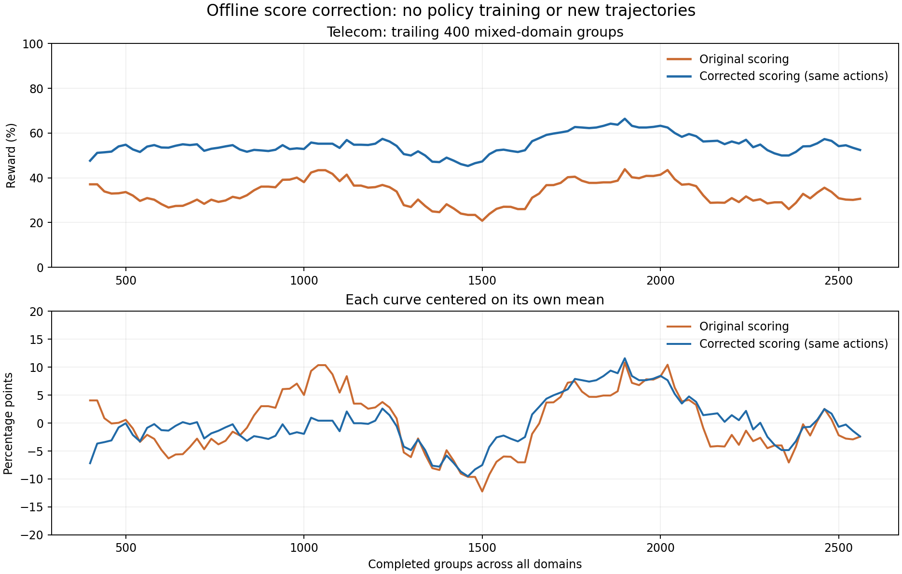

# 修复收益与证据边界

目的：区分评分纠错、训练信号恢复、模型能力提升和奖励曲线波动。2026-09-27 检查时，旧运行 24446 已完成 140 updates、保存 iter139；reward-v2 尚未训练，也没有新的官方评测结果。

## 已测到的收益

对旧运行全部已完成 Telecom 组进行离线重评分：274 组、2,192 条轨迹、186 个不同任务。使用原始动作和工具响应，修正参考状态同步、结构化数值比较和充值描述数值等价性；其他已声明奖励分量保持记录值。没有重新生成轨迹或更新策略，也没有将任务改成 ENV-only。回放错误数为 0。

| 指标 | 原评分 | 修复评分 |
|---|---:|---:|
| Telecom 终局 reward 均值 | 33.12% | 54.43% |
| 有组内二元结果差异的完整任务组 | 87 / 274 | 217 / 274 |
| 400 个混合领域组窗口下，Telecom 均值的标准差 | 5.43 pp | 4.42 pp |
| 同一窗口曲线的峰谷差 | 23.04 pp | 21.11 pp |

467 条轨迹从 0 修正为 1，0 条从 1 变为 0，999 条仍为 0。Telecom 的评分纠错量是 **+21.30 pp**；仅把这一项修正计入整条混合训练日志，四域整体过滤前均值会增加 **约 2.28 pp**。这两个数都不是重新训练的收益。

实际曾进入训练的 Telecom 组有 221 个，其中 94 个原终局全错组在重评分后出现了成功/失败差异。这说明 outcome advantage 可以恢复区分；这些组原先可能已经通过 progress credit 训练，并非新增了 94 个训练组。

原日志包含训练过程中的不同策略版本。本对照固定每条已有轨迹，度量评分修正；不是单个冻结 checkpoint 的测试成绩。每个混合窗口仅有 32–54 个 Telecom 组。

## 不能由此得出的结论

- 尚不能给出 reward-v2 的官方 pass@1、pass@4(any)、pass^4 提升，也不能保证胜过 v1。数值格式反例和黄金动作回放是正确性检查，不是训练对照实验。
- Airline274、Banking16、Retail13 等是特定检查中可复现问题的任务数，不能直接换算成提分百分点或实际错误率。Banking/Retail 的修复会改变工具返回的业务 ID/状态，不能把旧对话原样重放后就解释成新环境下的策略表现。
- 修复不能保证奖励曲线单调上升。此次同轨迹分析中，平滑曲线标准差降低约 18.6%，但仍有 21.11 pp 的峰谷差。不能把这一下降比例外推成新训练的方差收益。
- 2,524 个任务的审查覆盖黄金动作、数值等价性、参考同步以及针对性的业务状态检查；没有穷尽所有模型生成的错误路径、任务语义/政策约束、并发状态和用户模拟器行为。

## 仍需验证的因素

新版本沿用了 16 个任务组 × K8 的 batch、随机领域混合、按 credit 信号筛组及无限策略滞后。不同任务难度、筛选后分布变化、异步多版本轨迹都仍然存在。credit 的因果归属、outcome/progress 权重、多域优化干扰和 LR/KL 设置也尚未通过这一轮实现修复得到验证。Telecom 默认 DB+COMMUNICATE 与功能性 ENV 条件的选择仍是独立的奖励设计问题。

收益验证应使用同一套明确版本的环境/评分实现评测 SFT、旧 v1 和新 v2；保持任务、User、采样设置和 seeds 一致，按任务配对比较 pass@1/pass@4(any)/pass^4，并报告领域指标和置信区间。训练预算还需区分优化器更新数、已接受轨迹数和实际生成轨迹数，不能只按曲线横轴对齐。曲线平滑度用于诊断，选配方仍以受控 held-out 结果为准。

证据：[逐轨迹配对结果](telecom_counterfactual.csv)、[统计汇总](repair_gain_summary.json)、[窗口数据](repair_gain_windows.csv)。复现：[重评分脚本](score_telecom_counterfactual.py)、[汇总与作图脚本](assess_repair_gain.py)。此次没有启动新训练或修改旧实验。
