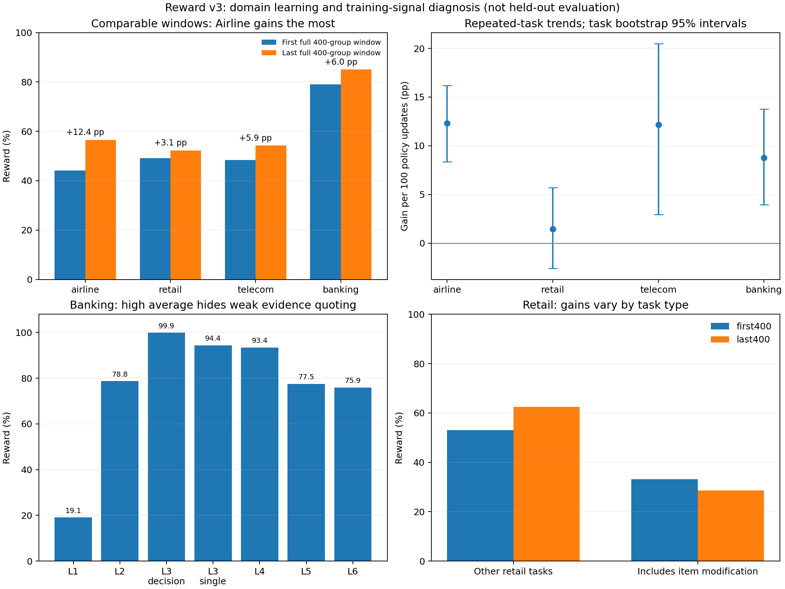

# v3 四领域学习增益诊断

目的：解释 reward-v3 训练曲线中各领域涨幅差异。检查时间2026-09-28；训练24668已 SUCCEEDED，140 updates、iter139。读取完整训练日志、credit 和轨迹元数据：2,593 个完成组、20,744 条最终轨迹；其中2,240组、17,920条实际训练。重复尝试按 group/sample 保留最后记录，未完成组排除；逐组轨迹均值与绘图日志一致。

结论：Airline有明显进步；Banking高均值掩盖子任务差异，并存在无密集信号的困难任务；Retail是最明显的停滞点，包含商品修改能力不足、任务/User/评分目标不一致，以及后期任务构成变化。现有日志不能把这些现象统一归因于学习率或多领域梯度冲突。

## 先统一曲线比较口径

以下比较前400个与最后400个完成组，各领域只计算窗口内本领域组。不是前20个不满窗口的点，也不是被筛选后训练批次的条件均值。

| 领域 | 首窗 | 末窗 | 差值 | 首/末任务组数 | 差值的任务 bootstrap 95%区间 |
|---|---:|---:|---:|---:|---:|
| Airline | 44.13% | 56.49% | +12.35 pp | 179 / 183 | [+4.79,+19.88] pp |
| Retail | 49.13% | 52.22% | +3.08 pp | 101 / 79 | [−8.41,+14.49] pp |
| Telecom | 48.39% | 54.26% | +5.87 pp | 31 / 47 | [−11.88,+22.43] pp |
| Banking | 79.07% | 85.03% | +5.95 pp | 89 / 91 | [−2.24,+14.22] pp |

最左侧 Telecom 的0%只有2组，Banking的96.88%只有4组；启动阶段样本少，且按完成顺序绘制，耗时不同的任务尚未全部返回。因此这两个点不适合作为稳定基线。固定领域权重也没有固定领域内部的任务难度。原图“Official reward”是通用绘图标签，v3运行时已替换部分评分实现；它仍是训练任务指标，不能当作冻结模型的官方 held-out 分数。

进一步对重复任务做任务固定效应拟合：去除每个任务的均值后，用组内轨迹的平均 token-weighted policy version 拟合 reward 趋势，并按任务联合 bootstrap 5,000次。每100次策略更新的斜率分别为：Airline +12.29 pp（95%区间[8.35,16.18]，289个重复任务），Telecom +12.14 pp（[2.96,20.47]，61个任务），Banking +8.76 pp（[3.94,13.75]，152个任务），Retail +1.46 pp（[−2.57,5.70]，163个任务）。这是本次运行的相关趋势，限于重复出现的任务，不能代替受控 checkpoint 评测或因果训练收益。

证据：[各领域汇总](domain_summary.csv)、[去任务难度趋势与训练健康](summary.json)、[非重叠窗口](nonoverlapping_windows.csv)。

## Airline：在学习，不能归入停滞领域

Airline首末完整窗口上升12.35 pp，重复任务校正后也有清晰正趋势。1,142个完成组中，1,061组实际训练，占全部训练组47.37%；任务池占比45.48%，没有明显采样不足。训练覆盖707/1,148个不同任务。

进步尚未覆盖所有任务。全程约16.99%的组全错、20.14%全对；现有140次更新不是每个任务都完整训练过的一轮。不能从最后一小段回落直接推断遗忘或优化器失效。

## Banking：平均分掩盖了信号不足的困难子任务

| 子任务 | 完成组 | 全程 reward | 实际训练组 |
|---|---:|---:|---:|
| L1 证据引用 | 57 | 19.08% | 21 |
| L2 检索 | 20 | 78.75% | 12 |
| L3 决策 | 90 | 99.86% | 1 |
| L3 单动作 | 113 | 94.36% | 85 |
| L4 两技能 | 181 | 93.44% | 142 |
| L5 中等工作流 | 85 | 77.50% | 74 |
| L6 完整工作流 | 28 | 75.89% | 26 |

Banking全程62.89%的组八条都成功，末窗达到70.33%。574个完成组只有361组实际训练，占全部训练组16.12%，低于任务池21.47%。这主要是学习信号随任务类型变化，不代表过滤器遗漏了本应有梯度的组。

L1尤其值得处理：57组中37组全错；其中31组因零信号未训练，另6组虽保留，也没有终局或progress的正向区分，只能依靠格式类惩罚。L1按 COMMUNICATE 评分，没有DB/ENV势函数；[StatePotential](../../../../examples/tau2-bench/rl/progress.py)将这类任务标为不支持，当前组内全0 reward自然产生0 outcome advantage。更多重复采样未必能打破这个循环。

456条L1轨迹中394条没有任何Agent工具调用，只有10条调用KB_search。抽查包含：直接编造存款到账时间；把37,500–375,000的额度范围说成37,500–40,000；对一般政策问题反复查验并不存在的用户身份。任务明确要求逐字引用完整政策，不能把这些错误统一视为合理同义改写。[样本与要求](examples.json)、[完整调用计数](failure_review_counts.json)、[子任务统计](banking_forms.csv)。

因此Banking需要区分已掌握的决策/单动作与困难的证据引用、长工作流。域平均85%不表示所有能力都接近上限，也不说明所有子任务都没有进步。

## Retail：商品修改瓶颈与错误反馈同时存在

600个完成组中598组实际训练，占全部训练组26.70%，高于池占比22.31%；训练覆盖362/563个不同任务。progress可用率100%，按轨迹归一化的progress advantage RMS为0.944，outcome RMS为0.698。credit确实参与了更新；这些RMS不能等同于参数梯度大小。44.31%的已训练组终局八条结果相同，没有组内二元结果区分，需要依靠progress/格式信号。

| Retail任务 | 首窗组数/成功率 | 末窗组数/成功率 |
|---|---:|---:|
| 包含商品修改 | 20 / 33.13% | 24 / 28.65% |
| 其余任务 | 81 / 53.09% | 55 / 62.50% |

商品修改任务占比19.80%→30.38%。把末窗按首窗这两类任务的比例重算，均值为55.80%，高于实际52.22%；构成变化解释了部分表面涨幅小，但商品修改本身仍未改善。这只是两类任务的描述性分解，没有校正类内所有难度。

实际轨迹确认了两种不同问题：

- **操作和目标完成能力不足。** `retail_347`，group2539/sample20316，把两个订单的商品放进同一个修改请求，先后触发商品不存在错误，之后又错误描述库存并改变了用户要的相机配置。`retail_79`，group2513/sample20106，参考目标要求修改3个商品，实际只修改2个。这类错误仍需要学习正确订单、商品、规格之间的对应关系及完整执行多个目标。
- **任务、用户请求和固定参考目标不一致。** `retail_265`，group2569/sample20555，用户第25条消息明确说“please put it all on my gift card”，Agent按要求将两单退到礼品卡，工具允许该选择；固定目标却要求其中一单退回信用卡，最终reward=0、Phi=−1。`retail_541`的用户指令说要修改smartwatch，但known_info和DB对应订单是黑色耳机，用户随后在对话中改变了请求。它同时有Agent未正确选择付款方式的问题，不能把整条失败全部归为数据错误。

336条Retail失败轨迹最终Phi=−1，其中116条（41个任务）在已匹配参考动作的诊断中，唯一不一致参数名是payment_method_id。这是进一步核查的候选集合，不是116条已证实的误判。尤其不能通过全局忽略付款方式来修复：未按用户要求付款也是真实错误。

全程2250条失败中，正常user_stop结束的占多数；只有18条too_many_errors，没有max_steps或agent_error。当前证据更指向最终业务字段、多个目标完成和目标一致性，不能用长度溢出或没进入训练解释。前一轮全量验证检查了数值/JSON等价和黄金动作执行，没有验证所有自然语言目标与用户后续选择的一致性。

证据：[任务类型](retail_task_types.csv)、[商品修改窗口](retail_item_change_windows.csv)、[原始要求和完整对话](examples.json)、[付款方式候选](failure_review_counts.json)。

## Telecom、训练健康与证据边界

Telecom相对旧曲线的抬升包含评分纠错。[旧v1同轨迹重评分](../../tau2-mix-rl-sft4505-reward-v2-20260927/repair_gain_summary.json)在没有训练的情况下从33.12%变为54.43%。v3本次全程Telecom均值为53.16%；这两批轨迹的策略和分布不同，不能据此判断新训练优劣，但不能把跨评分版本的抬升全部算成模型学习。v3内重复任务趋势则支持它确实在改善。

140次更新的loss和grad_norm均有限；梯度范数均值首20步0.621、末20步0.581，范围0.287–1.438。TIS均值接近1，clip fraction最大0.000120。已训练轨迹平均最早策略滞后：Airline2.69、Retail2.56、Banking2.02、Telecom7.17；没有证据表明其他三个领域的低增益主要由更大的异步滞后造成。全局entropy指标下降、参考KL上升，但这些不足以证明领域间梯度冲突或灾难性遗忘。

loss使用按rollout/轨迹归一化的reducer（calculate_per_token_loss=False），不能仅凭Banking回答短，就声称它的梯度贡献按token数成比例缩小。实际信号还取决于保留组、非零advantage和策略梯度方向。当前未测领域梯度余弦或同预算单域对照，不能把多域干扰当成已确认原因。

检查时最终checkpoint评测24757仍在运行；该脚本沿用历史官方评分入口。本文分析的是v3训练轨迹，未修改训练、评分或正在运行的评测，也未提交新作业。

## 后续优先级

1. 先检查Retail任务/User/评分目标的一致性：指定可验证的商品配置与付款偏好，消除目录不匹配和用户自由选择与唯一参考目标冲突。保留真实金额和付款错误的约束。
2. 为Banking证据引用/沟通任务设计基于正确证据和关键事实的训练信号，覆盖当前DB-progress缺失的任务；不能只奖励调用检索工具。解决零方差全错组缺少正确方向的问题。
3. Retail在一致任务上单独比较商品/订单/规格字段credit与当前DB-count信号，同时报告多目标全部完成率。当前密集credit有作用，但未证明足以教会商品绑定和完整完成任务。
4. 用固定任务、同版本环境和相同User评测早/中/晚checkpoint，再决定训练长度、分领域配额和LR/KL。现阶段直接提高学习率或统一增加所有领域预算，证据不足。

复现：[提取脚本](extract.py)、[分析与作图](analyze.py)。原始大文件仅读元数据前缀，抽查对话按文件偏移读取；新产物全部位于本目录。
