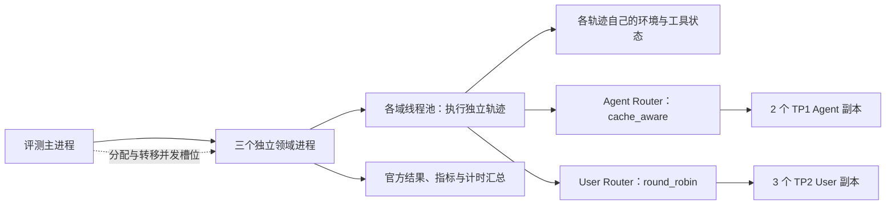

# ServiceAgent 第一部分：异步 benchmark 评测

本部分说明 tau benchmark 怎样评测客服 Agent、初始模型具体错在哪里，以及我们怎样缩短多轮评测的等待时间。内容包括代表性轨迹、代码中的并发实现、主实验配置及结果。2026-09-26 对照当前实现、历史讨论、提交脚本、summary 和所选原始轨迹补充核对；全量轨迹完整性及工具调用数量沿用 9 月 22 日整理时的核对记录。本文也对应简历第一点。

采用的方案是：各领域独立启动评测进程，域内同时推进多条轨迹，共享 Agent 和 User 两类模型服务；某个领域全部完成后，把它的轨迹并发槽位分给尚未完成的领域。根据请求计时和副本负载，又将八张 GPU 调整为两个 Agent 副本、三个 User 副本，并让 User 请求轮流分发。历史三领域 100 tasks × 4 trials 的作业耗时从 **174.26 分钟降至 35.71 分钟，约加速 4.88 倍**，按申请卡数计算的资源占用从 **11.62 降至 4.76 GPU-hours，减少 59.0%**。

这组数字来自 2026-09-01 的旧协议测速。当时 Qwen3.6 User 的工具解析器不匹配，后续才修复并切换到官方原生 Agent 接口。因此，4.88 倍只说明旧配置之间的整体执行时间差，不能作为修复后协议的测速结果，也不能据此判断模型质量。后续原生接口已完成四领域 197 tasks × 4 trials 的评测，见第七节。

项目文档使用 tau3-benchmark 的名称，历史代码和实验目录仍使用 `tau2-bench`，Banking 的环境注册名为 `banking_knowledge`。下文保留代码中的名称，便于查找。本部分只讨论评测；训练期间 rollout 与 Trainer 的重叠执行见[第四部分](04_异步Agentic_RL.md)。

## 1. Benchmark 评什么：任务、工具、环境与评测轨迹

一次客服评测包含被测 Agent、扮演客户的 User 模型，以及执行工具和保存业务状态的环境。一个任务的一次 trial 会生成一条完整轨迹，轨迹内可能经历多次 Agent 回复、工具执行和 User 回复。Agent 与 User 有前后依赖，单条轨迹仍需按对话顺序推进。

这里区分三个计数单位：task 是一个业务任务；trial 是该任务的一次独立运行；trajectory 是这次运行保存的完整对话、工具调用和环境结果。三领域测速采用 Airline 20、Retail 40、Telecom 40 个 test tasks，每个任务运行 4 次，共 400 条轨迹。Agent 为原始 `Qwen3-4B-Instruct-2507`，User 为本地 `Qwen3.6-27B`。这部分测试使用原始模型，后续 SFT/RL 的模型成绩由各自实验说明。

一个任务把信息分给不同参与方。Agent 得到领域业务规则和它能调用的工具；User simulator 得到客户身份、诉求、已知信息及交互要求，再通过对话逐步表达这些信息。环境保存订单、预订、账户或设备状态，并实际执行工具。参考动作和评分条件由评测器读取，正常评测不会直接放进 Agent 的提示。对应实现是 `runner/build.py` 中的 Agent/User 构造函数，以及任务里的 `user_scenario`、`initial_state`、`evaluation_criteria`。[角色与环境构造][runner-build]

| 领域 | 典型任务 | 完成任务要处理的状态 |
|---|---|---|
| Airline | 订票、改签、取消、查询航班 | 预订对应的航段、日期、舱位、价格和支付方式，以及业务规则允许的操作 |
| Retail | 查订单、换商品、改地址、退货 | 用户名下的具体订单、商品规格、订单是否仍可修改、差价退到哪里 |
| Telecom | 恢复信号、移动数据或 MMS | 客户账户、具体手机号对应的线路，以及 User 侧手机设置；常有多个故障同时存在 |
| Banking Knowledge | 查产品条件、比较方案、指导办理 | 检索到的业务文档、客户约束及申请操作；本节使用的 97 个任务另见第三部分 |

任务成功由 `reward_info` 记录。评测器根据该任务的 `reward_basis` 组合需要检查的项，例如最终 DB 状态、环境断言、必须告知的信息或自然语言条件；在本节使用的二值判定下，参与计分的任何一项为 0，整条轨迹就失败。参考工具调用也会产生 `action_checks`，但只有 `ACTION` 被纳入 `reward_basis` 时才直接参与总分。由其他合理调用顺序得到同样的目标状态，也可能通过评测。[评分实现][evaluator]

因此，阅读轨迹要同时看用户要求、工具是否真正执行、执行后的状态和评分字段。User 说“谢谢”或 Agent 说“已经完成”，都不能替代环境结果；反过来，官方 reward 为 1 也只说明该任务实际启用的评分条件通过，不能理解成每一句解释和每个中间动作都经过了全面检查。

下面选取三个任务，各看一条成功和一条失败轨迹，均来自修复 parser 后的原生 full 12279，Agent 都是原始 Qwen3-4B。客户和业务状态是 benchmark 的模拟数据，过程是已保存轨迹的中文概述。`trial` 与 `turn_idx` 均从 0 开始；`turn_idx` 是消息编号，包含 User 和工具消息，不等于 Assistant 回复次数。这六条轨迹用于解释机制，没有按随机抽样估计错误比例。

**Retail：只处理一件商品，不能把整张订单取消。** 用户先问空气净化器何时送达；若尚未发货，希望只取消这件商品，若不支持，则换成最便宜的空气净化器，把差价退到礼品卡。任务 `56` 的订单 `#W4284542` 还包含音箱和手机，初态是 `pending`。[原始任务与轨迹][retail-trajectories]

| 阶段 | trial 0：失败 | trial 1：成功 |
|---|---|---|
| 查询 | 用 `get_user_details`、`get_order_details` 找到正确订单，读到净化器 item `8302289002`，价格 547.55 美元 | 同样找到这件商品及关联的礼品卡 |
| 决策 | 用户只确认取消净化器，Agent 却在消息 16 调用 `cancel_pending_order(order_id="#W4284542", reason="no longer needed")` | 用户在写操作前转而要求更换，Agent 调用 `get_product_details`，选出 473.43 美元的最低价规格 `9534205511` |
| 实际执行 | 返回整单 `cancelled`，2,020.61 美元退回原信用卡。用户指出错误后，Agent 再尝试修改，得到 `Error: Non-pending order cannot be modified` | 说明退款 74.12 美元并得到确认后，消息 20 调用 `modify_pending_order_items`，参数为原 item、新 item 及 `payment_method_id="gift_card_9368765"` |
| 最终状态与评分 | 整单已取消，DB 与目标状态不一致，reward=0 | 只替换净化器，其余商品保留，差价退到礼品卡；DB 匹配，reward=1 |

这里失败的工具调用本身能够执行，问题在于动作范围与用户要求不符。环境中的写操作会影响后面的可选操作，已经取消的订单无法再按原流程修改。本任务还列出 `NL_ASSERTION`，但没有具体断言，因而该项记为 1；两条轨迹的成败由 DB 是否匹配区分。

成功 trial 也受到 User 在写入前主动改述需求的影响，所以这组轨迹说明同任务的不同执行过程，不是只改变一次 Agent 决策的受控实验。task 56 的四次结果为 `0,1,0,0`：单次成功比例为 25%，至少一次成功为真，四次全成功为假。

**Telecom：User 说“已设置”，还要看设备是否真的改变。** 这个任务要求恢复移动数据，并达到 excellent 网速。初态同时存在飞行模式开启、网络偏好为 `2g_only`、移动数据关闭、省流模式开启四个问题。任务 ID 为：

```text
[mobile_data_issue]airplane_mode_on|bad_network_preference|data_mode_off|data_saver_mode_on[PERSONA:Hard]
```

Agent 可以查询运营商账户和线路，手机侧设置则由 User 的工具改变。下面对照 trial 2 与 trial 1。[原始任务与轨迹][telecom-trajectories]

| 阶段 | trial 2：失败 | trial 1：成功 |
|---|---|---|
| 改网络模式 | 消息 62 的 Agent 把 `set_network_mode_preference` 写成普通文本工具标签，`tool_calls=null`；消息 63 的 User 说已改为 4G/5G，但也没有结构化调用 | 消息 23 的 User 实际调用 `set_network_mode_preference({"mode":"4g_5g_preferred"})`；消息 24 有对应工具返回 |
| 查看和修复 | User 后续调用 `check_status_bar`，仍返回 `Poor / 2G / Data Disabled`；虽又开启数据、关闭省流，最后仍是 `Poor / 2G / Data Enabled` | User 实际关闭飞行模式、开启数据、关闭省流，再调用 `run_speed_test` |
| 最终验证 | 移动数据开启断言通过，但 excellent 网速断言失败；正常以 `user_stop` 结束，reward=0 | 消息 50 的测速返回 275.00 Mbps、Excellent，两项环境断言均通过，reward=1 |

本任务的 `reward_basis=["ENV_ASSERTION"]`，要求数据已开启且速度至少达到 200 Mbps、描述为 excellent。评分取决于最终设备状态；参考动作中少一次设置只是诊断证据。失败轨迹还存在 Agent 查错线路等问题，不能把整条失败都归于一个遗漏，也不能把 User 的未执行声明全算成 Agent 单方面的能力缺陷。这个例子说明了为什么多轮工具评测需要复查环境：双方说过什么，与环境实际发生了什么，可能不一致。

**Banking：拿到正确文档后，还要比较条件并完成申请。** `task_006` 中客户年收入 95,000 美元、信用分 540、无 Rho-Bank+ 订阅。客户要求境外交易费不高于 1.5%、最低还款比例不高于 1.5%，并支持虚拟卡管理。两条轨迹都只做了一次 `KB_search`，也都拿到了 EcoCard 的两份关键文档：`doc_credit_cards_ecocard_008` 给出两个比例均为 1.0%、支持虚拟卡；`doc_credit_cards_ecocard_001` 说明没有最低信用分门槛。[原始任务与轨迹][banking-trajectories]

| 阶段 | trial 0：失败 | trial 1：成功 |
|---|---|---|
| 解释检索结果 | 消息 4 把 1.0% 说成高于 1.5% 上限，又忽略 EcoCard 无最低信用分要求，得出没有卡符合条件的结论 | 消息 4 正确指出 EcoCard 的目标条件匹配，并推荐这张卡 |
| 客户后续行为 | User 表示去别处办理，随后结束，没有申请调用 | 消息 5 的 User 调用 `apply_for_credit_card`，参数包括 `card_type="EcoCard"`、`annual_income=95000`、`rho_bank_subscription=false`；工具返回申请已提交 |
| 最终状态与评分 | 未形成目标申请记录，DB 不匹配，reward=0 | 形成目标申请记录，DB 匹配，reward=1 |

这里的成功是正确的申请已经提交，不能写成信用卡已审批通过。此例的失败也不能归结为“BM25 没检索到知识”，因为判断所需的信息已经出现在返回文档里，错误发生在比较和决策阶段。两次 query 和检索顺序并不完全相同；成功 trial 对其他卡的部分文字说明也有不严谨之处。本任务只按 DB 计分，reward=1 不代表整段推荐文字都正确。

这些任务解释了多轮评测的耗时来源：一次 trial 往往需要反复查询、解释、确认、执行和检查结果，工具返回还会改变后续对话。不同轨迹的长度相差很大，因而有必要让多条独立轨迹交错推进。

旧入口按领域串行运行，域内 `MAX_CONCURRENCY=1`。一条轨迹等待 User 时，其他轨迹不能填补 Agent 的空闲时间。两个串行基线分别需要 229.94 和 174.26 分钟，一次模型验证要等待约三至四小时。[基线脚本][serial-script]明确记录了这种执行方式。

可以并行的是不同任务、不同 trial 的独立轨迹。异步评测据此让多条轨迹交错使用模型服务：轨迹 A 等待 User 时，轨迹 B 可以调用 Agent。每条轨迹仍保留自己的环境状态、消息历史和任务结果。

## 2. 实现：共享推理池与两级并发

最终测速配置使用 8 张 GPU。`2 Agent + 3 User` 指五个模型服务副本，其中每个 User 副本使用两张卡。

| 组件 | 配置 | 作用 |
|---|---|---|
| Agent 推理池 | 2 个 TP1 副本，GPU `0;1` | 每个副本独立服务完整的 4B Agent 模型 |
| User 推理池 | 3 个 TP2 副本，GPU `2,3;4,5;6,7` | 每个 27B User 副本跨两张卡执行 tensor parallel |
| Agent Router | `cache_aware` | 按缓存相关策略路由 Agent 请求 |
| User Router | `round_robin` | 轮流分配请求，使三个 User 副本都承担负载 |
| 领域执行器 | Airline、Retail、Telecom 各一个进程 | 独立调用官方 `run_domain`，共享推理服务地址 |
| 轨迹并发 | 初始 `2:2:5`，全局上限 9 | Telecom 获得更多初始并发，已完成领域的槽位可转移 |



一次评测从模型脚本进入 `run_eval.sh`，再进入 `run_eval.py`，最后由 Tau2 runner 执行。代码分工如下。

1. `run_eval.sh` 的 `start_sglang()` 为每个 GPU 分组启动一个模型服务，`start_router()` 分别建立 Agent 和 User 的请求入口。脚本等待服务探测通过后启动 Python 评测，并记录服务启动、评测和清理阶段。领域进程只连接这些服务，不各自加载一份 GPU 模型。
2. `run_eval.py::_run_domain_jobs()` 使用 `ProcessPoolExecutor`，以 `spawn` 方式为各领域启动独立进程。每个进程在 `_evaluate_domain()` 中构造自己的 `TextRunConfig`，传入任务划分、trial 数、模型接口、终止条件和并发配置，再调用官方 `run_domain()`。返回结果按输入领域顺序整理。
3. Tau2 的 `runner/batch.py::run_tasks()` 展开 task/trial 组合，通过 `ThreadPoolExecutor` 运行 `run_single_task()`。每条轨迹独立构造环境和对话状态。同一轨迹中的 Agent、User 和工具执行仍按消息依赖顺序推进；模型请求等待期间，其他轨迹可以继续发出请求。
4. 领域运行结束后，`_evaluate_domain()` 调用官方 `compute_metrics()`，并补充三种成功率、动作和 DB 诊断、请求耗时。父进程汇总各领域结果，写出 summary；完整轨迹由 Tau2 保存到 `data/simulations/`。

因此，这里的“异步”具体是跨领域多进程、域内线程并发，以及模型服务接收交错到达的请求。调度部分没有改写单条对话的业务执行顺序，也没有更换官方任务评分器。代码位置见[评测入口][eval-py]、[服务启动脚本][eval-sh]和[Tau2 runner][batch]。

弹性借槽由父进程和 runner 配合完成。父进程为每个领域创建一个跨进程信号量，初始值分别为 2、2、5；同时把每个领域线程池的 `executor_max_workers` 设为 9。线程启动一条轨迹前先获取槽位，完成后在 `finally` 中释放。这样，领域最初只运行自己的配额，后来拿到更多槽位时，已在等待的线程就能继续工作，不必重建线程池。

只有当一个领域的全部轨迹及领域汇总完成、对应 Future 返回后，父进程才会分出它当前拥有的全部配额。`_allocate_released_slots()` 按剩余领域的初始权重计算新增槽位：先取整数部分，余下的槽位按小数余量从大到小分配，余量相同时按领域输入顺序。它没有根据实时队列长度或单条轨迹剩余时间预测负载。

11878 的实际变化是：

```text
Airline / Retail / Telecom
        2 / 2 / 5     初始分配
        0 / 3 / 6     Airline 完成，释放 2 个槽位
        0 / 0 / 9     Retail 完成，释放 3 个槽位
```

以 Airline 完成时为例，它释放 2 个槽位，Retail 和 Telecom 的初始权重是 2 和 5。理论分配为 `2×2/7`、`2×5/7`，先分得 0、1，再把剩下的一个给余量较大的 Retail，得到 `0:3:6`。Retail 完成时分出的是它当前的 3 个槽位，Telecom 因此可以使用全部 9 个。

转移单位是已完成领域的轨迹配额。正在等待模型回复的轨迹继续持有槽位，不会因为一次请求结束就把配额交给其他领域。因此，这个方案能减轻领域结束后的空闲，但仍可能存在同一领域内部少数长轨迹拖尾。[调度设计][design]

## 3. 主实验配置与重要参数

以下按实际用途列出参数。标为“关键”的配置会直接改变评测协议、轨迹预算或并行方式，比较不同运行时需要明确记录。11878 的数值以[当时的脚本快照][async-script]为准；当前脚本已修复 parser，并默认使用原生 Agent，不能用今天的默认值反推历史运行。

| 类别 | 参数 | 11878 的设置 | 含义及对实验的影响 |
|---|---|---|---|
| **关键：模型** | `MODEL_PATH`、`USER_MODEL_PATH` | `models/Qwen3-4B-Instruct-2507`、`models/Qwen3.6-27B` | 分别为被测 Agent 和固定 User；路径相对于 ServiceAgent 根目录。SGLang 加载 HF 权重，不使用 Megatron 的 `_torch_dist` 目录 |
| **关键：任务预算** | `DOMAINS`、`TASK_SPLIT`、`NUM_TASKS`、`NUM_TRIALS` | 三领域、`test`、空值、`4` | 空的 `NUM_TASKS` 表示使用所选 split 的全部任务，共 `20+40+40=100` 个。非空值取各领域任务列表的前 N 个，不是全局总数，也不是随机抽样 |
| **关键：随机性** | `SEED`、`SGLANG_ENABLE_DETERMINISTIC_INFERENCE` | `300`、`0` | 固定 trial seed 的生成入口；未启用确定性推理。相同 seed 下改变并发和批处理仍可能改变生成轨迹 |
| **关键：采样** | `AGENT_TEMPERATURE`、`AGENT_TOP_P`；`USER_TEMPERATURE` | `0.6`、`1.0`；`0.0` | Agent 保留随机采样，User 用零温度；修改这些值会同时影响成功率、输出长度和运行时间 |
| **关键：生成预算** | `AGENT_MAX_TOKENS`、`USER_MAX_TOKENS` | `1200`、`512` | 限制每次模型回复的生成 tokens，不是整条轨迹的长度上限；不能与训练用的 16,384-token 轨迹上限混用 |
| **关键：终止条件** | `MAX_STEPS`、`MAX_ERRORS` | `200`、`10` | 限制单条 simulation 的交互步数和工具执行错误。`step` 包括向 Agent、User、环境推进的步骤，不能写成“最多 200 次 Agent 回复” |
| **关键：User 行为** | `USER_EXTRA_BODY_JSON` | `{"chat_template_kwargs":{"enable_thinking":false}}` | 关闭 User thinking，避免思考输出占用单次 512-token 预算；它与服务端 parser 配置分别控制生成和解析 |
| **关键：领域并行** | `PARALLEL_DOMAINS`、`DOMAIN_CONCURRENCY` | `1`、`airline:2,retail:2,telecom:5` | 启动独立领域进程，并指定每域初始活动轨迹配额 |
| **关键：借槽** | `GLOBAL_CONCURRENCY`、`BORROW_COMPLETED_DOMAIN_SLOTS` | `9`、`1` | 弹性分支要求初始配额之和为 9，领域完成后将配额分给剩余领域 |
| 回退并发值 | `MAX_CONCURRENCY` | `3` | 只有未显式设置 `DOMAIN_CONCURRENCY` 时才用于各域初始配额；11878 实际使用 `2:2:5` |
| **关键：路由** | `AGENT_ROUTER_POLICY`、`USER_ROUTER_POLICY` | `cache_aware`、`round_robin` | Agent 保留缓存相关路由，User 轮流分发到三个副本；`ROUTER_POLICY` 只是两者未单独指定时的共同默认值 |

服务侧配置决定模型如何使用 GPU，也需要随测速记录保留。

| 参数 | 11878 的设置 | 解释 |
|---|---|---|
| `AGENT_REPLICA_CUDA_GROUPS`、`TP` | `0;1`、`1` | 分号分开副本，每个副本使用一张 GPU，共两个 Agent 副本 |
| `USER_REPLICA_CUDA_GROUPS`、`USER_TP` | `2,3;4,5;6,7`、`2` | 逗号分开同一副本使用的 GPU；每个 User 副本做两卡 tensor parallel，共三个副本、六张卡 |
| `MEM_FRACTION`、`USER_MEM_FRACTION` | `0.85`、`0.90` | 传给 SGLang 的 `--mem-fraction-static`，控制模型服务的静态显存预算比例；不是实测显存利用率 |
| User `--dtype`、`--context-length` | `bfloat16`、`65536` | User 的加载精度与服务上下文长度；后者不同于单次生成上限 512 |
| User `--max-running-requests` | `2`，每个副本 | 限制单个 User 服务中的运行请求数。轨迹可能正在等 Agent、User 或工具，因此它不等于全局轨迹并发 9 |
| User `--reasoning-parser`、`--tool-call-parser` | `qwen3`、旧值 `qwen` | 历史工具 parser 不匹配，后续改成 `qwen3_coder` 并加 `--language-only`，详见第七节 |
| `--show-time-cost`、`--enable-request-time-stats-logging` | Agent/User 均开启 | 记录服务内部耗时，供定位请求负载；正文的客户端请求耗时由另一层计时获取 |

有两个容易读错的地方。其一，`GLOBAL_CONCURRENCY` 在当前代码的弹性分支中参与限流；若关闭借槽，仅使用固定领域并发，代码直接按各域配额执行，没有再加一把全局信号量。其二，启用借槽时各域线程池都可有 9 个 worker，但线程必须先拿到本域槽位；“三个领域各有 9 个线程”不等于 27 条活动轨迹。

seed 也由执行顺序之外的规则确定。`run_tasks()` 用 `config.seed` 初始化随机数发生器，预先生成 `num_trials` 个 seed，再展开 task/trial；同一 trial 编号的各任务复用该 trial seed。调度顺序变化不会重新编号任务或 trial。旧 `/generate` 适配器在[请求参数构造函数][request]里把 `seed` 转为 SGLang 的 `sampling_seed`；当前原生接口通过 Tau2 的模型调用路径传参。

当前底层入口还提供 `MAX_RETRIES=3`，用于轨迹发生基础设施异常后的额外重试，最多尝试四次；正常任务失败不会据此重跑到成功。`SIMULATION_TIMEOUT` 默认留空，表示未另设单条轨迹的墙钟超时。这两项与 `MAX_ERRORS` 的工具错误终止条件不同。模型 wrapper 中部分参数是直接赋值，如 `MAX_STEPS=200`、User parser 和全局并发 9；需要修改这些配置时，应查看 wrapper 本身，不能假设外部同名环境变量一定生效。

## 4. 为什么采用这组配置

主实验保留了四个配置：两种串行基线、第一版固定配额异步，以及最终弹性异步。串行 TP1 的 11723 用两张卡，耗时 229.94 分钟；11728 将 User 改为 TP2，申请四张卡，其中一张预留，耗时降到 174.26 分钟，GPU-hours 却增加。单条 User 请求加快后，跨轨迹等待仍然存在。

第一版异步 11756 在八张卡上使用四个 TP1 Agent、两个 TP2 User，各域固定并发 `3:3:3`，全量耗时降到 52.84 分钟。请求日志显示四个 Agent 副本分别收到 `1/3359/1/3703` 个成功请求，两个“1”只是服务探测；同时 User 请求占累计轨迹时间的 55.68%。这支持减少两个 Agent 副本，把空出的两张卡用于第三个 User 副本。Telecom 最晚结束，固定配额随其他领域完成变成 `0:3:3`、`0:0:3`，因此又给 Telecom 更高初始配额，并加入完成领域借槽。

路由对照使用 45 tasks × 4 trials 的小规模运行。11819 已改为两个 Agent、三个 User 和弹性 `2:2:5`，但 User 仍用 cache-aware，三个副本实际评测请求数为 `1033/1470/0`。11851 仅把 User 路由改为 round-robin，三个副本各收到 784 个成功请求（含一次探测），评测主体从 15.51 降至 13.81 分钟。这是选择 User round-robin 的依据；两次随机生成的总工作量仍有变化，因此 11.0% 是这一次对照的耗时差，不能作为固定可复现的路由收益。

最终 11878 的三个 User 各收到 2,012 个成功请求，扣除探测后合计 6,033 次 User 调用，400 条轨迹全部完成。Agent 请求仍为 `6662/998`，可见 User 分配已均匀，Agent 的分配仍有偏斜。本文采用的是这组已有全量结果的配置，没有证据表明它已是最优并发或最优路由。[完整实验记录][async-readme]

其余探索仅保留影响实现的结论：首次 smoke 11752 因 `/generate` 使用错误的 `seed` 字段导致 12 条轨迹全部成为基础设施错误，修正为 `sampling_seed` 后，11753 完成 12/12；外层评测也补上了基础设施错误的退出码传播。这些小样本用于检查实现，未纳入最终性能比较。旧配置共同存在的 User parser 问题见第七节。

## 5. 性能结果与计时口径

下表为简历数字的完整对照，均为三领域 100 tasks × 4 trials。GPU-hours 使用申请卡数计算。

| 作业 | 申请 GPU 数 | 执行配置 | 作业耗时 / min | GPU-hours | 相对 11728 加速 |
|---|---:|---|---:|---:|---:|
| [11723][s11723] | 2 | TP1 User，串行 | 229.94 | 7.66 | 0.76× |
| [11728][s11728] | 4 | TP2 User，串行；1 卡预留 | 174.26 | 11.62 | 1.00× |
| [11756][s11756] | 8 | 4 Agent + 2 User，固定域并发 | 52.84 | 7.05 | 3.30× |
| [11878][s11878] | 8 | 2 Agent + 3 User，弹性借槽、User round-robin | 35.71 | 4.76 | 4.88× |

计算方式为：

```text
端到端加速比 = 174.26 / 35.71 = 4.88
串行资源占用 = 4 × 174.26 / 60 = 11.62 GPU-hours
异步资源占用 = 8 × 35.71 / 60 = 4.76 GPU-hours
资源占用下降 = 1 - (8 × 35.71) / (4 × 174.26) = 59.0%
```

这里的 GPU-hours 是作业占用资源时间，包含 11728 的预留 GPU；它不等于实际 GPU 忙碌时长、能耗或直接测得的 GPU 利用率。4.88× 是从 4 卡串行配置到 8 卡异步配置的整体收益，包含并发、副本数量和布局变化。相同 8 卡下，11756 → 11878 的作业加速为 1.48×，资源占用再下降 32.5%。

计时分别记录以下四种口径，不能混用：

| 口径 | 11756 | 11878 | 含义 |
|---|---:|---:|---|
| 模型服务启动 | 5.38 min | 5.37 min | 启动 worker、router，等待服务就绪 |
| Python 评测主体 | 47.29 min | 29.26 min | `_run_domain_jobs()` 的墙钟时间，含领域进程启动、评测和域内汇总，不含后续总 summary 写出 |
| Shell wrapper | 52.75 min | 34.68 min | 包含服务启动、评测进程和清理 |
| 作业端到端 | 52.84 min | 35.71 min | 实验记录采用的作业运行口径，另含 wrapper 之外的作业开销，不含排队等待 |

因此，`5.37 + 29.26` 不应直接写成 35.71。Shell 的 `eval_process_start/end` 包住整个 Python 进程，采用整数秒；summary 的计时只包领域执行函数，两者起止位置不同。Job-manager 的状态日志也有轮询粒度。本文沿用实验记录中的端到端数值，并用原始阶段日志核对其量级和含义。

逐请求计时进一步解释了调整依据：

| 指标 | 11756 | 11878 |
|---|---:|---:|
| Airline / Retail / Telecom 域耗时 | 10.43 / 19.18 / 47.07 min | 11.34 / 21.08 / 29.02 min |
| 累计轨迹时长 | 12,841.90 s | 13,600.28 s |
| 有效轨迹并行度 | 4.53× | 7.75× |
| Agent / User 请求累计耗时占比 | 43.99% / 55.68% | 51.42% / 48.24% |
| User 请求 p50 / p95 | 1.17 / 2.69 s | 1.01 / 2.03 s |
| Agent 请求 p50 / p95 | 0.63 / 2.09 s | 0.73 / 2.06 s |

计时在消息和领域两层采集。旧 Agent 在请求前后调用 `perf_counter()`，把秒数写入消息的 `raw_data.tau2_eval_timing`；[TimedUserSimulator][timed-user] 在官方 User 生成函数外做同样的记录，保留原响应。原生 Agent 路径读取消息已有的 `generation_time_seconds`。`_timing_summary()` 遍历各条轨迹汇总这些样本，父进程合并各域样本后重新计算总体 p50/p95，没有直接平均各域分位数。

有效并行度定义为“所有轨迹 duration 之和 ÷ 评测墙钟时间”。领域之间同时运行，域耗时不能相加作为总耗时。请求计时包括客户端调用、服务排队与推理，User 包装层还包含该次生成函数的其他处理，不能直接解释成 GPU kernel 时间。`other` 是每条轨迹 duration 减去已记录 Agent/User 时间后取非负值，再累计得到的余量，包含环境和未单独记录的开销，并非独立测量的纯工具耗时。

从 11756 到 11878，累计轨迹时间反而增加约 5.9%，评测墙钟时间却下降约 38.1%，与提高并行使用程度的解释一致。第一版 User 耗时更大、Agent 副本闲置，支持把两张卡从 Agent 转给 User；Telecom 尾部从 47.07 降至 29.02 分钟，支持借槽方案的整体效果。副本布局与借槽在同一阶段一起变化，现有实验不能分别量化二者的独立收益。round-robin 有同配置 smoke 对照，但也只是一次随机运行对比。

## 6. 结果完整性与成功率的解释

9 月 22 日整理时对四次历史运行的原始 `results.json` 做过核对：各有 100 个任务、400 个唯一 simulation ID，每个任务都有 trial `0,1,2,3`；各次运行的 `(domain, task_id, trial, seed)` 集合相同。每域 summary 的 `infra_error_count` 均为 0。11756 和 11878 分别包含 12,527、13,691 条正数 Agent/User 请求计时。

三个成功率指标在每任务四次试验完整时可直接解释为：

- `pass@1` / `pass^1`：全部轨迹的成功比例。
- `pass@4(any)`：四次中至少成功一次的任务比例。
- `pass^4`：四次全部成功的任务比例，不是将总体 pass@1 直接取四次方。

例如某任务四次结果为 `1,0,1,0`，它对 pass@1 的贡献是 0.5，对 pass@4(any) 是 1，对 pass^4 是 0。代码中的 `_pass_metrics()` 从官方 `reward_info.reward` 读取结果，检查每个已返回任务是否有预期数量的 trials，再计算这三项比例；它不重新设计任务奖励，也没有自动验证所有预期 task ID 都已出现，因此全量完整性还要与任务清单对应。

总体按任务数汇总；在每任务 trial 数相同时，这也等于按轨迹数计算 pass@1，不对领域百分比简单平均。另一个实现细节是，summary 的 `pass_at_4_any` 和 `pass_power_4` 字段名固定，但函数实际使用该次运行的全部 trials。本文只对四次 trial 的 full 运行称 pass@4/pass^4，单次 trial 的 smoke 不应据此解释四次可靠性。下表保留旧协议结果，供核对当时的统计比较，不作为 parser 修复后的模型排名。

| 作业 | pass@1 | pass@4(any) | pass^4 | Action accuracy | DB accuracy | `max_steps` 终止数 |
|---|---:|---:|---:|---:|---:|---:|
| 11723 | 28.00% | 47.00% | 13.00% | 43.97% | 36.46% | 27 |
| 11728 | 27.00% | 50.00% | 6.00% | 43.34% | 37.60% | 25 |
| 11756 | 26.50% | 48.00% | 12.00% | 42.48% | 35.64% | 22 |
| 11878 | 24.75% | 46.00% | 8.00% | 42.94% | 33.51% | 27 |

Action accuracy 按官方正确 read/write action 数除以对应总数计算；DB accuracy 按 `db_match / (db_match + db_mismatch)` 计算，不把未检查 DB 的轨迹加入分母。

[历史实验报告][async-readme]按领域分层、以相同任务配对进行 20,000 次 bootstrap，记录了 11878 相对 11728 的差值及 95% 区间：

| 指标 | 差值 | 95% 配对区间 |
|---|---:|---:|
| pass@1 | −2.25 pp | [−6.00, +1.50] pp |
| pass@4(any) | −4.00 pp | [−11.00, +3.00] pp |
| pass^4 | +2.00 pp | [−3.00, +8.00] pp |

三个区间都包含 0，表示这次样本未检出明确差异；这不等于证明两种执行方式等效，也不能排除所有配置共同存在的协议错误。Agent 采用随机采样，SGLang 未启用确定性推理，并发请求顺序发生变化，固定 seed 也不要求轨迹逐条相同。DB accuracy 仍下降了 4.09 pp，不能概括为“所有质量指标不变”。

作业状态和轨迹结果也需分开读取：11723、11728 在完整结果落盘后遇到 Shell `unexpected EOF`，最终退出码为 2；11752 则恰好相反，轨迹全是基础设施错误，外层仍返回 0。后者促成了 `_require_no_infrastructure_errors()` 的修复。`max_steps`、任务失败等行为诊断继续作为评测结果记录。

## 7. 修复工具解析，接入官方原生接口和四领域

**旧测速配置的协议问题。** 11878 的[提交脚本快照][async-script]明确使用 `--tool-call-parser qwen`。Qwen3.6 User 输出的是 Qwen3-Coder 风格的 `<function=...>` 调用，通用 `qwen` parser 未将这些文本转换成结构化工具调用。

9 月 22 日按相同口径扫描原始轨迹的记录如下：

| 历史运行 | 结构化 User tool calls | 含字面量 `<tool_call>` 的 User 消息数 |
|---|---:|---:|
| 11723 | 0 | 2,486 |
| 11728 | 0 | 2,207 |
| 11756 | 0 | 2,148 |
| 11878 | 0 | 2,651 |

11878 的三个 User-worker 日志分别包含 878、898、875 条 `Failed to parse JSON part`，合计 2,651 条；HTTP 请求仍正常返回，因而没有计为 `infrastructure_error`。这解释了为什么“400 条轨迹完整、基础设施错误为 0”仍不足以证明工具交互正确。旧文档中的统计兼容性结论需要带上这一限制。[Worker 0][w0]、[Worker 1][w1]、[Worker 2][w2]

后续修复将 User 工具 parser 改为 `qwen3_coder`，增加 `--language-only`，保留 `--reasoning-parser qwen3` 和原先的 `enable_thinking=false`。12134 的三领域 smoke 完成 15/15 轨迹，其中 Telecom 有 89 次原生 User 工具调用和 89 条匹配结果，worker 日志没有对应 JSON 解析错误。[修复验证][parserfix]

Agent 也从 `slime_sglang_agent` 的自定义 prompt、`/generate` 传输切换到 `official-native`：使用 Tau2 自带 `llm_agent`、原生 `/v1/chat/completions` 和 `tools`，保留 `assistant.tool_calls`、`role=tool` 及匹配 ID。历史测速使用了官方 runner 和评分器，但 Agent 仍是自定义适配器；“官方 runner”和“官方原生 Agent 协议”是两个不同层次。[当前接口说明][official-readme]

**接入 Banking。** 四领域入口增加 `banking_knowledge`，显式传入 BM25 检索配置；任务配额变为 `20/40/40/97`，共 197 tasks、788 条轨迹。仍采用 2 Agent + 3 User、全局并发 9，初始域配额改为 `1:2:2:4`，已完成领域继续释放槽位。Banking 的数据和任务构造另见[第三部分](03_Banking任务构造.md)。

后续原生 full 的配置与历史测速的关系如下。没有列出的模型、采样、输出长度和终止参数沿用第三节设置。

| 配置 | 11878 历史三领域测速 | 12259 / 12279 原生四领域 full |
|---|---|---|
| Agent 模式 | `slime_sglang_agent`，旧自定义适配器 | `AGENT_EVAL_MODE=official-native`，Tau2 `llm_agent` |
| Agent 请求与历史 | 手工 prompt，经 `/generate` 生成并解析 | 原生 `/v1/chat/completions`，保留 `tools`、`tool_calls`、`role=tool` |
| Agent 工具 parser | 旧适配器负责解析 | SGLang `AGENT_TOOL_CALL_PARSER=qwen`，用于本次 Qwen3-4B |
| User 服务 | `--reasoning-parser qwen3 --tool-call-parser qwen` | `--language-only --reasoning-parser qwen3 --tool-call-parser qwen3_coder` |
| 领域及初始配额 | `airline:2,retail:2,telecom:5` | `airline:1,retail:2,telecom:2,banking_knowledge:4` |
| 全量任务预算 | 100 tasks × 4 trials | 197 tasks × 4 trials |
| Banking 检索 | 未使用 | `RETRIEVAL_CONFIG=bm25`，`RETRIEVAL_CONFIG_KWARGS_JSON` 未覆盖默认检索参数 |

`official-native` 使用 Tau2 的原始 Agent system prompt，不接受旧的 `AGENT_PROTOCOL_PROFILE`。Banking 的 `RETRIEVAL_CONFIG` 会映射到环境构造的 `retrieval_variant`，可选的 kwargs 才会传到 `retrieval_kwargs`。选择 BM25 是本次评测协议的一部分：检索方式会改变 Agent 可使用的工具及其观察到的内容，需要在模型对比时固定。

| 作业 | 协议 / 目的 | 完成情况及结果 | 应如何使用 |
|---|---|---|---|
| 11940 / 11941 | 四领域初次 smoke / full；User 仍用错误 parser | Full 完成 197 tasks / 788 轨迹，基础设施错误为 0，但有 3,691 条 parser 错误 | 仅保留为故障诊断，质量结果无效 |
| 12165 | 修复 User parser 后的四领域 full，Agent 仍为旧适配器 | 788/788；基础设施错误为 0；评测主体 51.85 min，wrapper 57.45 min | 证明修复后的旧 Agent 路径已跑完，不能与原生 Agent 路径混为同一协议 |
| 12239 / 12240 | 原生接口 preflight / 四领域 smoke | 38 项评测测试通过；smoke 12/12 轨迹，基础设施错误为 0，工具调用与返回 ID 匹配 | 原生接口与异步调度联合验证 |
| 12259 | 原生接口四领域 full | 788/788；基础设施错误为 0；pass@1 / pass@4(any) / pass^4 为 19.67% / 30.46% / 10.15%；评测 46.69 min | 结果完整，summary 写出后 wrapper 发生 EOF，作业退出 2 |
| 12279 | 同配置、同 seed 300 重复原生 full | 788/788；基础设施错误为 0；20.94% / 32.49% / 10.15%；评测 43.85 min，wrapper 49.73 min；退出 0 | 四领域完整正常结束的验证记录 |

四领域旧 README 仍有“corrected full evaluation is still required”的未更新文字，但 12165 的[summary][s12165]与[结束日志][l12165]已经存在，本文以完成产物为准。12259 的 wrapper EOF 在[实验记录][native-full]中归因为运行期间编辑了被读取的脚本；12279 的重跑正常结束。

12279 中 Banking 比 Telecom 先结束，配额实际变为 `1:2:2:4 → 0:2:2:5 → 0:0:3:6 → 0:0:9:0`。9 月 22 日的轨迹核对还记录了 12259、12279 分别有 2,266、2,314 次结构化 User 工具调用，与旧测速的 0 次有明确区别。

这些原生 full 的作用是证明评测链路支持四领域和完整重复运行；它们使用原始 4B Agent，不代表后续 SFT/RL 的最终成绩。现有这组记录没有修复后四领域的配对串行测速，不能将 4.88× 外推到该配置。

## 8. 初始 Qwen3-4B 为什么表现不好

2026-09-02 的讨论提出用 Qwen3.5-4B non-thinking 对照原始 Qwen3-4B-Instruct-2507，检查同任务轨迹中缺少的具体能力；9 月 3 日继续按领域解释。对应的[原子能力差距分析报告][atomic-report]保存了输入、逐案例判断和局部重放结果。这里的“原子能力”指完成下一步业务操作所需的具体能力，例如从一组订单中找对商品、根据已知票价选最低价方案，不是额外定义一个总分。

这份分析使用的 Qwen3 两次运行正是 12259、12279，对照是 Qwen3.5 non-thinking 的 12275。它们都使用修复后的原生接口、Qwen3.6 User、四领域任务、seed 300、每任务 4 次 trial 和 Banking BM25；Qwen3 的两次运行是同一评测 seed 的重复，不能称作两个 seed 的平均结果。[输入清单][atomic-inventory]

| 领域 | Qwen3 第一次：成功 / 轨迹数 | Qwen3 第二次：成功 / 轨迹数 | Qwen3.5 non-thinking：成功 / 轨迹数 |
|---|---:|---:|---:|
| Airline | 26/80（32.50%） | 30/80（37.50%） | 64/80（80.00%） |
| Retail | 86/160（53.75%） | 95/160（59.38%） | 131/160（81.88%） |
| Telecom | 30/160（18.75%） | 26/160（16.25%） | 125/160（78.13%） |
| Banking | 13/388（3.35%） | 14/388（3.61%） | 15/388（3.87%） |
| 四领域总体 | 155/788（19.67%） | 165/788（20.94%） | 335/788（42.51%） |

总体低分需要拆开解释。12279 在前三领域成功 `151/400=37.75%`；Banking 只有 `14/388=3.61%`，却占四领域任务数的 `97/197=49.24%`，合并后总体变成 20.94%。Qwen3 在 Retail 已能完成过半轨迹，Telecom 则明显较弱。Qwen3.5 在前三领域达到 `320/400=80.00%`，但 Banking 仍仅 3.87%。Banking 的困难同时影响两个模型，且在总体中权重很大。

这不是完全等预算的模型对照：Qwen3 的 Agent 单次输出上限为 1,200 tokens，Qwen3.5 为 8,192 tokens，局部重放也保留了这一差别。因此，分数和轨迹可以帮助定位问题，但不能把分差全部归因于模型架构，或声称提高输出上限本身没有影响。Qwen3.5 也只是对照模型，其轨迹仍需检查，不能当作标准答案。[Qwen3.5 评测记录][qwen35-native]

分析把三次运行按 `(domain, task_id, trial)` 对齐，共 788 个场景。其中 166 个场景是 Qwen3 两次都失败而 Qwen3.5 成功，413 个是三次都失败，98 个是 Qwen3 两次结果不一致。这种配对固定了任务和 trial 编号，但模型选择不同动作之后，后续 User 回答和环境状态也会变化，所以两条完整轨迹不是只替换一步动作的因果对照。

逐任务分析结合工具参数、环境结果、Qwen3.6 初审和 agent 复核，保留了 197 个任务各自的代表案例。为减少偶然成败的影响，报告另外筛出 43 个差距较稳定的任务：Qwen3 两次共八条轨迹至多成功两次，Qwen3.5 四条至少成功三次。报告中的“高置信”指这条筛选规则，不是统计显著性的名称，也不是人工标注保证。[逐案例判断][atomic-cases]

| 领域 | 这次分析观察到的主要问题 | 怎样理解 |
|---|---|---|
| Airline | 7 个筛选任务中，3 个主要是业务前提检查，2 个是证据使用不足 | 模型能查预订和航班，但查到信息后，仍可能没先判断是否允许取消，或没有比较完整的候选价格。报告中的 task 16 查到了总价 207 美元的组合，却选择了 216 美元；task 24 在取消条件不满足时仍执行取消 |
| Retail | 9 个筛选任务中，3 个主要是实体与状态对应错误，2 个是动作选择错误 | “实体与状态对应”就是把用户说的某个商品，对到正确订单、item ID 和当前订单状态。第一节 task 56 把单个商品的诉求执行成整单取消，随后连原本可行的修改也无法执行 |
| Telecom | 27 个筛选任务中，动作选择和实体状态对应各 8 个；证据不足、目标跟踪各 4 个 | 需要同时区分手机设置、具体线路和账户后台。报告中有任务实际应处理 `L1002`，模型却读取另一条线路，漏掉目标线路已用 15.1 GB、套餐只有 15.0 GB 的状态；修复一项设置也可能留下其他故障 |
| Banking | 没有任务达到上述差距筛选条件；388 个场景中有 360 个是三次都失败 | 两个模型共同困难。代表案例涉及文档检索、产品条件比较、真实用户或卡片信息的获取、申请步骤，但 97 个任务中仍有 72 个主要原因标为 `unclear`，现有证据不能把全部失败归结为某一项 |

这些数量只描述筛选任务或明确注明的场景集合，不能当成整个 benchmark 各种错误的发生比例。它们说明 Qwen3 的问题经常发生在“已经会调用工具之后”：没把当前用户目标、查到的证据、正确对象的状态和业务规则结合起来，作出合适的下一步决定。[任务级分类统计][atomic-stats]

当时还做了一个小规模的前缀重放，用来区分“前面没查到或整理好信息”和“面对已有信息仍选错下一步”。每个领域选 3 个决策点，共 12 个；截取 Qwen3、Qwen3.5 在分歧前各自的历史，把两种历史分别交给两个模型，每个条件采样 4 次，只检查下一步是否可接受，共 192 次局部生成。

| 生成下一步的模型 | 使用 Qwen3 原有历史 | 使用 Qwen3.5 的历史 |
|---|---:|---:|
| Qwen3 | 4/48 可接受 | 15/48 可接受 |
| Qwen3.5 | 17/48 可接受 | 31/48 可接受 |

例如 Banking `task_015`，两个模型在 Qwen3 的历史上都是 0/4；换成已经查询真实用户与卡片状态的历史后，都变成 4/4。这个决策点说明前面获取的证据会影响后续操作。另一些案例即使更换历史，Qwen3 仍不能选对下一步，说明也存在局部决策问题。这些是定向挑选的案例，而且只生成下一步，没有继续运行完整任务；表中比例不是 pass@1，不能解释成 benchmark 总体成功率的提升。[重放实现][atomic-code]、[重放结果][atomic-replay]

初始模型已有基本工具调用和部分业务处理能力，但在多对象、多约束、多故障任务中不够稳定；Banking 则还有两个模型共同未解决的问题。这解释了后续为什么需要检查 SFT 数据示范，以及训练信号是否真的奖励正确动作、参数和最终状态。上述诊断本身没有证明某个训练方案已经有效，训练收益仍要由后续受控评测给出。

## 9. 代码位置、运行入口与证据查找

历史实现和当前代码保留了相同的领域进程、轨迹线程与完成领域借槽设计。`slime` 保存了 9 月 1–2 日的完整历史日志和 summary；本文代码链接指向 `slime-async-tau2`，它还支持覆盖 Agent GPU 分组、接入外部 User 服务和设置 `TAU2_SRC`。这些接入选项未参与 11878 的历史测速。当前代码也有后续维护，不能将两个目录视为逐文件完全相同。

| 文件 | 对应职责 |
|---|---|
| [run_eval.py][eval-py] | 构造 `TextRunConfig`；启动领域进程；解析域配额；分配已释放槽位；聚合官方指标、计时与基础设施错误 |
| [run_eval.sh][eval-sh] | 启动模型副本与两个 Router；等待服务就绪；记录启动/评测阶段；退出时清理服务 |
| [三领域 wrapper][wrapper3] | 设置 2 Agent + 3 User、`2:2:5`、全局 9、借槽、模型采样参数和输出路径 |
| [四领域 wrapper][wrapper4] | 增加 `banking_knowledge`、BM25、`1:2:2:4`，选择 smoke/full 预算 |
| [model_request.py][request] | 旧 `/generate` 路径的 `sampling_seed` 映射；写入请求计时元数据 |
| [timed_user.py][timed-user] | 调用官方 User simulator 后附加耗时，保留原响应和生成行为 |
| [sglang_agent.py][legacy-agent] | 历史自定义 Agent 的 prompt、生成、解析和请求计时；当前原生路径使用 Tau2 `llm_agent` |
| [Tau2 runner/batch.py][batch] | 任务/trial seed 与轨迹执行；支持可选线程池大小和外部信号量，轨迹结束释放槽位 |
| [test_tau2_official_async_eval.py][tests] | 进程隔离、顺序保持、槽位转移、阻塞唤醒、异常传播、seed 映射、计时、原生工具历史和 Banking 配置测试 |

已有验证包括小规模 smoke、三领域全量、路由对照 smoke、四领域原生 smoke/full 和同 seed 重复 full。12239 的原始 preflight 日志记录了当时 38 项评测测试通过，另包含 RL rollout 回归和语法检查；这个数量是历史测试记录。测试覆盖的重点是进程隔离、结果顺序、配额转移后线程继续执行、原生工具调用历史、异常传播和配置传递。真实模型的解析与工具执行还需结合 smoke 轨迹判断。

本次文档更新核对了代码、提交脚本和已有结果，没有重新提交 GPU 实验。现有实验也未分别测出“增加 User 副本”和“借槽”的独立收益，未提供修复后四领域的同协议串行基线。这些是后续若要补齐性能结论所需的对照，不能写成已经完成。

当前 wrapper 已包含 parser 修复并默认使用原生 Agent 接口。直接运行当前代码不会逐项复现 11878 的旧协议；解释历史结果时应查看当时的提交脚本和轨迹 `info.agent_info`，不能仅根据文件名中的 `official` 判断协议。

当前模型 wrapper 和 `run_eval.sh` 的 `PROJECT_ROOT` 默认仍是 `/mnt/afs/users/fush/projects/ServiceAgent/slime`。直接执行 wrapper 时，要通过环境变量选择根目录；经过 `scripts/submit.sh` 提交时，提交器会把选定的项目根目录传入作业。下面显式设置根目录、Agent 模式和结果目录，运行修复后的原生四领域小规模评测，每域 3 个任务、每任务 1 次；本次文档更新没有执行该提交。

```bash
cd /mnt/afs/users/fush/projects/ServiceAgent/slime-async-tau2

bash scripts/submit.sh --experiment tau2-async-eval-recheck --gpus 8 \
  --project-root /mnt/afs/users/fush/projects/ServiceAgent/slime-async-tau2 \
  --env AGENT_EVAL_MODE=official-native \
  --env EXPERIMENT_DIR=/mnt/afs/users/fush/projects/ServiceAgent/slime-async-tau2/output/experiments/tau2-async-eval-recheck \
  examples/tau2-bench/eval/official/models/run_qwen3_4b_qwen36_user_async_four_domain.sh \
  -- smoke
```

全量运行将末尾 `smoke` 改为 `full`，使用 197 tasks × 4 trials。额外参数通过 `--env KEY=VALUE` 传入，不能依赖提交前在本地 Shell 中普通 `export` 的变量。若显式设置 `NUM_TASKS` 或 `NUM_TRIALS`，wrapper 会保留这些预算覆盖，应在结果中核对。若提交新的实验，按仓库约定同步维护实验 README 和 `output/doc/INDEX.md`，并填入实际作业日志链接。

读结果时，先用 summary 的 `agent_eval_mode`、任务预算、领域配额和 `retrieval_config` 确认是哪套协议，再查看 `overall` 成功率、诊断与计时，以及 `concurrency_events` 的实际槽位变化。逐条轨迹路径由 `domains.<domain>.results_file` 给出，相对于 `/mnt/afs/users/fush/projects/ServiceAgent/tau2-bench/`。服务启动参数和副本负载以相邻 worker/router 日志及提交脚本为准；summary 没有完整保存所有服务参数。

| 要核对的结论 | 优先查看 |
|---|---|
| 简历措辞和数字 | resume-photo.tex |
| 串行基线配置与结束状态 | [11728 提交脚本][serial-script]、[11728 run log][l11728]、[11728 summary][s11728] |
| 第一版异步和最终异步的性能、配额变化 | [11756 summary][s11756]、[11878 summary][s11878]、[11878 run log][l11878]、[完整实验记录][async-readme] |
| 旧 parser 的实际配置和失败 | [11878 脚本快照][async-script]、[User worker 日志][w0]，以及 summary 指向的原始轨迹 |
| 修复后的 User 工具执行 | [12134 parser 修复 smoke][parserfix] |
| 四领域与原生接口的完整验证 | [原生 smoke][native-smoke]、[12259 summary][s12259]、[12279 summary][s12279]、[12279 run log][l12279] |
| 初始模型低分的分析 | [分析报告][atomic-report]、[输入清单][atomic-inventory]、[任务分类][atomic-stats]、[局部重放结果][atomic-replay] |
| 第一节案例的完整任务、消息和评分 | [Retail 轨迹][retail-trajectories]、[Telecom 轨迹][telecom-trajectories]、[Banking 轨迹][banking-trajectories]，按正文 task ID 和 trial 定位 |

[design]: ../docs/superpowers/specs/2026-09-01-tau2-elastic-domain-concurrency-design.md
[async-readme]: ../output/experiments/tau2-eval-qwen36-user-async-timed/README.md
[s11723]: ../output/experiments/tau2-eval-qwen36-user-timing/eval/seed300_summary.json
[s11728]: ../output/experiments/tau2-eval-qwen36-user-timing-tp2/eval/seed300_summary.json
[s11756]: ../output/experiments/tau2-eval-qwen36-user-async-timed/eval/full/seed300_0901_045448_summary.json
[s11878]: ../output/experiments/tau2-eval-qwen36-user-async-timed/eval/full-round-robin/seed300_0901_102800_summary.json
[serial-script]: ../output/experiments/tau2-eval-qwen36-user-timing-tp2/jobs/fsh-qwen3-4b-agent-qwen36-user-tp2-timed-0901-095133/run_full_qwen3_4b_qwen36_user_timed.sh
[async-script]: ../output/experiments/tau2-eval-qwen36-user-async-timed/jobs/fsh-qwen36-round-robin-2a3u-full-seed300-0901-182544/run_full_qwen3_4b_qwen36_user_async_timed.sh
[l11728]: ../output/experiments/tau2-eval-qwen36-user-timing-tp2/jobs/11728-qwen3-4b-agent-qwen36-user-tp2-timed-0901-095135970/run_0_20260901_095135970.log
[l11878]: ../output/experiments/tau2-eval-qwen36-user-async-timed/jobs/11878-qwen36-round-robin-2a3u-full-seed300-0901-182544913/run_0_20260901_182544913.log
[w0]: ../output/experiments/tau2-eval-qwen36-user-async-timed/eval/full-round-robin/sglang_user_worker0_32000_seed300_0901_102800.log
[w1]: ../output/experiments/tau2-eval-qwen36-user-async-timed/eval/full-round-robin/sglang_user_worker1_32001_seed300_0901_102800.log
[w2]: ../output/experiments/tau2-eval-qwen36-user-async-timed/eval/full-round-robin/sglang_user_worker2_32002_seed300_0901_102800.log
[parserfix]: ../output/experiments/tau2-eval-qwen36-user-parserfix-smoke/README.md
[official-readme]: ../examples/tau2-bench/eval/official/README.md
[s12165]: ../output/experiments/tau2-eval-qwen36-user-four-domain/eval/four-domain-full-bm25/seed300_0902_021944_summary.json
[l12165]: ../output/experiments/tau2-eval-qwen36-user-four-domain/jobs/12165-qwen36-four-domain-bm25-full-parserfix-textonly-seed300-0902-101805474/run_0_20260902_101805474.log
[native-smoke]: ../output/experiments/tau2-eval-official-native-smoke/README.md
[native-full]: ../output/experiments/tau2-eval-official-native-full/README.md
[s12259]: ../output/experiments/tau2-eval-official-native-full/eval/four-domain-full-bm25/seed300_0902_044845_summary.json
[s12279]: ../output/experiments/tau2-eval-official-native-full/eval/four-domain-full-bm25/seed300_0902_060330_summary.json
[l12279]: ../output/experiments/tau2-eval-official-native-full/jobs/12279-tau2-official-native-four-domain-full-seed300-repeat-0902-135700721/run_0_20260902_135700721.log
[eval-py]: ../examples/tau2-bench/eval/official/run_eval.py
[eval-sh]: ../examples/tau2-bench/eval/official/run_eval.sh
[wrapper3]: ../examples/tau2-bench/eval/official/models/run_full_qwen3_4b_qwen36_user_async_timed.sh
[wrapper4]: ../examples/tau2-bench/eval/official/models/run_qwen3_4b_qwen36_user_async_four_domain.sh
[request]: ../examples/tau2-bench/eval/official/model_request.py
[timed-user]: ../examples/tau2-bench/eval/official/timed_user.py
[legacy-agent]: ../examples/tau2-bench/eval/official/sglang_agent.py
[batch]: ../tau2-bench/src/tau2/runner/batch.py
[tests]: ../tests/test_tau2_official_async_eval.py
[runner-build]: ../tau2-bench/src/tau2/runner/build.py
[evaluator]: ../tau2-bench/src/tau2/evaluator/evaluator.py
[atomic-report]: ../output/experiments/tau2-qwen3-qwen35-atomic-gap-analysis/README.md
[atomic-inventory]: ../output/experiments/tau2-qwen3-qwen35-atomic-gap-analysis/inventory.json
[atomic-cases]: ../output/experiments/tau2-qwen3-qwen35-atomic-gap-analysis/adjudicated_cases.jsonl
[atomic-stats]: ../output/experiments/tau2-qwen3-qwen35-atomic-gap-analysis/atomic_gap_summary.csv
[atomic-replay]: ../output/experiments/tau2-qwen3-qwen35-atomic-gap-analysis/replay_summary.json
[atomic-code]: ../examples/tau2-bench/analysis/atomic_gap_analysis.py
[qwen35-native]: ../output/experiments/tau2-eval-qwen35-official-native-four-domain/README.md
[retail-trajectories]: ../tau2-bench/data/simulations/tau2_official_Qwen3-4B-Instruct-2507-qwen36-user-async_four-domain-full-bm25_seed300_0902_060330_retail_test_4trials/results.json
[telecom-trajectories]: ../tau2-bench/data/simulations/tau2_official_Qwen3-4B-Instruct-2507-qwen36-user-async_four-domain-full-bm25_seed300_0902_060330_telecom_test_4trials/results.json
[banking-trajectories]: ../tau2-bench/data/simulations/tau2_official_Qwen3-4B-Instruct-2507-qwen36-user-async_four-domain-full-bm25_seed300_0902_060330_banking_knowledge_test_4trials/results.json
