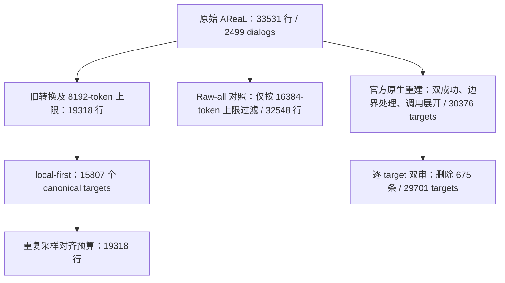

# ServiceAgent 第二项：AReaL 三领域 SFT 数据质量治理

本文对应简历第二点，整理 Airline、Retail、Telecom 的 AReaL SFT 数据治理：数据有什么问题，尝试过哪些筛选方式，为什么调整，以及重训和评测支持什么结论。资料核对日期为 2026-09-22；范围包括简历数字对应的 8 月 local-first 实验，以及后续已经完成的官方原生格式重建和 turn 级复筛。Banking 任务构造属于第三点。

这项工作的核心是把上游对话数据转成适合当前 Agent 的监督样本：区分对话结果与单轮质量，检查工具和参数、Agent/User 能力边界、消息结构、loss mask 与长度，再用模型评审补充业务语义判断，最后通过匹配的 SFT 和官方任务评测决定是否采用。

结果分阶段理解。8 月 local-first 从 2,046 个双成功候选 dialog 中得到 1,863 个 dialog、15,807 个监督 targets；相对旧 SFT，pass@1 提升 5.75 pp、pass@4(any) 提升 13.00 pp，但 pass^4 下降 6.00 pp。9 月的官方原生方案重建出 30,376 个原子 targets，成为后续三领域数据配方的对照基准；在相同的 100-update 无 KL vanilla GRPO 中，Raw-all SFT 初始化发生行为坍塌，Processed 未出现同类格式坍塌，最终两评测 seed 平均 pass@1 为 22.75% / 50.75%。进一步用 Qwen3.8 双审删除 675 个 targets 后，匹配更新数的 SFT 评测反而退步，因此该次复筛未被采用。数据结构更规范、judge 认为更干净、训练后模型更好，是需要分别验证的三件事。

## 1. 数据来源与计数口径

上游文件是 [AReaL-tau2-data/tau2_sft_train.jsonl][source-data]，本地[数据卡][source-card]说明其由 SEA 合成。项目贡献是数据适配、质量分析、筛选和重训验证。

原始一行是“此前上下文 `messages` + 当前 Assistant 输出 `answer` + `metadata`”。同一完整对话按多个 Assistant turn 产生多行，`source_dialog_id` 用于聚合源对话。**33,531 行不等于 33,531 条独立轨迹。**

| 领域 | 原始 SFT 行数 | 去重 source dialog 数 |
|---|---:|---:|
| Airline | 12,842 | 999 |
| Retail | 11,395 | 1,000 |
| Telecom | 9,294 | 500 |
| 合计 | 33,531 | 2,499 |

术语在下文保持一致：dialog 是完整源对话；target 是本行要学习的 Assistant 输出；prefix 是该 target 之前可见的上下文；canonical targets 是未为训练预算重复采样的保留目标。后续“原子 target”进一步要求每行只监督一次工具调用或一段文本回复。

`correct` 和 `reward` 是源数据附带的对话级标签。同一 dialog 内标签一致，但两个字段并不总相同：

| `correct` / `reward` | 原始 dialog 数 | 原始行数 | 筛选时的解释 |
|---|---:|---:|---|
| 1 / 1 | 2,047 | 24,816 | 双成功，允许进入正向 SFT 候选 |
| 0 / 0 | 330 | 6,637 | 双失败 |
| 0 / 1 | 117 | 1,928 | 两个标签不一致 |
| 1 / 0 | 5 | 150 | 两个标签不一致 |

双成功只提供整段任务结果的证据，不能证明每个中间动作都正确或值得模仿。SFT JSONL 也没有为每个 dialog 提供完整可重放的任务 DB 和 evaluator criteria；质量筛选不能声称重新执行并验证了所有源轨迹。

几版数据的关系如下，避免把后续 30,376 个 targets 误认为由 15,807 条扩充而来：



## 2. 旧训练数据暴露了哪些问题

首先检查模型实际训练过的文件，而不是只看上游数据卡。旧 max8192 文件有 19,318 行、2,496 个 dialog，领域分布为 8,783 / 8,595 / 1,940。与原始数据相比，转换形状和长度限制共同排除了 14,213 行，Telecom 只保留了原始行的 20.87%。[确定性分析][det-report]

| 观察 | 证据 | 对训练的影响 |
|---|---|---|
| 失败或标签冲突行进入正向 SFT | 2,507 / 19,318 行来自非双成功 dialog；可见双成功候选为 2,046 dialogs / 16,811 行 | “能转换、能训练”没有保证示范质量 |
| 训练提示存在内部协议冲突 | 输出格式允许 `one or more tool calls`，当时领域 policy 又要求每轮最多一个调用 | 模型同时接收互相矛盾的行为要求 |
| Agent/User 工具边界不清 | 旧格式将工具结果写成 `role=user` 的 `Tool result:` 文本；Telecom 含用户设备侧操作 | Agent 容易混淆客服后端工具与用户手机侧能力 |
| 历史 Assistant 被重复监督 | 19,318 个训练 targets 对应 124,857 次 Assistant turn 暴露，其中同轮 multi 暴露 16,722 次 | 一段历史会随多个 prefix 反复进入 loss，错误或特定调用风格也可能被放大 |
| 只看最长训练 prefix 会漏看完整轨迹 | 412 个 dialog 的最长训练 prefix 看似 single，完整源对话实际含 multi | 不完整视图会改变对调用模式和结局的判断 |

这里有一个容易混淆的名称：保存的 `strict` 转换器检查的是 Assistant 同轮“文本 + 工具调用”混合输出，**当前实现仍保留多工具调用**。这可直接从 [prepare_sft_data.py][prepare-code] 与 [SFT README][sft-readme]核对。不能仅凭文件名 `strict`，就把该文件理解成 single-call 数据。早期转换调整、后来将 multi 直接判为违规的审计，是不同环节。

第一次质量审计沿用了 single-call policy，把 1,883 / 2,496 个可见 dialog 的 multi 模式判为冲突。结合标签和 Qwen3.6 评审后，仅保留 235 个 dialog、998 行，占原训练行的 5.17%；Airline 只剩 31 行，领域覆盖严重失衡。该产物被保留为历史筛选结果，没有直接作为全量训练集替代旧数据。[第一次审计][initial-audit]

这一阶段也检验了 judge 的使用方式：72 个分层样本重复评审的 verdict 一致率为 94.44%，但被挑选去做本地/API 交叉复核的 783 个疑难样本，一致率仅 61.43%。两组样本难度不同，不能把前一个数当作全量判断准确率。显式 thinking 还曾挤占输出预算、导致结构化结果截断，后续修正了该轮评审的生成配置。

## 3. 对 multi-tool 的纠偏：检查依赖，而非按调用数量删除

第二轮采用协议中立分析，分别检查“轨迹含 multi”“错误发生在 multi turn”“批量调用导致错误”。这三个概念不再混为一谈。

在同一批 2,496 个可见 dialog 中，完整源对话含 multi 的有 2,295 个，占 91.95%；Airline 和 Retail 的 non-multi 样本分别只有 5、24 个，不能直接用全局 single/multi 成功率推断调用模式的因果效果。

使用本地 Qwen3.6-27B 与已有外部 `gpt-5.6-luna` 评审，对 689 个 dialog 进行质量复核，其中包括 450 个非双成功 dialog、92 个 single 成功参照和 147 个 multi 成功对照。总体质量差的有效匹配单元为 34 个 anchor，multi − single 为 **+0.005 分（满分 4 分），95% CI [−0.034, +0.045]**；Telecom 的双失败比例差为 **+0.94 pp，95% CI [−7.95, +9.82] pp**。这些结果没有支持“multi 数量本身就是低质量”的筛选假设。[对照报告][multi-report]

失败归因也给出相同方向的证据：341 个含 multi 的非双成功 dialog 中，Luna 将 66 个归为 multi 导致或促成失败，其余包含无关、未知等情况。这是模型对失败集合的归因，不能解释成 multi 的真实因果失败率。[失败分析][failure-report]

据此采用 `dependency-safe-multi`：同轮调用的参数必须在调用前已有依据，调用之间不依赖尚未返回的 observation；写操作须满足用户确认和业务前置条件，且各调用都必要。若第二个动作需要第一个动作的结果，就应等待结果后再执行。训练 system、领域 policy 与该轮评测 profile 一起调整，消除单调用与多调用的提示冲突。

最严格的双评审交集仍只有 69 个 dialog、630 个 targets，分布为 Retail 64 个 dialog、Airline 5 个、Telecom 0 个。它适合作为高置信参考集合，覆盖量不足以替代整个训练集。这推动了后续 local-first 扩展，而不是继续收紧到只剩少量“完美对话”。

## 4. Local-first：将对话级评审落实到 target-prefix 保留

本阶段处理旧训练文件中的 2,046 个双成功 dialog。全量复审使用本地 Qwen3.6-27B，复用已有 Luna 覆盖的 239 个成功 dialog 作为补充否决依据，没有新增外部 API 调用。[筛选实现][local-code]

需要准确区分评审和筛选粒度：**本轮 Qwen3.6 主要对整个 dialog 评审，并给出各 multi turn 的判断；程序再逐 target 检查其 prefix，决定是否输出训练行。**它不是对每个保留 target 单独进行一次完整 LLM 评审。

实际处理包含以下几步：

1. 仅让 `correct=1 AND reward=1` 的 dialog 进入自动候选；失败与标签冲突样本不进入本轮正向 SFT。
2. 检查当前 target 及其 prefix 的工具名、schema、Agent/User namespace 和消息形状。较晚的结构错误不会自动删除它之前的干净 targets；整段语义评审仍判 `drop` 时，也不会仅因早期前缀干净就自动挽救。
3. 对全局业务流程、参数依据、工具选择等使用校准后的 dialog 评审；对 target 前缀中每个 multi turn 检查依赖和必要性。可靠的 `review` 可以在其他条件满足时保留，不把所有不确定项直接删除。
4. 历史消息设 `step_loss_mask=0`，只让最终获准的 Assistant target 为 1。历史仍供模型理解上下文，但不会因出现在多个训练 prefix 中被反复计算监督 loss。
5. 改写 system/policy 后重新用真实 Qwen tokenizer 计算完整长度，超过 8,192 tokens 的整行排除。不能沿用改写前的 token 数，也不通过截掉开头消息勉强适配。

实际数据收敛为：

| 阶段 | Airline targets | Retail targets | Telecom targets | 合计 |
|---|---:|---:|---:|---:|
| 旧训练文件 | 8,783 | 8,595 | 1,940 | 19,318 |
| 双成功候选 | 7,570 | 8,526 | 715 | 16,811 |
| canonical 保留目标 | 7,277 | 8,243 | 287 | 15,807 |
| 对齐训练预算后的行数 | 8,873 | 10,092 | 353 | 19,318 |

canonical 数据来自 1,863 个 dialog：Airline 857、Retail 945、Telecom 61；其中 2,554 个 targets 仍保留 dependency-safe multi。改写提示后的最大完整长度为 **8,190 tokens**，另有 35 个原本可保留的目标因提示改写后超长被删除。[筛选统计][local-summary]

为了与旧 SFT 对齐行数和更新预算，程序将 15,807 个 canonical targets 重复采样到 19,318 行，新增的是 3,511 次训练暴露，不是新的独立样本。Telecom 的预算占比从旧数据约 10.04% 降到 1.83%，这构成必须通过分域评测观察的分布变化。

工程上先后修正了“提示改写后未重算长度”和单服务筛选吞吐不足的问题；最终用八个独立本地 Qwen3.6 服务处理全部候选，并复用已经完成的判断。结果是 2,046 个候选 dialog 均有本地评审、没有 review 调用失败。[运行记录][local-readme]

## 5. Local-first 重训结果与一致性取舍

新模型从原始 Qwen3-4B-Instruct-2507 初始化，使用 19,318 行、2 epochs、batch size 16、学习率 `1e-5 → 1e-6`，训练至 `iter_0002413`。这里对齐的是行数与训练更新预算；target-only mask、提示内容和领域占比发生了变化，不能把结果解释成单独某条过滤规则的因果收益。

评测对 raw、旧 multitool SFT、新 local-first SFT 使用同一配置：官方任务与评分器、`legacy-custom` Agent 适配器、`dependency-safe-multi` profile、v1 STOP User、Airline/Retail/Telecom `20/40/40` 个任务 × 4 trials、seed 300、Agent temperature 0.6、输出上限 8,192 tokens、`max_steps=200`。本次重新读取三组原始轨迹，均为完整 100 tasks / 400 trials，基础设施错误为 0。

| 模型 | pass@1 | pass@4(any) | pass^4 |
|---|---:|---:|---:|
| Raw Instruct | 20.50% | 43.00% | 6.00% |
| 旧 multitool SFT | 21.25% | 41.00% | 10.00% |
| Local-first SFT | 27.00% | 54.00% | 4.00% |

pass@1 为全部 trial 的成功比例；pass@4(any) 为四次至少成功一次的任务比例；pass^4 为四次全部成功的任务比例。

以同任务配对、100,000 次 bootstrap 计算，新 SFT 相对旧 SFT 的结果为：

| 指标 | 差值 | 95% 配对区间 |
|---|---:|---:|
| pass@1 | +5.75 pp | [+0.50, +11.00] pp |
| pass@4(any) | +13.00 pp | [+2.00, +24.00] pp |
| pass^4 | −6.00 pp | [−12.00, −1.00] pp |

这正是简历中两项提升的来源，但同时存在可观测的一致性损失。区间基于这一次生成 seed 的任务重采样，不代表已完成跨训练 seed 的稳定性验证。[完整对照][local-eval]

| 领域 | 旧 SFT：pass@1 / pass@4(any) / pass^4 | Local-first SFT |
|---|---:|---:|
| Airline | 32.50 / 50.00 / 20.00% | 30.00 / 45.00 / 10.00% |
| Retail | 20.62 / 40.00 / 12.50% | 29.38 / 57.50 / 5.00% |
| Telecom | 16.25 / 37.50 / 2.50% | 23.12 / 55.00 / 0.00% |

总体提升来自 Retail、Telecom 的单次成功与任务覆盖；Airline 的三项指标均下降，三个领域的 pass^4 都下降。`too_many_errors / max_steps` 反而从旧模型的 `36/17` 降到 `21/12`，所以一致性回退不能简单归因于更多终止错误。

当时的决定是保留 local-first 广覆盖候选层，**不将该 checkpoint 直接升为唯一默认模型**；提出分域 consistency anchor、第二个评测 seed 和 pass^4 非劣验收要求。`FINAL_RECOMMENDATION.md` 中“20% anchor mixture”写在下一步实验里，现有该实验产物不能证明这项消融已经完成。[当时决策][local-decision]

后续确实完成了另一种边界样本方案：Contract + boundary 将 Telecom 配额恢复为 970 个普通样本、580 个自然交接样本和 390 个工具归属修复样本，并在该分支的 v3 验收条件下被选为 RL 初始化。这里的 anchors 用于明确 Agent/User 工具归属，不能与前述双评审 consistency anchor 配方混称为同一个已验证实验。[边界数据分支][boundary]

## 6. 官方原生格式重建：从源数据恢复可用覆盖

9 月的 `official-native-expanded` 直接从全部 33,531 行源数据重新构建，而不受旧 19,318 行转换结果限制。目标是让 SFT 的提示、工具 schema、消息历史与当前 Tau2 `llm_agent` 运行方式相符。[转换器][native-code]

实现分为两遍。第一遍按 dialog 收集标签、领域和真实工具返回；第二遍仅处理标签一致的双成功 dialog，重建每个 target 的上下文。具体变化为：

| 处理 | 做法与原因 |
|---|---|
| 当前 Agent 提示和工具 | 使用 Tau2 `LLMAgent.system_prompt` 与当前领域 Agent 工具 schema，消除旧文本适配器的表示差异 |
| Agent/User 视图 | 隐藏 User 手机侧调用及其工具返回，保留用户操作后的自然语言报告；缺少必要报告时不构造依赖它的 Agent target |
| 多工具展开 | 按源顺序把一次 `answer` 中的多个调用展开成多个原子 targets，保留合法调用内容 |
| 工具返回配对 | 后续调用的 prefix 插入前一调用和源数据中的真实返回，不自行生成 observation |
| 监督范围 | 一行只监督最终 Assistant target，历史 Assistant、User、Tool 等全部 mask；不监督 reasoning/thinking 字段 |
| 长度 | 在最终原生模板下计算长度；超过 16,384 tokens 的整行删除，保留行不截断 |

例如，源 target 为 `[call A, call B]` 时，展开关系为：

```text
训练行 1：原 prefix → call A                         只监督 call A
训练行 2：原 prefix + call A + 真实 result A → call B 只监督 call B
```

这是格式和执行顺序的适配，不能解释成“看到 multi 就删除”或“模型不再需要学会第二个调用”。对于依赖真实 observation 的后续 target，缺少源返回就不能补造。

构建过程为：

| 阶段 | 数量 |
|---|---:|
| 全部源行 | 33,531 |
| 标签一致且双成功的源行 | 24,816 |
| 展开后的候选 targets | 31,679 |
| 超过 16,384-token 上限而删除 | 1,303 |
| 最终 targets | 30,376 |

最终保留 2,047 个源 dialog，领域 targets 为 Airline 13,783、Retail 13,614、Telecom 2,979；其中 13,979 个文本 targets、16,397 个工具 targets，最长 16,382 tokens。本次重读输出文件确认每行只有最后一个 target 的 mask 为 1，源目标索引没有重复。[构建与验证记录][native-readme]

与 local-first 的 287 个 Telecom canonical targets 相比，新版本恢复了更多可用监督。但来源池、长度上限、表示方式和筛选规则一起变化，不能把增加的覆盖单独归因于某一个因素。

## 7. Raw-all 与 Processed 的官方原生对照

为了区分“做 SFT 的收益”与“数据处理配方的收益”，另建 Raw-all SFT 对照：保留成功、失败及冲突标签，只删除原生 Qwen 渲染后超过 16,384 tokens 的行。Raw-all 不等于未训练的 Raw Instruct。

| 对比项 | Raw-all SFT 数据 | Processed SFT 数据 |
|---|---|---|
| 行数 | 32,548 | 30,376 |
| 来自非双成功 dialog 的训练行 | 8,428，25.89% | 0 |
| 一行的含义 | 一个原始 answer | 一个展开后的原子 target |
| 工具 target 中含 multi | 4,058 / 12,211 | 0 / 16,397 |
| 工具 target 同时含文本 | 1,898 / 12,211 | 0 / 16,397 |
| 当前 namespace/schema 有效调用 | 20,473 / 20,489，99.92% | 16,397 / 16,397，100% |
| 最长保留长度 | 16,379 tokens | 16,382 tokens |

Raw-all 的 target 工具 schema 原本已经有 99.92% 有效，说明单靠 JSON/schema 修复并不能解释主要差异。更大的数据变化是失败标签过滤、上下文和工具归属处理、target 原子化，以及领域占比改变。[数据对照][native-quality]

两模型均从原始 Qwen3-4B-Instruct-2507 初始化，8 GPU、batch 16、2 epochs、训练 seed 1234、cosine LR `1e-5 → 1e-6`。由于数据行数不同，Raw-all 为 4,068 updates，Processed 为 3,796 updates；这是相同训练轮数的配方对照，不是相同更新数或监督 token 数的单因素实验。

评测采用官方原生 `llm_agent`、修复 parser 后的 Qwen3.6-27B non-thinking User、三领域 `20/40/40` 个任务 × 4 trials、seeds 300/301、Agent temperature 0.6、输出上限 1,200 tokens、200 steps。它与第五节的 v1 STOP User、自定义 Agent profile、8,192-token 输出上限不同，**不能把 27.00% 与 55.75% 相减作为这一步的提升**。

| 两个评测 seed 的均值 | pass@1 | pass@4(any) | pass^4 | Action accuracy | DB accuracy |
|---|---:|---:|---:|---:|---:|
| Raw-all SFT final | 53.125% | 82.50% | 23.00% | 74.48% | 46.03% |
| Processed SFT final | 55.750% | 81.00% | 28.00% | 74.76% | 44.12% |

Processed 相对 Raw-all 的 pass@1 为 +2.625 pp、pass^4 为 +5.00 pp，但 pass@4(any) 为 −1.50 pp，DB accuracy 为 −1.91 pp。按同任务内先平均两个 seed、再进行 100,000 次配对 bootstrap，整体 pass@1 的 95% CI 为 `[−2.12, +7.38] pp`，pass^4 为 `[−1.50, +11.00] pp`，都包含 0。[模型对照][native-comparison]

分域结果更具体：Telecom pass@1 提升 9.69 pp，区间 `[+2.81, +17.19] pp`；Retail pass@4(any) 下降 10.00 pp，区间 `[−20.00, −1.25] pp`。因此可确认结构规范化和分域收益，但不能概括为所有指标、所有领域都显著变好。

**后续 RL 对照提供了更强的稳定性证据。** 两个 SFT checkpoint 分别作为 RL 初始化，使用相同训练任务池、Qwen3.6 User、训练 seed 1234、rollout seed 42、每组 K=8、每步五个任务组和 `1/2/2` 领域配额，均运行 100 次 vanilla GRPO 更新。学习率为 `2e-6`，只有二值任务奖励，KL 与 entropy loss 系数均为 0，零方差组保留且 advantage 为 0。这里比较的是 SFT 数据配方留下的初始化差异，并非直接把 SFT JSONL 当作 RL 任务数据。[实验配置][rl-readme]

| 初始化数据配方 / 阶段 | 两评测 seed 平均 pass@1 | pass@4(any) | pass^4 |
|---|---:|---:|---:|
| Raw-all SFT | 53.125% | 82.50% | 23.00% |
| Raw-all + RL iter99 | 22.75% | 42.50% | 12.50% |
| Processed SFT | 55.75% | 81.00% | 28.00% |
| Processed + RL iter99 | 50.75% | 80.00% | 22.50% |

Raw-all 在 iter39 的 seed-300 pass@1 仍为 56.25%，到 iter69 降至 25.50%。逐步轨迹分析显示，update 45 后开始持续复制工具 schema 的 `description/parameters`，缺少真正的 `arguments`；解析后形成空参数调用，随后重复失败。两组都完成了 100 次有限数值更新，没有 NaN/OOM，因此这里的“崩溃”应具体写成工具调用行为与任务性能坍塌。[行为分析][rl-behavior]

Processed 没有同类格式坍塌，最终 pass@1 比 Raw-all RL 高 **28.00 pp，95% task-paired CI [+21.75, +34.38] pp**，两个评测 seed 方向一致。相对各自 SFT，pass@1 降幅分别为 30.375 pp 与 5.00 pp。这支持“该数据治理配方改善了这套 RL 配置下的初始化稳定性”，但 Processed RL 自身也没有超过其 SFT。[最终结果][rl-results]

归因仍有边界：这是一个配对训练 seed、两个评测 seed；筛选、消息重建、调用展开和数据分布共同变化。行为分析还确认当时存在生成原文与进入 loss 的重建序列不一致的问题，因此不能把 Raw-all 坍塌唯一归因于失败样本，也不能将结论外推为原始数据在任何 RL 配置下都必然崩溃。

## 8. 逐 target 双审：筛出了语义问题，但没有赢得重训对照

在 30,376 个 Processed targets 上，进一步使用本地 Qwen3.8-27B 做两轮逐 target 复核，seeds 300/301、`reasoning_effort=xhigh`。本轮每个请求只判断最后一个 `step_loss_mask=1` 的 Assistant target，根据该行可见的 policy、工具 schema、User 信息与 observation 判断，不向 judge 提供源 `correct/reward` 标签。[复筛方案][turn-readme]

判断重点是业务流程、事实与参数依据、工具能力、确认条件和状态结论。历史 Assistant 说过的话不自动当作事实；当前 target 如果正确纠正了此前错误，应予保留。如果目标只是在信息尚不完整时解释条件性方案，也不能误判为承诺该方案已经可执行。

pilot 的主要调整集中在这些真实误判上：

| 版本 | 发现的问题 | 调整方向 |
|---|---|---|
| v1 | 双审接受了“先升舱，再绕过 Basic Economy 禁改规则”的方案 | 按端到端业务流程判断，不能只看单个工具是否能执行 |
| v2 | 把不符合条件的取消当作可提供的替代选项 | 每个被提供的选项都需符合当前已知事实 |
| v3 | 把跨多天的时间差误算成 24 小时内 | 对时间条件明确计算依据 |
| v4 | 把预订对象尚未确定时的条件性说明误删 | 区分已知不可行方案与事实未定时的条件说明 |
| v5 | 128-row pilot 完成，9 个校准案例符合预期 | 进入全量双审，保留既有人工校准结果 |

全量合并仅删除两轮都判 `drop` 的目标，分歧或 `review` 保留；数据按原输入顺序复制，未改写 target。结果如下：

| 项目 | targets |
|---|---:|
| 输入 | 30,376 |
| 最终 `keep` | 29,015 |
| `review`，保留 | 686 |
| 删除 | 675 |
| 训练子集 | 29,701 |

原始 `drop/drop` 有 676 个，因第 23,976 行已有人工“条件性说明应保留”的校准结论，最终保留该行并记为 review，因此实际删除 675 个。删除项中，Airline / Retail / Telecom 为 548 / 107 / 20，文本 / 工具 targets 为 607 / 68。删除主要涉及业务流程与事实问题，而不是已经检查过的 JSON 格式错误。[合并统计][turn-summary]

**利用错误上下文中的有效监督。** 评审显式判断当前 target 与历史错误的关系：依赖错误、纠正错误、与错误无关，或证据不足。本次重新统计 [turn_decisions.jsonl][turn-decisions]，两轮都判 `keep` 且对关系分类一致的目标中，有 23 个 `recovers_prior_error`，以及 69 个 `prior_error_irrelevant`；另有 130 个两轮都判为依赖前文错误且最终被删除的目标。这些是模型评审的一致判断数量，不是人工标注准确率。

例如第 14,336 行来自 `airline_dialog_563`：前面的 Assistant 曾错误建议取消一笔不满足取消条件的预订，当前 target 承认并纠正此前建议，重新解释政策条件并提出转人工。两轮都将该 target 判为 `keep / recovers_prior_error`，没有因为前文存在错误而连带删除正确恢复轮。历史消息只作为上下文，loss 仍只监督当前目标。

这支持“区分轨迹结果与单轮质量，保留含错误上下文中的有效步骤和纠错监督”。但源数据构建仍要求 `correct=reward=1`，上述示例也是双成功对话；已完成产物不能支持“从终局失败轨迹中回收正向 SFT 样本”的表述。终局失败/冲突轨迹已用于失败归因，正向片段回收在早期筛选规范中提出过，未发现同等完整的训练采用证据。复筛子集的整体收益还需看下方重训对照，不能把这些保留数直接归因于基础配方的 RL 提升。

复筛后从同一 raw init 重新做两轮 SFT，并检查 checkpoint 曲线。主对照固定为双方训练到 **3,600 updates**，以避免删除数据后“相同 epoch、不同更新数”的混淆。两组均在 seeds 300/301 上完成 100 tasks × 4 trials，基础设施错误为 0。

| 同为 3,600 updates，两个评测 seed 均值 | pass@1 | pass@4(any) | pass^4 | Action accuracy | DB accuracy |
|---|---:|---:|---:|---:|---:|
| Processed SFT | 55.750% | 84.00% | 25.00% | 74.63% | 43.62% |
| Turn-filtered SFT | 52.125% | 80.00% | 21.50% | 73.00% | 42.31% |
| 复筛后 − 原数据 | −3.625 pp | −4.00 pp | −3.50 pp | −1.63 pp | −1.31 pp |

同为两轮训练的 final 对照和各自选定 checkpoint 的对照也没有逆转结论。**这次 turn 级过滤没有赢得受控数据消融，实验决定保留 30,376-target 的 Processed 数据配方。**这些差值是已有评测的点估计，不额外宣称全部统计显著。[重训对照][turn-eval]

这也限定了 judge 的作用：它能定位具体语义错误，却不能仅凭删除量或双审一致性保证下游收益。当前证据尚不能把退步唯一归因于覆盖下降、示范分布改变或 judge 误判中的某一种原因。

## 9. 已完成的结论、代码与证据入口

这条工作的完整主线是：先还原实际训练数据，发现标签、协议、边界和监督范围问题；纠正按 multi 数量一刀切的筛选；将对话级评审落实到 target-prefix；再从源数据重建当前运行时兼容的原子监督，最后以重训对照检验额外语义筛选是否有用。

对简历第二点，应分别理解以下事实：2,496 是旧训练文件可见 dialog 数；2,046 是其中双成功候选数；1,863 / 15,807 是 local-first 输出的 dialog / target 数；19,318 是重复采样后的训练预算；8,190 是提示改写后的实测最大长度；+5.75 / +13.00 pp 来自第五节的特定评测，同时存在 −6.00 pp 的 pass^4 变化。“提出 consistency anchor 验证”与“完成并证明某个 anchor 配方有效”也应分开表述。

后续的 30,376-target Processed 配方及 29,701-target 复筛实验是另一组完成的证据，不能借用 local-first 的提升来证明它们，也不能只保留后来复筛的删除统计而省略负结果。本文记录既有结论，没有启动新的筛选或训练。

| 代码 / 产物 | 职责或可核对内容 |
|---|---|
| [prepare_sft_data.py][prepare-code] | 旧转换、strict 的实际含义、工具文本表示 |
| [audit_sft_quality.py][audit-code] / [第一次统计][det-report] | 训练可见 dialog、标签组合、领域保留与 loss 暴露 |
| [audit_sft_multitool.py][multi-code] / [协议中立对照][multi-report] | 完整源对话与训练 prefix 区分，single/multi 匹配分析 |
| [build_local_first_sft.py][local-code] / [filter_summary.json][local-summary] | dialog 评审、逐 target-prefix 保留、mask、改写后长度和预算重复采样 |
| [local-first EVAL_COMPARISON.json][local-eval-json] | 三模型对照、配对区间，以及原始轨迹路径 |
| [build_agent_official_native_expanded.py][native-code] | 两遍重建、Agent/User 视图、真实工具返回、原子 target 和独立格式验证 |
| [build_raw_all_sft.py][rawall-code] / [Raw-all 质量对照][native-quality] | 尽量保持源表示的基线，与 Processed 的数据及任务配对分析 |
| [filter_official_native_turns.py][turn-code] / [turn_decisions.jsonl][turn-decisions] | 逐 target 双审、人工校准保留、最终删除与保留决定 |
| [原生 SFT checkpoint 评测][native-curve] / [复筛重训对照][turn-eval] | 完整训练曲线、选定 checkpoint、同更新数与同 epoch 结果 |
| [Raw-all / Processed RL 结果][rl-results] / [行为分析][rl-behavior] | 相同 GRPO 配置下的初始化稳定性、坍塌形态、最终能力与归因边界 |

本次重新统计了原始源文件、旧 max8192 文件、local-first canonical 文件与 Processed 文件；核对了 local-first 原始评测轨迹及后续 native summary。两个仓库中的 local-first 构建、official-native 构建、turn 复筛三个核心脚本内容一致。以上数据、训练与评测均为已有产物，没有将未运行的建议写成完成结果。

[source-data]: ../datasets/AReaL-tau2-data/tau2_sft_train.jsonl
[source-card]: ../datasets/AReaL-tau2-data/README.md
[prepare-code]: ../examples/tau2-bench/sft/prepare_sft_data.py
[sft-readme]: ../examples/tau2-bench/sft/README.md
[det-report]: ../output/experiments/tau2-sft-quality-audit/DETERMINISTIC_REPORT.md
[initial-audit]: ../output/experiments/tau2-sft-quality-audit/README.md
[multi-report]: ../output/experiments/tau2-sft-multitool-quality-audit/COMPARISON_REPORT.md
[failure-report]: ../output/experiments/tau2-sft-multitool-quality-audit/FAILURE_ATTRIBUTION.md
[local-code]: ../examples/tau2-bench/analysis/build_local_first_sft.py
[local-summary]: ../output/experiments/tau2-sft-local-first-relaxed/filter_summary.json
[local-readme]: ../output/experiments/tau2-sft-local-first-relaxed/README.md
[local-eval]: ../output/experiments/tau2-sft-local-first-relaxed/EVAL_COMPARISON.md
[local-eval-json]: ../output/experiments/tau2-sft-local-first-relaxed/EVAL_COMPARISON.json
[local-decision]: ../output/experiments/tau2-sft-local-first-relaxed/FINAL_RECOMMENDATION.md
[boundary]: ../output/experiments/tau2-sft-agent-user-boundary-v2/README.md
[native-code]: ../examples/tau2-bench/sft/build_agent_official_native_expanded.py
[native-readme]: ../output/experiments/tau2-sft-official-native-expanded/README.md
[native-quality]: ../output/experiments/tau2-sft-raw-all-max16384/QUALITY_AUDIT.md
[native-comparison]: ../output/experiments/tau2-sft-raw-all-max16384/FINAL_REPORT.md
[native-curve]: ../output/experiments/tau2-sft-official-native-expanded/CHECKPOINT_EVAL.md
[turn-readme]: ../output/experiments/tau2-sft-turn-quality-qwen38-xhigh-v1/README.md
[turn-summary]: ../output/experiments/tau2-sft-turn-quality-qwen38-xhigh-v1/summary.json
[turn-eval]: ../output/experiments/tau2-sft-official-native-expanded-turn-filtered/CHECKPOINT_EVAL.md
[turn-code]: ../examples/tau2-bench/sft/filter_official_native_turns.py
[turn-decisions]: ../output/experiments/tau2-sft-turn-quality-qwen38-xhigh-v1/reviews/turn_decisions.jsonl
[audit-code]: ../examples/tau2-bench/analysis/audit_sft_quality.py
[multi-code]: ../examples/tau2-bench/analysis/audit_sft_multitool.py
[rawall-code]: ../examples/tau2-bench/sft/build_raw_all_sft.py
[rl-readme]: ../output/experiments/tau2-rl-sft-raw-vs-processed-vanilla-grpo/README.md
[rl-results]: ../output/experiments/tau2-rl-sft-raw-vs-processed-vanilla-grpo/RESULTS.md
[rl-behavior]: ../output/experiments/tau2-rl-sft-raw-vs-processed-vanilla-grpo/BEHAVIOR_ANALYSIS.md
