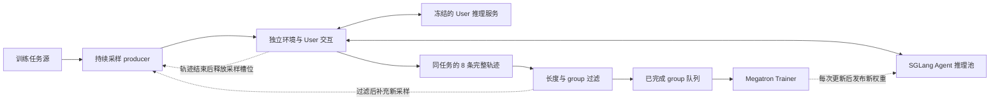

# ServiceAgent 第四项：异步 Agentic RL

本文对应简历第四点，整理训练系统的做法、尝试、修改和结果，核对日期为 2026-09-22。依据两个实现仓库的代码、运行日志和官方评测产物；沿用历史目录名 `tau2-bench`，Banking 的运行时领域名为 `banking_knowledge`。当前项目称 tau3-benchmark。

本步骤把多轮客服交互接入 slime 的 GRPO 训练，在解决长轨迹显存问题后，实现持续采样与 Trainer 更新重叠，再通过环境多进程、数据库缓存和即时补充采样减少等待。最终 Airline 流水线在相同 20 updates 下，采样开始至第 20 次优化完成的耗时由 **370.22 分钟降至 80.46 分钟，提速 4.60×**；该实现随后用于四个领域的独立专家训练。

简历中的数字来自不同阶段：三组学习率各完成 100 updates 属于早期数值稳定性实验；`+5.88/+13.00/+2.00 pp` 属于三领域 Contract + boundary SFT 的 long100 实验；4.60× 属于后来的 Airline 系统优化。它们共同描述本步骤的演进，不能合成“一次四领域异步实验同时获得全部收益”。

另有一处需要按原始日志澄清：[已有汇总][old-overview]把 370.22 分钟的一组称为“无优化同步基线”，但该运行实际为 `tau2_sampling_mode=async`，已经使用 `continuous.Tau2Producer`。因此本文将它称为“优化前异步流水线”。严格同步/异步 20-update 对照只有 **1.060×** 加速；100-update 对照的异步训练进程反而略慢，详见第六、七节。

## 1. 这一步接收什么，解决什么问题

[第一项][doc1]提供官方评测和 Agent/User 推理服务，[第二项][doc2]提供可用的 Agent SFT 初始化，[第三项][doc3]补充 Banking 训练任务及精简后的 SFT 数据。RL 接收的是任务描述、初始数据库和环境，而不是把 SFT 对话文件重新训练一遍：Agent 必须现场与 User 交互、调用工具，再按实际结果获得奖励。

一次 rollout 是一条完整任务轨迹。GRPO 对同一个任务采样 K=8 条轨迹，组成一个 group；一个 optimizer update 消费若干完整 group。早期三领域异步对照每步 5 组，即 40 条；后期 Airline 测速和四领域专家每步 16 组，即 128 条。`iter19` 表示完成第 20 次更新，不能理解成只训练了 19 步。

| 阶段 | 初始化 / User | 训练范围与主要配置 | 回答的问题 |
|---|---|---|---|
| 7 月稳定性扫描 | 旧 multitool SFT / v1 STOP User | Airline；K=8；K2 KL 系数 0.01；三组 LR，各 100 updates | 能否消除 NaN，并控制行为退化 |
| 8 月 boundary long100 | Contract + boundary SFT / v1 STOP User | 三领域；LR=2e-6；turn-credit-v1；K2 0.01 | 修正初始化后，完整训练 100 步能否改善官方能力 |
| 9 月严格 sync/async | official-native-expanded SFT iter3795 / Qwen3.6-27B User | 三领域；batch40；二值 GRPO；KL/entropy=0；TIS；20、100 updates | 调度重叠本身的速度和模型效果 |
| 9 月 Airline 流水线优化 | 旧四领域 SFT iter4673 / 外部 Qwen3.6 User | Airline；batch128；progress-db-count-v1；KL=0 | 如何减少采样、CPU 处理和提交训练的等待 |
| 9 月四领域专家 | 修正后的四领域 SFT iter4505 / 外部 Qwen3.6 User | 四个独立专家；batch128；沿用优化后流水线 | 该系统能否承载四领域训练，各域得到什么效果 |

这些初始化不是同一个模型。特别是历史 boundary SFT、9 月三领域 processed SFT 和最新四领域 SFT4505，不能都简称“当前修正 SFT”后混在一张增益表里。User、Agent 接口、奖励及输出上限也经历过变化，结果只在各自匹配对照内解释。

训练最初面临两个直接问题：多轮交互的长度差异很大，少数慢轨迹阻塞整批训练；工具返回和历史消息不断增长，一条超长轨迹就可能使 log-prob forward OOM。后续又发现，即使推理 GPU 有空余，单进程环境处理和 group 补充方式仍会让 Trainer 长时间没有数据可用。

## 2. 异步训练怎样工作

实现建立在 slime 已有的 Megatron、Ray 和 SGLang 组件上。项目增加的重点是 Tau2 持续采样 producer、任务池、按 Agent 调用边界同步权重，以及真实采样 token 与训练数据的对齐。[训练入口][train-code]、[producer 实现][producer-code]



Producer 持续推进多条独立对话。某个 group 完整且通过过滤后，进入 ready 队列；Trainer 收齐本次所需组数就开始计算，其他轨迹仍在生成。后期无限 lag 模式按 group 完成顺序消费，不预先把任务绑定到固定 batch。

严格同步对照也使用同样的 producer、推理并发和任务池，但在 Trainer 计算期间暂停环境初始化与交互步骤。异步模式取消这个训练期暂停。因此对照的“同步”不是单线程 rollout，而是采样与训练之间有屏障。

权重更新仍有必要的短暂停顿：先禁止新的 Agent 请求并等待已进入的 Agent 请求结束，再应用新权重、刷新 Generator KV cache，最后发布新版本并恢复请求。异步模式下的 User 请求可以继续。这样一次 Agent 生成不会在中途换权重，但一条跨多个回合的长轨迹可以包含不同策略版本。

实际部署及资源范围如下：

| 部署 | Trainer | Agent Generator | User | 总资源口径 |
|---|---|---|---|---|
| 严格三领域 sync/async | 2 GPU，TP2 | 2 个 TP2 副本，共 4 GPU | 本作业内 1 个 TP2 副本，2 GPU | 每臂共 8 GPU |
| 后期 Airline 优化 | 2 GPU，TP2 | 3 个 TP2 副本，共 6 GPU | 独立服务，2 个 TP2 副本，4 GPU | 训练作业 8 GPU，另有 4 GPU User |
| 最新四领域专家 | 两个 8-GPU 训练作业，内部同上 | 随训练作业部署 | 两作业共享 4-GPU User | 并行运行时共申请 20 GPU |

后期还使用四个 CPU-only Ray 环境进程，将 Agent admission 总上限 48、环境 step 总上限 160 分配给各进程。GPU 副本数、HTTP 并发、环境并发和 K8 group 数是不同层次的参数，增加其中一个不会自动增加其他层的供给。

## 3. 长轨迹 OOM、完整上下文与真实采样 token

**OOM 的根因。** slime 按 `max_tokens_per_gpu` 做 microbatch 装箱，但单条样本超过上限时仍会单独形成一个超大 microbatch。log-prob forward 先生成完整的 `[T,V]` logits，T 是序列长度，V 是词表大小；少量长对话就能触发显存不足。降低 microbatch 总预算不能约束这个单样本例外，`log_probs_chunk_size` 也只分块后续 softmax 计算，不能消除已经生成的完整 logits。[当时的定位与修复记录][rl-readme]

旧 `_limit_training_context` 曾通过丢弃开头消息缩短输入。这样会把在完整历史下生成的答案，放到另一段上下文下计算概率，改变训练所对应的条件分布。修复采用完整对话保留和重新采样：

1. 将 `TAU2_RL_MAX_TRAIN_TOKENS` 与 `max_tokens_per_gpu` 对齐为 16,384。
2. 只重采样超长的那条轨迹，最多额外重试两次；同组其余可用轨迹先保留。每次重试重新创建环境和 User 状态。
3. 重试后仍超长，或没有可训练的 Agent 输出时，丢弃整个 group 并补组，保持 K=8。超长样本的内部零 loss 占位只用于传递无效状态，不作为训练数据。
4. 推理服务返回上下文溢出时也进入同一重试流程，不能把溢出前残留的短前缀当作一条完整有效轨迹训练。

上限约束的是完整对话和实际进入 forward 的 segment 长度。当前 raw-token 路径取二者的最大值进行检查；一条轨迹有多个重复完整前缀的 segment 时，不把它们的长度总和误当作一次 forward 的长度。[rollout 实现][rollout-code]

**异步版本进一步记录真实行为。** 只把最终消息重新套模板，还不足以恢复真正采样时的序列：工具调用解析、JSON 重排和消息重建都可能改变文本。当前 Agent 请求直接发送 token IDs，并保存每回合的实际 prompt IDs、输出 IDs、逐 token behavior logprob、结束原因和策略版本。训练保留模型实际采到的终止 token；User、Tool 和框架插入内容的 loss mask 为 0。[Agent 请求实现][agent-code]

相邻回合只有满足“下一次实际 prompt 以此前 segment 的全部 tokens 为精确前缀”时才合并，否则保留独立的完整 prompt + output。合并只减少重复前向，不改写输入。一个 smoke 中，1,314 个 Agent 回合合为 130 个训练 segments，输入 token 暴露由 9,008,335 降到 1,097,492；这是该 smoke 的前缀复用统计。[token 与 segment 实现][tokens-code]、[smoke 记录][async-readme]

GRPO 先在原始 K=8 条完整轨迹上计算组内 advantage，再展开训练 segments。多个 segments 共享原轨迹标识，并按整条轨迹的有效 mask 总量归一，避免一条轨迹仅因拆成更多 segments 就得到更大 loss 权重。[数据转换实现][ray-rollout-code]

简历中的“全对话 on-policy tokenization”应解释为：保留产生行为时的完整上下文及真实输出，避免截断、重新序列化造成训练错配。**异步训练允许策略滞后，并非所有 token 都由本次最新策略生成。** 真实 token 对齐与策略新鲜度是两个问题。

后者通过策略版本诊断及 TIS 处理。记实际生成策略为 behavior，更新前训练侧重算概率的策略为 prox，当前优化中的策略为 current：

```text
TIS 权重 = stop_gradient(min(2, exp(log π_prox − log π_behavior)))
PPO ratio = exp(log π_current − log π_prox)
```

两层比率分别处理采样/训练概率差异和本次 PPO 更新；TIS 权重截断并停止梯度。[loss 实现][loss-code] 它提供 token 层的滞后修正，不能据此宣称任意旧轨迹已恢复成严格 on-policy 数据。

## 4. 数值稳定性与 group filtering 如何演进

早期 Airline 使用 LR=1e-5、`low_var_kl`，在约 step49–71 出现 KL 升高、任务奖励归零、截断率约 60% 和 backward NaN。后续改用 K2 KL、系数 0.01、entropy=0，同时加入 field reward、行为惩罚及 shaped-zero-variance group replacement，再扫描 `2e-6 / 3e-6 / 5e-6`。[扫描记录][stability]

K2 在代码中为 `0.5 × (log π − log π_ref)²`；`low_var_kl` 则包含指数项。改用 K2 去掉了这一指数计算路径，但该轮同时改变了 LR 和奖励配方，没有独立的“只改 KL estimator”消融。

| LR | 100 updates | 最后 10 步 K2 均值 | 最近 384 条轨迹的重复调用数 / 轨迹 | 官方 pass@1 / pass@4(any) / pass^4 |
|---|---|---:|---:|---|
| 2e-6 | 完成，无 NaN/Inf | 0.0593 | 0.211 | 25.50 / 49.00 / 7.00% |
| 3e-6 | 完成，无 NaN/Inf | 0.1604 | 0.247 | 23.50 / 47.00 / 5.00% |
| 5e-6 | 完成，无 NaN/Inf | 0.3443 | 2.557 | 18.50 / 39.00 / 3.00% |
| 对应旧 multitool SFT | 未做本轮 RL | — | — | 23.25 / 46.00 / 8.00% |

训练为 Airline-only；官方评测覆盖三领域 100 tasks × 4 trials，seed300、相同 v1 STOP User、Agent temperature=0.6。5e-6 的重复调用由初期 0.135 升到 2.557，说明“无 NaN”不能等同于行为稳定。2e-6 相对 SFT 的 pass@1 仅 +2.25 pp，95% CI 为 [−2.84,+7.34] pp，pass^4 还下降 1 pp。因此简历的“三组均稳定完成”应收紧为“三组均无 NaN/Inf 完成 100 updates，较小 LR 的行为更稳定”。[官方结果][stability-eval]

稀疏二值奖励还带来另一种低效：同任务八条轨迹全部成功或全部失败时，组内奖励相同。基本 GRPO 的 `Aᵢ=(rᵢ−mean(r))/(std(r)+1e-6)` 为 0，无法提供该组的相对策略梯度。过滤策略随实验目的改变：

| 实验 | 零方差 / 全同结果组的处理 | 原因与影响 |
|---|---|---|
| 早期 field reward | 按 shaped reward 判断；二值结果相同但细粒度分数不同的组可保留 | 利用工具、参数和状态差异提供训练信号 |
| 严格 sync/async 二值 GRPO | 保留零方差组，advantage=0 | 两臂共同固定算法配置，比较执行方式 |
| 后期 Airline / 四领域专家 | 显式排除官方结果全 0 或全 1 的完整 K8 组 | 让训练 batch 包含成功与失败；另保留过滤前统计 |

超长且重试失败的组始终移除。当前过滤器还区分具体 credit 配方的局部信号，不能仅凭函数名推断所有阶段都使用同一规则。[过滤实现][filter-code]

动态 filtering 通过继续采样补满有效 batch，会增加实际生成成本，并改变训练数据分布。所以上报 accepted reward 时还保留过滤前成功率、过滤原因、重试数和未使用组数。后期进度奖励及因果 turn advantage 的具体设计归入简历第五点；这里记录它们怎样影响采样供给和系统开销。

## 5. 从持续采样到真正缩短等待：尝试与修改

**先处理策略 lag 与长尾。** 最初用 earliest-turn lag≤1：只要一个未完成组已经包含旧版本的 Agent 输出，就优先等待并消费它，以免继续更新后越过 lag 上限。严格 20-update 异步实验中，lag wait 为 2,039.32 秒，占训练循环 69.32%；Trainer 计算只有 514.06 秒。已有 2,590 次 Agent 请求、1,533 次 User 请求与训练重叠，仍然会被少数长组拖住。[等待分析][wait-report]

后续实现 unlimited lag，移除未完成旧组的阻塞条件，按已完成组顺序训练。首次修改仍残留旧组屏障和补充限制，经用例复现后修正。固定 8 GPU 的 job 18434 完成三个 20-update 配置，原始日志给出的训练进程耗时如下：

| 配置 | 训练进程秒数 | 相对 pool10 / lag1 |
|---|---:|---:|
| pool10，lag≤1 | 3,222 | 1.000× |
| pool10，不设 lag 上限 | 2,675 | 1.204× |
| pool20，不设 lag 上限 | 2,674 | 1.205× |

该轮放宽 lag 后约快 20%，把 pool 从 10 加到 20 则几乎没再缩短时间。两种 unlimited 配置的 seed300 官方三领域结果分别为 `55.25/79.00/30.00%` 和 `53.75/80.00/24.00%`，没有显示增大 pool 能同步改善三项质量指标。[三臂日志][lag-log]、[pool10 评测][lag10-eval]、[pool20 评测][lag20-eval]

**再定位为什么更多 Generator 仍吃不满。** 后期把 User 移到外部，训练作业内增加到三个 TP2 Generator，但 Trainer 仍长时间等数据。21033 的 51,530 次 Agent 请求中，客户端平均 17.751 秒，SGLang 服务内平均 0.614 秒、服务端排队约 0.013 秒。客户端与服务端差值包含 admission、CPU、HTTP 和传输，不能全部归因于 GPU。

单进程探测进一步提供了 CPU 证据：554 个线程只用约 1.2 个 CPU 核；一次 GIL profile 中，DB 展开、Pydantic 序列化和状态比较占采样 Python 执行的 94.4%。大量线程不能让这些 Python 运算同时跑满多核。[采样诊断][sampling-report]

| 发现 / 尝试 | 实际改变 | 结果与取舍 |
|---|---|---|
| 每个 Agent 决策重复序列化同一 DB | DB-count 和 potential 共用一次 snapshot；只读步骤复用 snapshot/score，写工具执行前失效；自定义 `sync_tools` 保持重新计算 | 减少重复 Python 工作；既有测试对照了重新计算与缓存结果 |
| 每条轨迹重复从共享盘读大 JSON；同任务并发重复构造 reference DB | 缓存 Airline/Retail 不可变 JSON bytes，再分别创建可变 DB；同进程内首次构造 reference 时加锁，缓存容量 32→64 | 保留轨迹间独立状态；8 个并发请求的本地 reference 构造示例由 8 次变成 1 次 |
| 完成组要等 Trainer 消费后才能释放容量 | 先改为完整组就绪即释放活动组槽位，再细化为单轨迹结束即释放容量 | 后期最多 256 条未完成轨迹、64 个未完成组；训练仍等待每组完整 K8 |
| 最后一批被未完成的旧组占住预算 | 只在 ready 组加正在训练组足够覆盖剩余预算时停止补充 | 减少收尾强制等待；同时记录多生成但未使用的样本 |
| cache-aware 下多个 Agent 副本负载不均 | 改用 round-robin；修正实际 CLI 为 `--router-policy` | 起初错误参数未生效，运行时核对后纠正；最终三个 Generator 的利用率接近 |
| 并发限制未随三个 Generator 调整 | Agent/HTTP 总上限 32→48，step 上限 80→160 | 减少上游排队；仍需处理 CPU 瓶颈 |
| 单进程 GIL 限制 DB 与 reward 计算 | 将环境、User orchestration 和 reward 分到四个 CPU-only Ray 进程 | 探测的总 CPU 利用约 121%→407–420%；训练 GPU 拓扑不变 |
| HTTP 响应异常长时间持有 Agent gate | 先补充 ReadTimeout 的单次新连接重试；再将 Agent HTTP timeout 600→60 秒并传入所有 worker | 前一长跑多次出现 168–500 秒同步停顿；重跑的最大权重同步为 28.68 秒 |
| 随机重复抽到无信号任务 | shuffled deck 遍历；确认全 0 后，等待两个新策略版本再重新生成完整 K8，与新任务交替 | 改变任务采样分布，不能只算工程调度变化；最终用官方评测选择 |

最后一行的 retry 是重新生成轨迹，不重放旧 rollout。它与“超长轨迹最多两次重试”是不同机制：前者在完整组过滤之后等待策略更新，后者在当前单条轨迹的生成过程中处理长度限制。[任务源实现][task-source]、[DB 加载][env-code]、[进度计算与缓存][progress-code]

曾分析过提前筛组：先完成的四条若全部成功或全部失败，就终止剩余四条。对历史 507 个 K8 组重算后，这会误删 **97/320=30.31%** 的有效混合组，其中很多最后只有 1/8 成功或 7/8 成功，恰好包含组内学习信号。因此最终仍等待完整 K8，不启用前四条硬过滤。[提前筛选统计][prefix-analysis]

实施过程先用四步 probe 验证供给和训练闭环，再做长跑。四步测得 94.26→15.84 分钟，但任务顺序和保存频率不同，只作为诊断。第一次 30-step 运行因长 HTTP 等待在 18 步停止；修正 timeout 后的 job 21168 完成 30/30，138 项 preflight 通过，全部 loss 与梯度范数有限，iter9/19/29 保存完成。这次长跑才提供第六节的 4.60× 结果。

## 6. 速度结果：分别报告调度对照和流水线优化

**严格同步/异步对照。** 20 updates 的两臂均从同一 processed SFT 初始化，每臂接受 100 个 K8 组、800 条轨迹；相同 8 张 H100 80GB、User32/HTTP80、pool10/lag≤1、二值奖励、TIS、LR=2e-6、KL=0。

| 计时项 | 同步 17907 | 异步 17908 |
|---|---:|---:|
| 端到端，秒 | 3,614 | 3,408 |
| 训练循环，秒 | 3,146.7 | 2,941.9 |
| Trainer 计算，秒 | 509.3 | 514.1 |
| ready + lag wait，秒 | 2,448.1 | 2,200.1 |
| 实际接受组：Airline / Retail / Telecom | 58 / 30 / 12 | 59 / 32 / 9 |

端到端提速 `3614/3408=1.060×`，节省 206 秒、5.70%。此口径从 User 初始化之前开始，到训练及 checkpoint 完成为止，不含安装、preflight、排队和官方评测，包含运行内重试。虽然共同配置匹配，实际任务组成、轨迹长度和重试不同，只有一对训练运行。[效率报告][sync20-speed]

后续 job 18009 实际完成两臂各 100 updates。此次重读两份阶段日志，`tau2_training_process` 分别为 **16,165 / 16,544 秒**，即 **269.42 / 275.73 分钟**；按同步/异步计算为 **0.977×**。训练循环本身也由 15,880.08 增至 16,259.42 秒。这是训练进程计时，起点在 User 服务启动之后，包含训练进程初始化，不能与上表含 User 初始化的端到端秒数直接混用。它表明该 lag≤1 配置的短跑提速没有在这一对 100-step 运行中保持。[同步 100 日志][sync100-log]、[异步 100 日志][async100-log]

**后期 Airline 系统优化。** 主对照为旧异步运行 21033 与四环境进程运行 21168，均使用 SFT4673、LR=2e-6、batch128/K8、progress1、Trainer2+Generator6、相同外部 User 和无限 lag。两者运行日志明确都是 `sampling_mode=async`。前一组已经包含 round-robin、部分 reward cache 和并发调整；4.60× 不能再单独归功于这些既有功能。[旧运行日志][slow-log]、[新运行日志][fast-log]

| 匹配窗口 / 指标 | 优化前异步 | 优化后异步 |
|---|---:|---:|
| 前 20 updates，分钟 | 370.22 | 80.46 |
| 稳定 17 updates，分钟 | 311.66 | 65.09 |
| 平均 batch ready 等待，秒 / update | 868.65 | 142.63 |
| ready 日志至 Trainer 启动，秒 | 133.95 | 0.85 |
| Trainer 计算，秒 / update | 81.85 | 82.57 |
| Trainer GPU 平均利用率 | 7.22% | 33.73% |
| Generator GPU 平均利用率 | 21.54% | 76.22% |

第一行由原始 JSON 的 `22213.492456 / 4827.536633` 秒换算，提速 **4.6014×**，耗时减少 **78.3%**。稳定窗口采用零基 update1–17，排除旧运行的首步和末两步，得到 4.79×。[速度 JSON][speed-json]

这两个窗口从首次采样入池计时，截止相应 optimizer completion；包含窗口内采样、重试、同步和中间 checkpoint，**不含模型启动及窗口之后的最终保存/清理**。阶段计时有重叠，不可逐列相加；ready 时间戳精度为秒，0.85 秒是近似边界差值。GPU 利用率来自每 5 秒采样，覆盖 8 张训练作业 GPU，不含外部 4 张 User GPU。

完整新运行的 30 updates 从采样开始到最后一次优化共 **124.19 分钟**，调度器记录的作业启动至结束为 **135.48 分钟**。最后十步平均 4.37 分钟/步，说明收益持续到短 probe 之后。30 步实际训练 480 组、3,840 条轨迹；共完成 915 组，425 组被过滤、490 组保留，其中 10 组未训练，另有未完成组产生的记录。[长跑报告][speed-report]

这组速度收益主要来自减少环境处理和供给等待，单步 Trainer 计算几乎不变。但任务顺序、重试调度和实际生成量同时变化，所以它是固定更新预算的系统对比，不是固定所有生成样本的单因素实验，也不据此外推“所有领域都快 4.60×”或按比例推算已完成的 GPU-hours 节省。

## 7. 官方效果对照：提速、可训练和能力提升各自得到什么证据

本文 `pass@1` 为全部 trial 的成功比例，`pass@4(any)` 为四次至少成功一次的任务比例，`pass^4` 为四次全部成功的任务比例；多领域整体值按任务数加权。pp 表示百分点。训练 reward 曲线不代替这些留出评测。

**Contract + boundary long100。** 简历的 `+5.88/+13.00/+2.00 pp` 来自这一历史三领域实验。其 SFT 已处理 Agent/User 工具边界；先前 iter9 因截断、格式和执行错误等诊断被停止，后续从相同 SFT 新开 optimizer/root，再在新运行内部续训到 iter99。保留 LR=2e-6、K2=0.01、K=8、turn-credit-v1、训练 max_steps=60 和 v1 User；三个阶段的领域组配额为 `3/2/1 → 3/1/2 → 2/2/2`。

| 两个评测 seed 的均值 | pass@1 | pass@4(any) | pass^4 |
|---|---:|---:|---:|
| 对应 Contract + boundary SFT | 23.625% | 43.50% | 8.50% |
| 历史 boundary RL iter9 | 25.25% | 50.00% | 9.00% |
| boundary long100 iter99 | 29.50% | 56.50% | 10.50% |
| iter99 − SFT | +5.875 pp | +13.00 pp | +2.00 pp |

评测为 seeds300/301，各 100 tasks × 4 trials、相同协议、temperature=0.6、max_steps=200。三个领域的平均 pass@1 均提高，两 seed 的 pass@1 和 pass@4(any) 都超过 SFT 与 iter9，满足当时预设的 `win` 规则；所有整体 pass^4 配对 CI 仍包含 0。它支持这条训练配方的能力收益，既不是四领域 SFT4505 的结果，也没有同源同步/异步对照来分离调度贡献。[long100 记录][boundary100]

**同源 processed SFT 的 sync/async 对照。** 20-step 对照的官方评测由 17964/17965 完成；100-step 对照使用 18009 的完整同步评测与 18161 的完整异步评测，排除 18009 中被停止的重复异步评测。两种训练长度每个模型均有 seeds300/301、每 seed 400 条轨迹，四份 100-step summary 的基础设施错误均为 0。

| 训练预算 | 方法 | pass@1 | pass@4(any) | pass^4 |
|---|---|---:|---:|---:|
| 20 updates | 同步 iter19 | 54.000% | 79.50% | 24.00% |
| 20 updates | 异步 iter19 | 57.875% | 84.00% | 29.50% |
| 100 updates | 同步 iter99 | 57.375% | 80.50% | 29.00% |
| 100 updates | 异步 iter99 | 56.375% | 82.00% | 24.00% |

20-step 异步−同步为 `+3.875/+4.50/+5.50 pp`，任务配对 bootstrap 95% CI 分别为 `[+0.25,+7.50] / [0,+9.00] / [−0.50,+11.50] pp`；Action accuracy 为 74.72→75.62%，DB accuracy 为 44.88→47.28%。只有该次 pass@1 区间严格高于 0，且没有覆盖不同训练 seed 的波动。[20-step 效果报告][sync20-quality]

100-step 两 seed 分别为：同步 `58.00/82.00/30.00%`、`56.75/79.00/28.00%`；异步 `57.25/84.00/22.00%`、`55.50/80.00/26.00%`。本次从原始 summary 重新按任务数汇总，异步−同步为 **−1.00/+1.50/−5.00 pp**。因此 20 步的正向点估计不足以概括整个同步/异步实验；长跑没有显示三项指标都优于同步。[同步 seed300][s100-300]、[同步 seed301][s100-301]、[异步 seed300][a100-300]、[异步 seed301][a100-301]

放宽 lag 后还完成了 pool20 的三领域混合 RL 与 Airline-only RL 的 iter99 评测。相同 seed300 下，SFT、混合 RL、Airline RL 的整体结果分别为 `56.25/81/30%`、`59.25/84/27%`、`55/85/21%`。混合训练改善单次成功和覆盖，但一致性下降；同样不支持“异步越充分，模型就越好”。[unlimited iter99 对照][unbounded-quality]

**4.60× 流水线对应的质量检查。** 以下都为 SFT4673 来源、Airline-only 训练，采用相同官方三领域评测协议；表内展示目标域 Airline 的 20 tasks ×4 trials、seed300 结果。

| 模型 / 运行 | RL updates | Airline pass@1 / pass@4(any) / pass^4 |
|---|---:|---|
| SFT4673，对应三领域评测基线 | 0 | 47.50 / 70.00 / 25.00% |
| 优化前外部 User control21033，iter19 | 20 | 52.50 / 80.00 / 25.00% |
| 优化后 shuffled/retry 21168，iter19 | 20 | 53.75 / 80.00 / 30.00% |
| 同一优化后运行，iter29 | 30 | 48.75 / 75.00 / 20.00% |
| 优化后 uniform-source control21429，iter19 | 20 | 42.50 / 60.00 / 30.00% |

曾先用新 iter29 对比旧 iter19，看到 Airline 回落；补做同为 20 步的 iter19 评测后，新流程实际为 `+1.25/0/+5.00 pp`。这消除了该次“提速必然损害效果”的依据，但一个评测 seed 也不能证明质量严格等价。

uniform-source control 甚至达到 **71.86 分钟、5.15×**，其 accepted training reward 也更高，却在 Airline 官方评测低于 shuffled/retry。最终保留 4.60×配置，未采用最快配置。固定任务 RNG 仍无法保证相同训练样本：旧、新 uniform 两组实际训练的 320 个 group IDs 仅 244 个重合，完成顺序、过滤和策略演化都影响最终接受集合。[质量诊断及选择][fast-quality]、[uniform 测速][uniform-speed]

## 8. 四领域已经怎样接入，最终得到哪些结果

最新四领域运行从 SFT4505 重新开始。该 SFT 使用第二项的 30,376 条 AReaL 数据与第三项的 5,672 条精简 Banking 数据，共 36,048 行。RL 任务池则为 Airline 1,148、Retail 563、Telecom 271、Banking 542，共 2,524 个任务；542 为合成训练任务，不包含官方 97 个 Banking test tasks。

四个专家分别从同一个 SFT4505 初始化独立 optimizer，不串接前一个领域训练后的权重。job 22033 按顺序执行 Airline 60、Retail 30、Telecom 20 updates；job 22034 执行 Banking 30 updates。四域都完成各自正式预算，共 140 updates，按 batch128 计算为 17,920 条接受训练轨迹；每域另有 2 步 smoke，不计入正式预算。[四领域运行记录][experts]

沿用 LR=2e-6、K8/batch128、progress-db-count-v1、progress/format 权重 1、gamma0.98、KL/entropy=0、shuffled/retry、完整 uniform-outcome 过滤、无限 lag、四个环境进程、16K cap 和两次超长重试。Banking Agent HTTP timeout 保留 600 秒，其余域使用 60 秒。这一版没有沿用早期稳定性扫描的 K2 loss 系数 0.01。

已完成的 checkpoint 评测使用相同四领域官方协议：Airline/Retail/Telecom/Banking 为 20/40/40/97 任务，各 4 trials，共 788 条；seed300、Qwen3.6-27B non-thinking User、Agent temperature0.6、max_tokens1200、max_steps200，Banking 使用 BM25。下表仅摘取各专家在自身目标域的结果，每个 checkpoint 实际评测了四个领域。

| 目标领域 | SFT4505：pass@1 / pass@4(any) / pass^4 | 已评测专家 checkpoint | 对应目标域结果 | 相对 SFT 的解释 |
|---|---|---|---|---|
| Airline | 42.50 / 65.00 / 30.00% | iter29 | 53.75 / 75.00 / 35.00% | +11.25/+10.00/+5.00 pp；随后 iter59 为 43.75/60/30%，并非越训越好 |
| Retail | 58.75 / 77.50 / 35.00% | iter9；iter29 | 60.625 / 87.50 / 30.00%；60.625 / 85.00 / 32.50% | 单次成功和覆盖提高；两者 pass^4 仍低于 SFT |
| Telecom | 47.50 / 82.50 / 12.50% | iter9；iter19 | 51.875 / 90.00 / 15.00%；43.75 / 75.00 / 20.00% | iter9 三项点估计均提高；iter19 用更低成功率换来更高 pass^4 |
| Banking | 4.12 / 8.25 / 1.03% | iter9；iter19 | 4.64 / 11.34 / 0.00%；3.61 / 8.25 / 0.00% | 绝对成功率仍低，没有明确的一致性收益 |

这些是一个 eval seed 上的 checkpoint 观察，选择过多个训练时点，不等同于跨训练 seed 验证。Airline、Retail、Telecom 各列还是不同模型，不能把各域最好数字拼成“一个四领域模型”的整体分数。

Banking iter19 的 388 条 trial 包含 1 条上下文溢出，按该次既定报告口径计作失败，14/388 成功；原评测作业因此标记 FAILED，原始错误计数保留。Banking 正式 30 步训练已完成，但 iter29 评测被停止，没有完整 Banking 结果，不纳入该域最终对比。其余表内 checkpoint 的完整 summary 均为零基础设施错误。[Banking iter9][bank9]、[Banking iter19][bank19]

这里的 Banking 分数与第三项 Qwen3.8 在合成留出任务上的 82.38%不是同一测试：本表评测 4B 学生模型在官方 97 个任务上的泛化。四领域训练链路已跑通，并不意味着四域都获得了足够大的能力增益。

## 9. 对应简历的解释与证据入口

这项工作可以按以下因果顺序讲述：多轮客服 RL 先受长轨迹显存和采样等待限制；完整上下文、长度重采样和 group 过滤使训练可用；持续 producer 让采样与优化重叠；真实 behavior token、策略版本和 TIS 处理异步数据的训练对齐；profiling 随后定位 CPU/GIL 与补充采样瓶颈，四环境进程和相关改动把 Trainer 等待显著缩短；最后用固定官方协议检查训练得到的模型。

| 简历中的说法 | 本次核对后的准确解释 |
|---|---|
| producer–Trainer overlap | 已有真实请求重叠证据；严格 20 步对照提速 1.060×，100 步对照未保持提速 |
| 全对话 on-policy tokenization | 保留行为生成时的完整上下文及真实 token；异步仍允许策略 lag，并使用 TIS |
| 16,384-token 上限与重采样 | 解决单条轨迹绕过 microbatch 预算的问题；先重采样单条，失败后才整组替换 |
| DB cache、即时补充 | 包含不可变源 DB 缓存、reference 复用、决策 snapshot 缓存，以及单轨迹结束后的槽位补充 |
| 370.22→80.46 分钟，4.60× | 同初始化、同 20 更新预算的 Airline 异步流水线优化；窗口不含启动和最终清理，另有 4-GPU User |
| 三组 LR 稳定完成 100 updates | 三组均无 NaN/Inf；5e-6 仍有明显重复调用与官方效果退化 |
| long100 相对 SFT 提升+5.88/+13/+2 pp | 历史三领域 Contract + boundary 匹配对照；不能归因于异步调度或当作 SFT4505 的四领域结果 |
| 四领域客服 Agent 训练 | 四个专家均完成正式训练预算；官方效果有分域差异，Banking 仍弱 |

复核入口按用途整理如下，正文各表另有直接结果链接：

| 要核对的内容 | 入口 |
|---|---|
| 训练更新、权重同步与持续采样 | [train_async.py][train-code]、[continuous.py][producer-code] |
| 实际 token、完整上下文、超长重试 | [agent.py][agent-code]、[agent_tokens.py][tokens-code]、[rollout.py][rollout-code] |
| GRPO 组与 segment 顺序、TIS | [slime/ray/rollout.py][ray-rollout-code]、[Megatron loss][loss-code] |
| 数据库、进度缓存与任务重采样 | [envs.py][env-code]、[progress.py][progress-code]、[random_tasks.py][task-source] |
| 历史稳定性及 long100 | [LR sweep][stability]、[官方 LR 对照][stability-eval]、[boundary long100][boundary100] |
| 严格同步/异步实验 | [实验 README][async-readme]、[20 步效率][sync20-speed]、[20 步质量][sync20-quality]、第七节四份 100 步 summary |
| 4.60×的定位、统计和质量选择 | [采样诊断][sampling-report]、[长跑报告][speed-report]、[原始速度 JSON][speed-json]、[质量对照][fast-quality] |
| 当前四领域正式训练与 checkpoint 效果 | [SFT4505 四领域专家记录][experts] |

[doc1]: 01_异步评测.md
[doc2]: 02_AReaL三领域SFT数据质量治理.md
[doc3]: 03_Banking任务构造.md
[old-overview]: ../output/doc/TAU2_ASYNC_SYNC_SPEED_CREDIT.md
[train-code]: ../train_async.py
[producer-code]: ../examples/tau2-bench/rl/continuous.py
[rl-readme]: ../examples/tau2-bench/rl/README.md
[rollout-code]: ../examples/tau2-bench/rl/rollout.py
[agent-code]: ../examples/tau2-bench/rl/agent.py
[tokens-code]: ../rollout/agent_tokens.py
[ray-rollout-code]: ../ray/rollout.py
[loss-code]: ../backends/megatron_utils/loss.py
[filter-code]: ../examples/tau2-bench/rl/filters.py
[stability]: ../output/experiments/tau2-rl-stability-k2-fieldreward-lr-sweep/README.md
[stability-eval]: ../output/experiments/tau2-rl-stability-k2-fieldreward-final-eval/README.md
[boundary100]: ../output/experiments/tau2-rl-agent-user-boundary-v2-long100/README.md
[async-readme]: ../output/experiments/tau2-areal-async-rl/README.md
[wait-report]: ../output/experiments/tau2-areal-async-rl/ready-train20-async-bottleneck.md
[lag-log]: ../output/experiments/tau2-areal-async-rl/jobs/18434-tau2-async-lag-pool-ablation-retry-0913-171212339/run_0_20260913_171212339.log
[lag10-eval]: ../output/experiments/tau2-areal-async-rl/eval/async-iter19-lag-pool-20-20260913-101740-unbounded-p10-seed300/seed300_0913_154749_summary.json
[lag20-eval]: ../output/experiments/tau2-areal-async-rl/eval/async-iter19-lag-pool-20-20260913-101740-unbounded-p20-seed300/seed300_0913_161601_summary.json
[sampling-report]: ../output/experiments/tau2-airline-db-count-tuning/reports/speed-diagnosis/sampling-fix-20260919.md
[prefix-analysis]: ../output/experiments/tau2-airline-db-count-tuning/reports/speed-diagnosis/prefix4-analysis.json
[task-source]: ../examples/tau2-bench/rl/random_tasks.py
[env-code]: ../examples/tau2-bench/rl/envs.py
[progress-code]: ../examples/tau2-bench/rl/progress.py
[sync20-speed]: ../output/experiments/tau2-areal-async-rl/ready-train20-efficiency.md
[sync20-quality]: ../output/experiments/tau2-areal-async-rl/ready-train20-final-results.md
[sync100-log]: ../output/experiments/tau2-areal-async-rl/serial/serial-train100-20260912-v1/sync-train_1789228124.log
[async100-log]: ../output/experiments/tau2-areal-async-rl/serial/serial-train100-20260912-v1/async-train_1789244631.log
[slow-log]: ../output/experiments/tau2-airline-db-count-tuning/arms/async/20260919-progress-db-count-v1-lr2e-6-b128-pw1-external-control/run.log
[fast-log]: ../output/experiments/tau2-airline-db-count-tuning/arms/async/20260919-progress1-b128-sampling-fix-long30-timeout60/run.log
[speed-json]: ../output/experiments/tau2-airline-db-count-tuning/reports/speed-diagnosis/long30-timeout60/speed_comparison.json
[speed-report]: ../output/experiments/tau2-airline-db-count-tuning/reports/speed-diagnosis/long30-timeout60/README.md
[s100-300]: ../output/experiments/tau2-areal-async-rl/eval/sync-iter99-serial-train100-20260912-v1/seed300_0913_010555_summary.json
[s100-301]: ../output/experiments/tau2-areal-async-rl/eval/sync-iter99-serial-train100-20260912-v1/seed301_0913_013414_summary.json
[a100-300]: ../output/experiments/tau2-areal-async-rl/eval/async-iter99-serial-train100-20260912-v1-parallel/seed300_0913_014843_summary.json
[a100-301]: ../output/experiments/tau2-areal-async-rl/eval/async-iter99-serial-train100-20260912-v1-parallel/seed301_0913_021746_summary.json
[unbounded-quality]: ../output/experiments/tau2-areal-async-rl/unbounded-iter99-vs-sft-seed300.md
[fast-quality]: ../output/experiments/tau2-airline-db-count-tuning/reports/quality-diagnosis/README.md
[uniform-speed]: ../output/experiments/tau2-airline-db-count-tuning/reports/quality-diagnosis/fast-uniform-control20/README.md
[experts]: ../output/experiments/tau2-domain-experts-sft4505-b128/README.md
[bank9]: ../output/experiments/tau2-domain-experts-sft4505-b128/eval/banking-iter9-four-domain/seed300_20260921_sft4505_banking_iter9_summary.json
[bank19]: ../output/experiments/tau2-domain-experts-sft4505-b128/eval/banking-iter19-four-domain/seed300_20260921_sft4505_banking_iter19_summary.json
