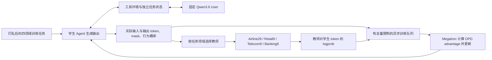

# ServiceAgent 第六项：多教师 OPD

> **历史实验说明（2026-09-29 更新）：** 本文的四教师、SFT 初始化与 Update80 选择属于 2026-09-23 的实验。当前最终主线改为 Mix RL iter139 初始化，Airline expert iter29 + 固定 Mix139 双教师，最终选择 OPD iter59。当前结果与完整对照见 [最终实验 README](../output/experiments/tau2-opd-mix139-airline-20260929/README.md)，面向读者的说明见 [新版项目主页](../project_page/index.html#opd)。本文保留历史配方与调参证据。

本文对应简历第六点，整理多教师 on-policy distillation（OPD）的做法、尝试、修正、结果和比较依据。资料核对日期为 2026-09-23，以训练实现、实际消费日志、官方评测原始结果及最新实验 README 为准。当前项目称 tau3-benchmark，历史代码和产物仍使用 `tau2-bench`；Banking 的训练元数据名为 `banking`，官方评测名为 `banking_knowledge`。

最终完成了四领域、160 次更新的纯 OPD，并从已评测的检查点中选择 **Update 80（`iter_0000079`）**。同一四领域 seed300 协议下，单个学生模型的 pass@1 / pass@4(any) / pass^4 为 **28.55 / 46.70 / 14.72%**，较 SFT4505 提高 **0.63 / 3.55 / 1.52 pp**；相对于按领域选用四位教师的成绩，pass@1 保留率为 **93.4%**。这是一个评测 seed 上的检查点选择结果。[最终实验][four-domain]

这一步使用学生生成的交互轨迹，由对应领域专家为学生实际生成的 token 打分。四位教师都是第五点训练出的 4B 专家；Qwen3.6-27B 负责模拟 User。前五点的结果作为既定输入，本文件只整理第六点，不改变既有训练配方或实验记录。

## 1. 目标、输入与教师选择

[第四点][doc4]提供持续采样、环境并行、真实 token 记录和异步 Trainer；[第五点][doc5]通过 `progress-db-count-v1` 训练出四个领域专家。第六点的目标是将这些专家的行为能力汇集到一个通用客服 policy 中，使最终推理只依赖一个学生 Agent。

学生与四位教师均来自 `Qwen3-4B-Instruct-2507`。共同起点 SFT4505 使用 30,376 条三领域 AReaL 样本和 5,672 条 Banking 样本，共 36,048 条监督样本。四位专家各自从该 SFT 初始化，独立进行 GRPO；OPD 学生也重新从 SFT4505 初始化优化器。四领域正式运行没有继续训练先前的双领域 OPD 权重。[SFT 来源][sft-readme]、[专家来源][experts]

| 教师负责的领域 | 实际采用的检查点 | 已有目标域评测支持的取舍 |
|---|---|---|
| Airline | Airline `iter29` | 在该专家已评测时点中，目标域 pass@1 最高；后续 iter49、iter59 回落 |
| Retail | Retail `iter9` | 与 iter29 的 pass@1 同为 60.625%；pass@4(any) 为 87.5%，高于 iter29 的 85%；iter29 的 pass^4 略高 |
| Telecom | Telecom `iter9` | pass@1 / pass@4(any) 为 51.875 / 90%，高于 iter19 的 43.75 / 75%；iter19 的 pass^4 更高 |
| Banking | Banking `iter9` | pass@1 / pass@4(any) 为 4.64 / 11.34%，高于 iter19；iter29 缺少完整 Banking 评测，未纳入选择 |

这里的 teacher selection 是“固定一个领域对应一位已选专家”。实际路由读取任务的 `domain`；`banking` 与 `banking_knowledge` 指向同一个端点。各教师对本域样本提供监督，没有学习一个动态门控器，也没有按轨迹成功率混合多位教师的概率。[路由实现][opd-code]

训练任务沿用专家的数据源：Airline 1,148、Retail 563、Telecom 271、Banking 542，共 2,524 行。合并时保留任务、初始 DB 路径及环境元数据，随后整体打乱，不设置逐领域 batch 配额。Banking 的 542 个合成训练任务与官方 97 个评测任务分开。[数据合并实现][merge-code]、[实际训练源][four-data]

## 2. 学生轨迹怎样获得教师监督

一次训练先让学生扮演 Agent，在真实工具环境中与固定 User 交互；完成后再请求教师打分。教师在学生已经走到的上下文里评价其输出，因此能够给学生自身会犯的错误提供信号。

教师请求携带原始 `input_ids`，设置 `max_new_tokens=0`、`return_logprob=true`、`logprob_start_len=0`。教师只计算输入 token 的概率，不在这一步另写一段示范回答。返回的 input logprob 按实际 response suffix 对齐，写入 `teacher_log_probs`。[请求与对齐][opd-code]

多轮对话有两个容易错位的地方，当前实现分别处理：

- 某些后续 prompt 无法与之前的 token 序列直接拼接，因此一条轨迹会拆成多个完整上下文的 training segments。每个 segment 单独请求教师打分，使用该段真实输入，不把一段的评分套到另一段上。
- response suffix 可能包含 User 回复、Tool 返回或模板内容；它们保留为上下文，但 loss mask 为 0。只有学生实际生成的 Assistant token 参与优化。多个 segments 共用整条轨迹的有效 token 数作为归一化分母，避免拆段后重复放大轨迹权重。

本次每个任务采样 K=1 条轨迹，每次更新消费 16 条完整轨迹。纯 OPD 将任务训练 reward 置为 0，保留真实任务成功率供诊断；关闭 progress reward、turn credit、advantage whitening、GRPO 标准差归一化及全成功/全失败组替换。可训练的失败轨迹也能获得教师反馈，长度超限或无可训输出的样本仍需重采样或替换。[配方][opd-readme]、[任务 reward 转换][rollout-code]

所以第五点的成果通过“已经训练好的专家权重”进入本步骤。当前蒸馏损失没有再次叠加第五点的 DB-count advantage，也没有按最终任务成功筛选教师轨迹。

## 3. 蒸馏目标与异步采样的处理

记 h 为学生可见的对话历史，y 为其实际生成的一个 token；q 是该领域教师，p 是更新前训练侧重算概率的学生，b 是生成这个 token 时的行为策略。当前纯 OPD 的逐 token advantage 为：

$$
A_t=\beta\big[\log q_d(y_t\mid h_t)-\log p(y_t\mid h_t)\big],\qquad \beta=1.
$$

教师比学生更认可这个 token 时，advantage 为正；教师给的概率更低时，advantage 为负。自然语言回复、工具名和参数都通过对应 token 接收信号；这里没有另设读工具、写工具或参数权重。[advantage 实现][loss-code]

异步交互可能跨越多次权重更新，所以 b 与 p 并不总相同。训练使用两层比率：

$$
w_t=\operatorname{stopgrad}\!\left[\operatorname{clip}\!\left(\frac{p(y_t\mid h_t)}{b(y_t\mid h_t)},0,2\right)\right],\qquad
r_t(\theta)=\frac{\pi_\theta(y_t\mid h_t)}{p(y_t\mid h_t)}.
$$

w 是 TIS 权重，修正给定历史下采样与训练的 token 概率差；r 是本次 PPO 更新比率。advantage 固定后进入带 clipping 的 policy loss，再乘 w；只在有效 Assistant token 上求和，并按整条轨迹取均值。[TIS 与 policy loss][loss-code]

在固定历史、重要性权重未截断、更新起点上，这一路径的逐 token 梯度对应当前学生的 `KL(p || q)`。实际训练仍使用收集到的历史，且存在 TIS 截断与推理/训练数值差异，因此“on-policy”在这里描述学生生成训练数据的方式，不能解释为每个样本都由更新时的最新策略生成。

日志里的未加权 `mean(log p − log q)` 也可能为负。在行为策略 b 下，其条件期望是 `KL(b || q) − KL(b || p)`；该值的符号不能直接判断 TIS 加权后的梯度方向。教师 log-ratio 曲线随采样上下文变化，本次暂缓的固定上下文打分检查没有被计为已完成验证。[公式复核][pilot-review]

队列控制与 TIS 各处理一个问题。`pool32` 约束并发采样，新增的 `buffer32` 则将“正在生成 + 已完成待训练 + 当前训练”的组一起计数，满额后暂停接纳新任务；Trainer 消费完成后补充容量。它减少完成队列造成的等待和策略滞后，但不规定长对话最多跨越几次版本更新。四环境进程仍使用 `policy_lag=-1`，不设置硬性的版本差上限。[队列实现][continuous-code]

## 4. 从双领域 pilot 到修正配方

第一阶段只训练 Airline 和 Retail，Telecom 作为未参与蒸馏的迁移观察域。教师固定为 Airline iter29、Retail iter9，学生从 SFT4505 开始，batch16、K1。先完成两步 smoke，再进行 20 步 pilot。[早期记录][pilot]

v1 使用 LR2e-6。由于教师与学生来自同一 SFT、平均 token log-ratio 较小，当时尝试在 v2 中将 LR 提高到 1e-5，并把预算扩为 60 步。OPD 系数保持 1：纯损失的整体缩放在 Adam 下会很大程度上被归一化抵消，不能简单把系数增大理解为等比例增大学习步长。

下表为这组历史三领域 seed300 评测，单元格是 pass@1 / pass@4(any) / pass^4（%）。它用于观察 pilot 演变；后续匹配对照重新评测了 SFT 和教师，不能直接沿用旧四领域控制分数计算增益。

| 阶段 | Airline | Retail | Telecom | 三域 pass@1 |
|---|---:|---:|---:|---:|
| v1：2e-6，Update20 | 41.25 / 70.00 / 20.00 | 63.75 / 87.50 / 35.00 | 46.875 / 80.00 / 15.00 | 52.50% |
| v2：1e-5，Update20 | 43.75 / 70.00 / 15.00 | 50.625 / 65.00 / 30.00 | 54.375 / 80.00 / 20.00 | 50.75% |
| v2：1e-5，Update40 | 48.75 / 65.00 / 25.00 | 44.375 / 60.00 / 27.50 | 48.125 / 77.50 / 10.00 | 46.75% |
| v2：1e-5，Update60 | 46.25 / 70.00 / 20.00 | 39.375 / 60.00 / 12.50 | 51.25 / 80.00 / 20.00 | 45.50% |

v2 完成了 60 次有限数值更新，但 Retail 持续退化。原有预取机制只约束尚未完成的组，完成队列会继续堆积：v1/v2 的 ready 队列峰值分别为 96/219，平均策略 lag 为 3.67/8.62；v2 后 20 步平均 lag 达 13.28。高 LR 与队列积压同时存在，这组结果不能单独识别两者各自造成多少退化。[日志复算][pilot-review]

期间还试过 v3：将 advantage 中的学生概率从当前 p 替换为行为 b，并继续使用原 TIS/PPO 权重。后续代码复核发现，在策略滞后时它对应的局部梯度目标变为 `KL(p || q) − KL(p || b)`。例如 `p=q=[0.8,0.2]`、`b=[0.5,0.5]` 时，正确 reverse-KL 梯度为 0，这个替换却仍产生非零梯度。v3 因而保留为历史可选开关，后续正式运行均关闭；不能把它描述成对旧版的无偏修复。

修正后的配方保留 current-student advantage + TIS，新增总预取回压、分域 raw success / lag / log-ratio 诊断，并每 10 步在 optimizer 更新后额外重算一次 logprob，观察实际更新幅度。每批仅做一次 optimizer step 时，反向计算起点上的 PPO ratio 为 1，日志 `pg_clipfrac=0`、`ppo_kl=0` 是预期现象；它们不能证明更新后的策略偏移受到了 0.2 的硬约束。

## 5. 两轮受控对照：buffer 与学习率

修正后先固定 LR2e-6、60 updates、训练/采样 seeds1234/42，比较 A 的 buffer32 与 B 的无限预取。随后固定 buffer32，使用同一组新 seeds1235/43，对比 2e-6 和 5e-6。每条训练均从 SFT4505 开始；仍只训练 Airline/Retail。[buffer 对照][buffer-readme]、[LR 对照][lr-results]

这一阶段用统一三领域协议重新评测 SFT、两位教师及学生：20/40/40 题，每题 4 trials，eval seeds300/301，域并发 2/2/5、总并发 9。下表为两个评测 seed 的均值，三项仍为 pass@1 / pass@4(any) / pass^4（%），总体按任务数加权。

| 模型与训练配置 | Airline | Retail | Telecom（未训练） | 三域总体 |
|---|---:|---:|---:|---:|
| SFT4505 | 44.38 / 62.50 / 32.50 | 50.94 / 78.75 / 22.50 | 42.81 / 80.00 / 8.75 | 46.38 / 76.00 / 19.00 |
| A：2e-6，buffer32，1234/42 | 46.25 / 65.00 / 30.00 | 55.94 / 81.25 / 33.75 | 45.31 / 77.50 / 11.25 | 49.75 / 76.50 / 24.00 |
| B：2e-6，无限预取，1234/42 | 45.63 / 67.50 / 22.50 | 57.81 / 81.25 / 28.75 | 48.13 / 82.50 / 13.75 | 51.50 / 79.00 / 21.50 |
| 2e-6，buffer32，1235/43 | 50.00 / 72.50 / 25.00 | 60.31 / 82.50 / 33.75 | 52.50 / 85.00 / 16.25 | 55.13 / 81.50 / 25.00 |
| 5e-6，buffer32，1235/43 | 43.75 / 60.00 / 25.00 | 55.63 / 77.50 / 32.50 | 46.88 / 82.50 / 16.25 | 49.75 / 76.00 / 24.50 |

**buffer32 确实控制了积压，但 A/B 任务分数没有明确胜负。** A 平均 lag1.03、最大4，总组数不超过32；B 平均 lag8.29、最大20，ready 峰值325。两组均消费646条 Airline、314条 Retail轨迹。A 的三域 pass@1 低于 B，pass^4 较高；各域 A−B 的 pass@1 配对区间均含0。B 还在集群故障后从 iter49 恢复，末10步重采样降低了 lag，因此不是完整不中断的无限预取对照。[A/B 完整分析][buffer-analysis]

继续采用 A 的依据是队列滞后受控、运行不中断，以及两个训练域的 pass^4 点估计更高。相对 SFT，A 的 Retail pass^4 提高11.25 pp，任务配对95% CI为 `[+1.25,+22.50]`。这里应分别报告工程机制和模型效果，不能将二者合写为“回压显著提升全部领域成绩”。

**匹配新 seeds 的 LR 对照支持选择 2e-6。** 两个评测 seeds 中，2e-6 的三个领域 pass@1 均高于5e-6；三域总体差值为+5.375 pp，任务配对95% CI为 `[+1.50,+9.375]`。两臂平均 lag均约1.02–1.03，均完成60次有限数值更新，未出现高 LR 数值崩溃；本轮选型依据是官方任务结果。

本轮学生在 Airline/Retail 的 pass@1 为50.00/60.3125%，匹配教师为45.625/55.3125%；两个学生−教师差值的配对区间仍包含0。两次独立2e-6训练的 Retail pass^4 都为33.75%，相对 SFT 的22.50%有重复的正向观察。但两次训练总体 pass@1 相差5.375 pp，本轮5e-6只有一条训练，LR比较尚未覆盖训练随机性。Airline本轮 pass^4为25%，仍低于SFT的32.5%。

这一阶段的 buffer 实验共完成4,000条官方轨迹，后续LR实验新增1,600条，均无基础设施错误。区间采用20,000次按任务配对重采样，同任务两个评测seed及各4次trial放在一起；这些区间没有覆盖训练seed和多次选型的不确定性。[原始统计与区间][buffer-results]、[LR 原始统计][lr-json]

## 6. 四领域正式运行：配置、覆盖与训练诊断

采用 `2e-6 + buffer32` 后，正式运行加入 Telecom、Banking 教师及对应任务，重新从 SFT4505 开始。训练作业23193完成160次更新并导出 iter159；教师服务23191提供四个固定端点。[完整运行脚本][four-run]

| 项目 | 实际配置 |
|---|---|
| 学生初始化 | SFT4505，新 optimizer；不加载双领域OPD训练状态 |
| 任务与预算 | 2,524行任务，batch16，K1，160 updates，共2,560条消费轨迹 |
| 学习率与随机种子 | LR2e-6；train seed1235、rollout seed43 |
| 优化信号 | current-student OPD，系数1；任务reward、reference-KL、entropy系数均0；关闭turn credit与outcome组过滤 |
| 学生采样 | temperature1、top_p1、max_tokens1200；max_steps200、max_errors10 |
| User | Qwen3.6-27B，temperature0、top_p1、max_tokens512，关闭thinking |
| 异步配置 | pool32、pending64、总buffer32、4个环境进程、无限lag接纳 |
| 长度处理 | 完整上下文及各训练segment受16,384-token上限约束，超长最多额外重试2次 |
| 保存与诊断 | 每10次更新保存；每10次更新记录一次更新后logprob变化 |
| GPU部署 | 学生8卡：Trainer2 + 3个TP2 Generator；教师8卡：4个TP2专家；User4卡，共20卡 |

这里的 reference-KL 系数0与 OPD 系数1是不同配置：前者是对参考模型的常规RL约束，后者是对领域教师的蒸馏信号。教师每域使用32,768上下文、`max-running-requests=1`；学生训练的16K上限仍单独执行。[启动配置][opd-launcher]、[教师服务][four-serve]

预算先按 `ceil(2524/16)=158` 计算，再对齐10步保存间隔设为160。这代表约一个任务源规模的轨迹预算。重试、组替换、跨epoch抽样和异步完成顺序都会影响实际消费，逐题覆盖以消费记录为准。

以下为本次直接复算：从 `run.log` 中的 `tau2_pool_batch` 提取已消费group ID，再关联 `trajectories.jsonl` 的有效记录；未消费的尾部轨迹不计入。不同任务数在每个领域内按task ID去重。[训练日志][four-train-log]、[轨迹记录][four-trajectories]

| 领域 | 任务源行数 | Update80累计消费 | Update160累计消费 | Update160不同任务覆盖 |
|---|---:|---:|---:|---:|
| Airline | 1,148 | 586 | 1,174 | 1,135 / 1,148 |
| Retail | 563 | 278 | 580 | 563 / 563 |
| Telecom | 271 | 120 | 237 | 227 / 271 |
| Banking | 542 | 296 | 569 | 542 / 542 |
| 合计 | 2,524 | 1,280 | 2,560 | 2,467 / 2,524（97.74%） |

Update80消费的1,280条恰好对应1,280个不同任务。最终2560条中有重复任务，仍有57个源任务未进入有效训练。Telecom消费占比约9.26%，低于其源任务占比10.74%；没有人为补齐领域配额。

160次更新的loss与grad norm均为有限值；平均最早turn策略lag为1.035，最大5，记录的总buffer始终为32、ready峰值16，累计替换58个不可用组。K1下zero-variance-group rate恒为100%，属于该配方的预期统计，不代表OPD advantage为0。

已消费样本的训练raw success为 Airline `629/1174`、Retail `273/580`、Telecom `87/237`、Banking `488/569`。Banking合成训练任务的85.76%成功率与官方97题上的约4%成绩属于不同任务分布；训练reward也没有参与本轮优化。日志中已消费样本的truncated_ratio与repetition_frac均为0，这些诊断不能替代官方成功率，或代表被长度过滤的轨迹不存在。

## 7. 官方评测与 Update80 选型

四领域结果采用与专家和SFT4505一致的官方协议：Airline/Retail/Telecom/Banking为20/40/40/97题，每题4次，共197题、788条轨迹；固定Qwen3.6 User，Agent temperature0.6、top_p1、max_tokens1200、max_steps200、max_errors10，Banking使用BM25。初始域并发1/2/2/4、总并发9，允许已完成领域让出并发槽位。[评测入口][four-eval-launcher]

三个成功率分别回答不同问题：

- pass@1：四次trial中成功次数的总体比例，即平均单次成功率。
- pass@4(any)：四次至少成功一次的任务比例，衡量任务覆盖。
- pass^4：四次全部成功的任务比例，衡量重复执行的一致性。

下表覆盖本次所有已完成的seed300检查点评测，并列出匹配SFT。Update从1开始计数、目录iteration从0开始，例如Update80对应iter79。表中action是预期read/write动作的匹配率；DB准确率只在实际有DB检查的轨迹上计算，均不等于所有工具调用的正确率。

| 模型/Update | pass@1 | pass@4(any) | pass^4 | Action acc. | DB acc. | max_steps条数 |
|---|---:|---:|---:|---:|---:|---:|
| [SFT4505][sft-summary] | 27.92% | 43.15% | 13.20% | 35.38% | 23.67% | 14 |
| [40][eval40] | 26.78% | 41.12% | 12.18% | 37.28% | 23.85% | 20 |
| **[80][eval80]** | **28.55%** | **46.70%** | **14.72%** | 36.19% | 24.77% | 11 |
| [90][eval90] | 27.03% | 41.12% | 12.18% | 35.33% | 25.43% | 18 |
| [100][eval100] | 28.43% | 47.21% | 12.18% | 36.36% | 24.34% | 25 |
| [110][eval110] | 28.55% | 44.16% | 14.21% | 36.91% | 25.46% | 16 |
| [120][eval120] | 27.03% | 43.15% | 9.64% | 36.42% | 24.51% | 19 |
| [160][eval160-300] | 27.41% | 46.70% | 11.68% | 36.69% | 24.24% | 22 |

选择Update80有三个直接依据：它与Update110并列最高pass@1；它有最高pass^4；其max_steps终止数也更少。Update100的pass@4(any)最高，但比Update80只多覆盖1个任务，同时全成功任务少5个。max_steps在这里是辅助诊断，没有被设成硬淘汰条件。

相对SFT，Update80的成功trial从220增至225，至少一次成功的任务从85增至92，四次全成功的任务从26增至29，对应+0.63/+3.55/+1.52 pp。Action/DB准确率分别提高约0.81/1.10 pp。继续训练到Update160没有保持这一综合表现，故最后一次更新不作为最终选择。

Update160另外完成了seed301，成绩为27.03/44.67/11.17%；其两个评测seed均值为27.22/45.69/11.42%。四领域SFT/教师的匹配seed301控制没有完成，Update80也只有seed300，不能把Update160的第二个seed写成对Update80的复验。后续提交的seed302/303/304评测已停止，不计入完成结果。[Update160 seed301][eval160-301]

四领域学生共保留8份完整评测：7个seed300检查点，以及Update160的seed301，共6,304条轨迹，summary均记录0项基础设施错误。Update80的最终HF目录为：

[tau2-opd-four-domain-20260923/pilot-lr2e6-seed1235-43/checkpoints/iter_0000079_hf][selected-model]

## 8. 教师能力保留率、分域收益与结论边界

“教师总体成绩”按每个任务的领域取对应专家的结果，再合并计数。它描述一个按领域选专家的参照系统；下表的学生成绩则来自同一个4B模型。所有数字来自相同四领域seed300协议，单元格为pass@1 / pass@4(any) / pass^4（%）。

| 领域 | SFT4505 | 对应教师 | Update80学生 | 学生/教师保留率 |
|---|---:|---:|---:|---:|
| Airline | 42.50 / 65.00 / 30.00 | [53.75 / 75.00 / 35.00][teacher-airline] | 50.00 / 80.00 / 30.00 | 93.0 / 106.7 / 85.7% |
| Retail | 58.75 / 77.50 / 35.00 | [60.625 / 87.50 / 30.00][teacher-retail] | 58.125 / 85.00 / 37.50 | 95.9 / 97.1 / 125.0% |
| Telecom | 47.50 / 82.50 / 12.50 | [51.875 / 90.00 / 15.00][teacher-telecom] | 48.125 / 87.50 / 15.00 | 92.8 / 97.2 / 100.0% |
| Banking | 4.12 / 8.25 / 1.03 | [4.64 / 11.34 / 0.00][teacher-banking] | 3.87 / 7.22 / 2.06 | 83.3 / 63.6 / 未定义 |

总体保留率先按任务数量汇总，再求学生与教师之比，使用未四舍五入的计数：

| 指标 | SFT4505 | Update80学生 | 按域选用四位教师 | 学生/教师 |
|---|---:|---:|---:|---:|
| pass@1 | 220/788 = 27.92% | 225/788 = 28.55% | 241/788 = 30.58% | 225/241 = **93.4%** |
| pass@4(any) | 85/197 = 43.15% | 92/197 = 46.70% | 97/197 = 49.24% | 92/97 = **94.8%** |
| pass^4 | 26/197 = 13.20% | 29/197 = 14.72% | 25/197 = 12.69% | 29/25 = **116.0%** |

本次已从SFT、Update80与四位目标域教师的原始`results.json`复算这些计数，并核对对应任务内容、trial seed与每题4次trial。它们与summary一致。保留率不是四个领域百分比的简单平均，也不是token概率匹配率。

93.4%衡量的是教师绝对成绩的保留。SFT初始化本身已经达到 `220/241=91.3%` 的教师总体pass@1，因此不能把93.4%描述为“追回了专家相对SFT新增收益的93.4%”。本次学生相对SFT多成功5条trial，与教师仍差16条。

分域效果并不一致。Airline相对SFT的pass@1提高7.50 pp、pass@4(any)提高15 pp，pass^4持平；Retail的pass@1减少1条成功trial，但多覆盖3题、多1题四次全成功；Telecom三项均有正向点估计。Banking则从16条成功trial减为15条、覆盖任务从8减为7，四次全成功任务从1增为2，仍是能力较弱的领域。Banking占官方任务的97/197，约49.2%，其低成功率对四域总体权重很大。

Banking教师的pass^4为0，所以该域保留率没有定义；不能记成0%或无穷大。Retail的125%、总体的116%都只是当前seed上的计数关系。教师拼接的全成功任务数本来略低于SFT，也不能仅凭116%宣称学生稳定优于全部专家。

最终结论限定为：按领域教师监督已汇集到一个学生模型，Update80在本次评测中较SFT有小幅总体提高，并保留约九成以上的教师单次成功率。检查点是在同一seed300、同一批官方测试任务上比较后选出的，尚无独立seed确认这一选型优势。

双领域阶段的55.13%与四领域的28.55%也不能直接比较为能力下降：两者任务集合、领域权重、训练预算及调度协议均不同。四领域运行同时扩展了教师、任务源和预算，属于完整扩展实验，没有隔离“只增加某一位教师”的因果效果。已完成的selection是领域专家检查点选择和学生检查点选择；动态teacher weighting、动作加权、OPD与progress/task reward混合、固定上下文打分仍不在本次完成结果中。

## 9. 简历表述与证据入口

简历第六点标题采用“多教师 on policy distillation”，正文解释学生自主交互、按域教师评分、真实 token 与分段上下文对齐、current-student reverse-KL advantage、TIS、总预取回压及学习率对照。分领域成功率集中列入“项目结果”，第六点结尾只报告教师能力保留比例：

> 经官方评测选择 Update 80 学生模型，在 Airline、Retail、Telecom、Banking 四个领域分别保留对应教师 93.0%、95.9%、92.8%、83.3% 的任务完成能力（以目标域 pass@1 比值衡量）。

“项目结果”对应同一个 Update80 学生：固定 User 与官方评测协议，197题、每题4次试验、seed300，Airline / Retail / Telecom / Banking 的 pass@1、pass@4(any)、pass^4 分别为 `50.00/80.00/30.00%`、`58.13/85.00/37.50%`、`48.13/87.50/15.00%`、`3.87/7.22/2.06%`。这些分数来自单个四领域学生，不拼接四个专家的目标域成绩。

展开讲解时，应保留“单seed检查点选型、Banking仍弱、纯OPD未混合任务奖励”这三个与结果解释直接相关的条件。完整简历措辞以简历源文件为准，前五点的既有内容保持不变。

| 核对内容 | 直接入口 |
|---|---|
| 学生SFT与领域专家 | [SFT4505实验][sft-readme]、[专家训练与目标域结果][experts] |
| 教师路由、原始token请求、segment对齐、任务reward置零 | [tau2_opd.py][opd-code]、[rollout.py][rollout-code] |
| OPD advantage、TIS与PPO loss | [loss.py][loss-code] |
| 总buffer回压、消费顺序与策略lag | [continuous.py][continuous-code] |
| pilot、v3目标修正和早期失败分析 | [pilot记录][pilot]、[代码与日志复核][pilot-review] |
| buffer A/B及匹配控制 | [结果][buffer-results]、[结论与恢复限制][buffer-analysis] |
| 小学习率选择与第二次训练复验 | [LR结果与区间][lr-results]、[机器可读统计][lr-json] |
| 四领域配方、预算和全部作业 | [最终README][four-domain]、[运行脚本][four-run]、[检查点评测脚本][checkpoint-eval] |
| Update80实际产物与原始评测入口 | [HF检查点][selected-model]、[summary及各域results路径][eval80] |
| 已有机制验证 | [教师请求与对齐测试][opd-tests]、[目标梯度、分域统计及launcher测试][training-tests]；本次仅复核已有结果，未重启训练或集群测试 |

[doc4]: 04_异步Agentic_RL.md
[doc5]: 05_Credit_assignment.md
[sft-readme]: ../output/experiments/tau2-sft-areal3-banking-simplified-full-20260920/README.md
[sft-summary]: ../output/experiments/tau2-sft-areal3-banking-simplified-full-20260920/eval/four-domain-sft-iter4505/seed300_20260920_sft_iter4505_four_domain_summary.json
[experts]: ../output/experiments/tau2-domain-experts-sft4505-b128/README.md
[teacher-airline]: ../output/experiments/tau2-domain-experts-sft4505-b128/eval/airline-iter29-four-domain/seed300_20260921_sft4505_airline_iter29_summary.json
[teacher-retail]: ../output/experiments/tau2-domain-experts-sft4505-b128/eval/retail-iter9-four-domain/seed300_20260921_sft4505_retail_iter9_summary.json
[teacher-telecom]: ../output/experiments/tau2-domain-experts-sft4505-b128/eval/telecom-iter9-four-domain/seed300_20260921_sft4505_telecom_iter9_summary.json
[teacher-banking]: ../output/experiments/tau2-domain-experts-sft4505-b128/eval/banking-iter9-four-domain/seed300_20260921_sft4505_banking_iter9_summary.json
[opd-readme]: ../examples/tau2-bench/opd/README.md
[opd-code]: ../examples/tau2-bench/opd/tau2_opd.py
[opd-launcher]: ../examples/tau2-bench/opd/run_tau2_opd_airline_retail.sh
[merge-code]: ../examples/tau2-bench/opd/prepare_airline_retail_data.py
[rollout-code]: ../examples/tau2-bench/rl/rollout.py
[loss-code]: ../backends/megatron_utils/loss.py
[continuous-code]: ../examples/tau2-bench/rl/continuous.py
[pilot]: ../output/experiments/tau2-opd-airline-retail-pilot/README.md
[pilot-review]: ../output/experiments/tau2-opd-airline-retail-pilot/REVIEW_20260922.md
[buffer-readme]: ../output/experiments/tau2-opd-current-buffer-ab/README.md
[buffer-results]: ../output/experiments/tau2-opd-current-buffer-ab/RESULTS.md
[buffer-analysis]: ../output/experiments/tau2-opd-current-buffer-ab/ANALYSIS_AND_NEXT.md
[lr-results]: ../output/experiments/tau2-opd-bounded-lr-20260922/RESULTS.md
[lr-json]: ../output/experiments/tau2-opd-bounded-lr-20260922/comparison.json
[four-domain]: ../output/experiments/tau2-opd-four-domain-20260923/README.md
[four-data]: ../output/experiments/tau2-opd-four-domain-20260923/data/four_domain_train.jsonl
[four-run]: ../output/experiments/tau2-opd-four-domain-20260923/run_distillation.sh
[four-serve]: ../output/experiments/tau2-opd-four-domain-20260923/serve_experts.sh
[four-eval-launcher]: ../output/experiments/tau2-opd-four-domain-20260923/eval_student.sh
[checkpoint-eval]: ../output/experiments/tau2-opd-four-domain-20260923/eval_checkpoint_seed300.sh
[four-train-log]: ../output/experiments/tau2-opd-four-domain-20260923/pilot-lr2e6-seed1235-43/run.log
[four-trajectories]: ../output/experiments/tau2-opd-four-domain-20260923/pilot-lr2e6-seed1235-43/trajectories.jsonl
[eval40]: ../output/experiments/tau2-opd-four-domain-20260923/eval/checkpoint-update40-seed300/summary.json
[eval80]: ../output/experiments/tau2-opd-four-domain-20260923/eval/checkpoint-update80-seed300/summary.json
[eval90]: ../output/experiments/tau2-opd-four-domain-20260923/eval/checkpoint-update90-seed300/summary.json
[eval100]: ../output/experiments/tau2-opd-four-domain-20260923/eval/checkpoint-update100-seed300/summary.json
[eval110]: ../output/experiments/tau2-opd-four-domain-20260923/eval/checkpoint-update110-seed300/summary.json
[eval120]: ../output/experiments/tau2-opd-four-domain-20260923/eval/checkpoint-update120-seed300/summary.json
[eval160-300]: ../output/experiments/tau2-opd-four-domain-20260923/eval/student/seed300_summary.json
[eval160-301]: ../output/experiments/tau2-opd-four-domain-20260923/eval/student/seed301_summary.json
[selected-model]: ../output/experiments/tau2-opd-four-domain-20260923/pilot-lr2e6-seed1235-43/checkpoints/iter_0000079_hf
[opd-tests]: ../examples/tau2-bench/opd/test_tau2_opd.py
[training-tests]: ../tests/test_tau2_opd_training.py
